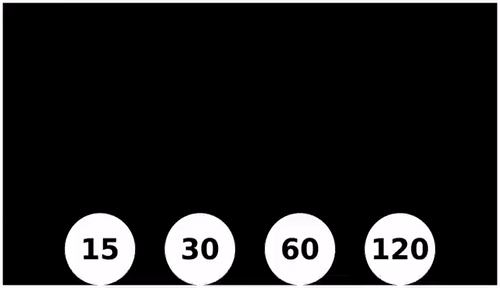
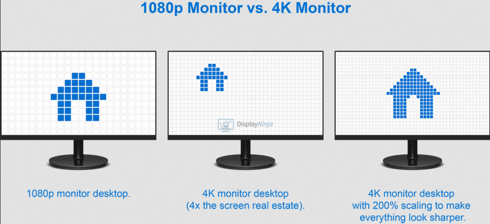
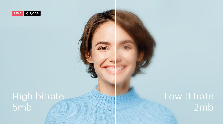

**Main Source:**

- **[Computer Display](/computer-graphics/computer-display)**

Video is basically a sequence of images. An image is stationary, however, if we keep changing the image with a small change in the detail of image, we will be able to create illusion of animation.

Each image in a video is called **frame**, and the measurement of how many frames is usually measured per second as FPS (frame per second). More FPS will result in smoother and better playback of the video.

  
Source: https://gfycat.com/discover/fps-comparison-gifs

### Resolution

Video, just like image, has resolution, which is the total number of pixel in the frame. Resolution is measured in width×height of the image. High resolution result in a higher quality image but also takes more space in memory.

Common video resolution include:

- **Standard Definition (SD)**: 720×480 pixels (NTSC) or 720×576 pixels (PAL)
- **High Definition (HD)**: 1280×720 pixels (720p) or 1920×1080 pixels (1080p)
- **Ultra High Definition (UHD)**: 3840×2160 pixels (4K UHD) or 7680×4320 pixels (8K UHD)

The resolution of video or image is also affected by the display size. For example, a small monitor that displays a 720p image may look fine, but a bigger monitor that displays the same image may appear blurry or less sharp and much loss of detail (assuming seeing it on full-screen). This is because, in a bigger monitor, individual pixels are spread out over a larger physical area.

The measurement of how densely pixels are packed is called PPI (pixels per inch), and a larger monitor typically has a higher PPI.

  
Source: https://www.displayninja.com/what-is-pixel-density/

#### Bit Rate

In video, **bit rate** is the measurement of how many bits are processed or transmitted over the network in a given period of time. The higher the bit rate, the better the quality of the video will be, but the more bandwidth it will require.

A low bit rate means we need to represent the video in a limited amount of bits. This makes some details are skipped to adjust with the available data.

  
Source: https://restream.io/blog/what-is-video-bitrate/
