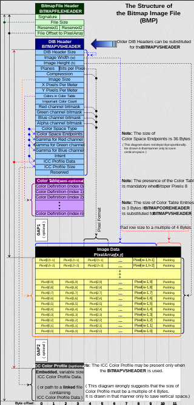

**Main Source:**

- **[BMP file format — Wikipedia](https://en.wikipedia.org/wiki/BMP_file_format)**

**Bitmap (BMP)** is a [raster image format](/computer-graphics/computer-images-part-1) that stores pixel data for an image. BMP stores pixel data in binary format. BMP are generally uncompressed, meaning the original data doesn't undergo [compression](/digital-signal-processing/compression) process.

  
_raw data inside a BMP file_  
Source: https://stackoverflow.com/questions/33483708/understanding-bmp-file

### BMP Structure

BMP file contains several components:

- **File Header**: File begins with a fixed-size header that provides general information about the file, such as the file type, size, and offset to the pixel data.
- **DIB Header**: The DIB (Device Independent Bitmap) contains specific information about the image, such as its width and height in pixels, color depth, compression method (if any), and color palette.
- **Color Palette** (optional): For images with [indexed color](#indexed-color) (color depths of 8 bits or fewer), an optional color palette may be present. The color palette is an array of color entries that maps pixel values to specific colors.
- **Pixel Data**: After the headers, the file contains the actual pixel data. The pixel data represents the image itself, with each pixel's color or intensity information stored in a specific format based on the color depth. For example, in a 24-bit color depth BMP file, each pixel is represented by three bytes, typically in the order of blue, green, and red (BGR).

  
Source: https://en.wikipedia.org/wiki/BMP_file_format

#### Indexed Color

Indexed color is a technique to store and represent color using a predefined color palette (usually limited). Instead of directly specifying the color of each individual pixel, indexed color images represent each pixel with an index value that corresponds to a specific color in the palette.

For example, in RGB, we may represent the color red in a pixel with (255, 0, 0). This results in each pixel to occupy 24-bit. With indexed color, we can represent the same color with fewer bits. However, indexed color usually restrict the amount of color in the palette.

We may define a color palette with 256 possible color. Therefore, we will need a minimum 8 bits to be able to access every color by its index in the palette. This is the reason indexed color favor image with less distinct color.

  
Source: https://en.wikipedia.org/wiki/Indexed_color

This image above represent the 5×5 grid using 2-bit color palette. This means it needs 2-bit to index a color, and can represent up to $2^2 = 4$ color.
