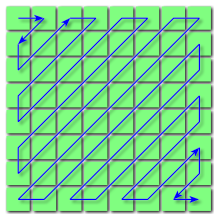

**Main Source:**

- **[JPEG — Wikipedia](https://en.wikipedia.org/wiki/JPEG)**

**JPG or JPEG (Joint Photographic Experts Group)** is a digital image format known for using [lossy compression](/cs-notes/digital-signal-processing/compression#lossy-compression), which reduces a lot of file size compared to [lossless compression](/cs-notes/digital-signal-processing/compression#lossy-compression) or even more compared to [BMP](/cs-notes/digital-media-processing/bmp) without compression at all.

  
Source: https://theinformaticists.com/2019/08/29/human-based-image-compression-using-a-deterministic-computer-algorithm-to-reconstruct-pre-segmented-images/

### JPG Compression

Many techniques are used to compress JPG, including lossy and lossless compression.

- **Color Space Conversion**: Color space is the specific color format to represent image. Typically, RGB is used, however in JPG, it is converted to the YCbCr color space. YCbCr separates luminance (Y), blue chrominance channel (Cb) and red chrominance channel (Cr). Chrominance is the measure how vary is the color from the neutral gray level of the image.

  The reason YCbCr color space is used is that human visual system is more sensitive to changes in brightness than color. By using this color space, we can separate the color into these component allowing us to be able to compress more irrelevant data.

    
  Source: https://developingdaily.com/article/technology/rgb-vs-ycbcr/398

- **Chrominance Subsampling**: This is the compression that take advantage over human visual system after color space is converted to YCbCr. Basically, the chrominance are reduced or downsampled, but it won't affect image quality significantly.

    
  Source: https://www.videomaker.com/article/f6/15788-the-anatomy-of-chroma-subsampling/

- **DCT & Quantization**: In simple term, [quantization](/cs-notes/digital-signal-processing/quantization) limits the possible color within the image. A pixel with similar color with its neighbor is combined. This results in more pixel color being same, which can be further reduced through other compression method. The quantization is done on [DCT](/cs-notes/digital-signal-processing/discrete-cosine-transform) coefficients.
- **Entropy Coding**: Entropy coding is a lossless compression, which combines [run-length encoding](/cs-notes/digital-signal-processing/compression#run-length-encoding-rle) optimized with zigzag scanning with [Huffman encoding](/cs-notes/digital-signal-processing/compression#huffman-encoding).

  Zigzag scanning is used to optimize run-length encoding. It's a scanning pattern where data is read in a zigzag pattern instead of from left to right, to prevent the jumps to the left after reaching the right edge of the image. The idea is, color within image is usually spatially correlated. That is, neighboring pixels tend to have similar or related values. It captures duplicates within the color group efficiently.

    
  Source: https://en.wikipedia.org/wiki/JPEG

### JPG Structure

JPG file are divided into several segments, each begins with a marker as the indicator.

- **File Header**: The JPG file begins with a file header that contains markers indicating the start of the JPG image. The most common marker is the start of image (SOI) marker (FF D8 in [hexadecimal](/cs-notes/computer-and-programming-fundamentals/number-system#hexadecimal)).
- **Application and Comment Markers**: JPG files can include markers that provide additional information or comments about the image. For example, the APP0 marker (FF E0) is often used to indicate the JFIF (JPG File Interchange Format) segment, which contains metadata about the image, such as resolution and pixel aspect ratio. Comment markers (COM) can be used to store textual comments.
- **Quantization Tables**: The Quantization Tables (DQT) segment (FF DB) contains the [quantization](/cs-notes/digital-signal-processing/quantization) tables used during compression. These tables define the quantization values applied to the [DCT](/cs-notes/digital-signal-processing/discrete-cosine-transform) coefficients during the compression process.
- **Huffman Tables**: The Huffman Tables (DHT) segment (FF C4) contains the [Huffman coding](/cs-notes/digital-signal-processing/compression#huffman-encoding) tables used for entropy encoding. Huffman coding is a lossless compression technique applied to the quantized DCT coefficients.
- **Image Information**: The image data is represented by one or more compressed image segments. These segments include the start of frame (SOF) segment (FF C0 or FF C2), which contains information about the image size, color space, and other parameters. The scan segment (SOS, FF DA in hexadecimal) specifies the order and location of the image components, including the Huffman tables used for each component.
- **End of Image**: The JPG file ends with an end of image (EOI) marker (FF D9), indicating the completion of the JPG image.

  
Source: https://stackoverflow.com/questions/48669812/how-do-i-read-and-compare-single-bytes-from-jpeg-file-in-c
