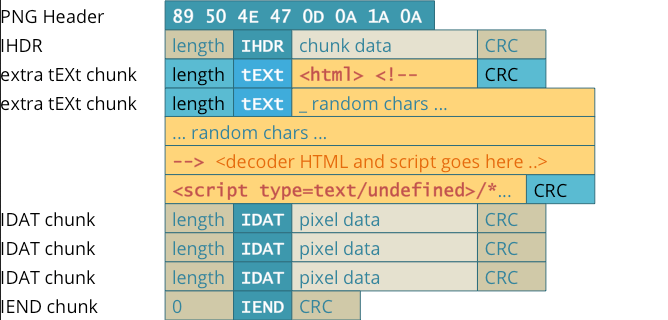

**Main Source:**

- **[PNG — Wikipedia](https://en.wikipedia.org/wiki/PNG)**

**PNG (Portable Network Graphics)** is a digital image format that uses [lossless compression](/cs-notes/digital-signal-processing/compression#lossless-compression), meaning it stores image without any loss of information, but with bigger file sizes compared to other format like [JPEG](/cs-notes/digital-media-processing/jpg-jpeg).

Other characteristic of PNG is that it supports [alpha channel](/cs-notes/computer-graphics/computer-images-part-2#alpha) transparency. In other word, PNG can display transparent areas within an image. Alpha channel is stored alongside the RGB channel, which mean PNG format require an extra 8 bits for each color, making a single pixel took 32 bits.

The alpha value vary between 0 (fully invisible) to 255 (fully visible). The transparency enables an image to be placed or combined with other transparent image, this is called alpha blending.

  
Source: https://www.stellarinfo.com/blog/jpg-vs-png/

:::info
Typically, the transparent background is indicated by the white-gray grid.
:::

### PNG Compression

The PNG compression consist of two steps:

1. **Filtering**: PNG does a pre-processing before the actual compression. This step identifies patterns or correlations between pixels. It works by applying a prediction algorithm to each pixel data in a scanline pattern. The prediction algorithm produces an estimated value for each pixel, and the difference between the estimated value and the actual pixel value is stored.

   There are five types of filter method in PNG, the purpose of these are to capture pattern so that it can be compressed more efficiently:

   - **None**: When there is little or no spatial correlation in the image data, no filtering is applied. Each pixel value is stored as is.
   - **Sub**: The pixel value is predicted based on the value of the pixel immediately before it in the same scanline.
   - **Up**: The pixel value is predicted based on the value of the pixel above it in the previous scanline.
   - **Average**: The pixel value is predicted based on the average of the pixel above it and the pixel immediately before it.
   - **Path**: The pixel value is predicted based on a linear combination of the pixel above it, the pixel immediately before it, and the pixel diagonally above it.

2. **DEFLATE**: DEFLATE is a combination of LZ77 and [Huffman encoding](/cs-notes/digital-signal-processing/compression#huffman-encoding) algorithm.

   - **LZ77**: LZ77 replace repeated sequence of characters with a reference consisting an offset (indicating the distance to the start of the repeated sequence), the length (representing the number of characters in the sequence), and the character itself.

       
     Source: https://www.researchgate.net/figure/An-example-of-LZ77-encoding_fig4_322296027

   - **Huffman Encoding**: After LZ77, Huffman encoding is also applied to further reduce data by making frequent symbols in smaller size and less frequent symbols in larger size.

### PNG Structure

PNG structures its data in chunks.

- **PNG Signature**: The file starts with an 8-byte signature that identifies it as a PNG file. The signature helps software recognize and validate the file format.
- **IHDR Chunk**: The IHDR (Image Header) chunk stores essential information about the image, such as its dimensions (width and height), bit depth, color type, compression method, and interlace method.
- **Ancillary Chunks**: After the IHDR chunk, there can be an optional ancillary chunks that provide additional information and features. There are many types of ancillary chunks, common examples include:
  - **bKGD (Background)**: The default background color.
  - **PLTE (Palette)**: This chunk defines a color palette for indexed color images.
  - **tRNS (Transparency)**: It specifies transparency information for the image, such as alpha values for individual palette entries or a single transparent color.
  - **pHYs (Physical Dimensions)**: This chunk indicates the intended physical size of the image in terms of pixels per unit.
  - **tIME (Last Modification Time)**: It stores the timestamp of the last image modification.
- **Image Data**: The actual image data comes after the header and optional ancillary chunks. The image data is compressed using a lossless compression, this chunk is called IDAT.
- **IEND Chunk**: The IEND (Image End) chunk marks the end of the PNG file. It serves as a marker to indicate that there are no more chunks following it.

    
  Source: https://github.com/HugoJH/HideIntoPNG
