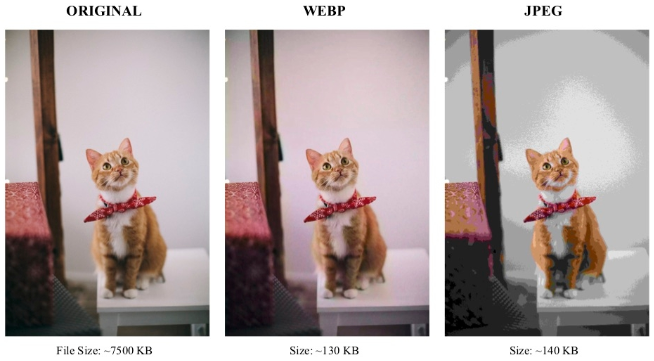
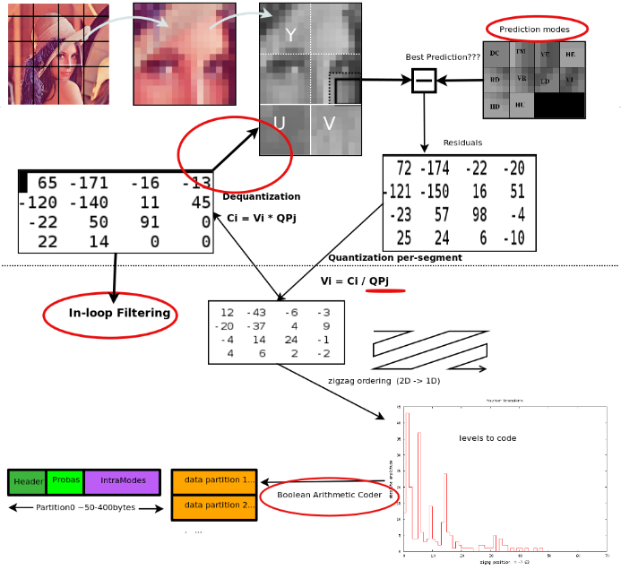

**Main Source:**

- **[WebP — Wikipedia](https://en.wikipedia.org/wiki/WebP)**
- **Various sources from Google**

**WebP** is an image format developed by Google that provides both [lossy](/cs-notes/digital-signal-processing/compression#lossless-compression/digital-signal-processing/compression#lossy-compression) and [lossless compression](/cs-notes/digital-signal-processing/compression#lossless-compression) for digital images. WebP is better suited for webpages than [JPG](/cs-notes/digital-media-processing/jpg-jpeg) due to its better compression efficiency, which reduces file size and improve performance. WebP is supported by browser natively, support image transparency, and animation through the WebP Animation format (WebPANIM).

  
Source: https://theinformaticists.com/2019/08/29/human-based-image-compression-using-a-deterministic-computer-algorithm-to-reconstruct-pre-segmented-images/

### WebP Compression

WebP uses similar technique as [JPG compression](/cs-notes/digital-media-processing/jpg-jpeg#jpg-compression) with small difference.

- **Predictive Coding**: WebP replaces pixel value within an image with prediction of pixel values. WebP uses a prediction algorithm to predict the pixel value based on the surrounding pixels. It uses the idea that near pixel have similar or correlated value. The difference between the predicted and the original pixel value is called residual data. It generally carries less information, and will be used to reconstruct the original data.
- **YUV Color Space Conversion**: WebP uses a color space similar to YCbCr in JPG, called YUV (luminance, chroma blue, and chroma red, respectively). The difference is that YUV values are centered around 0, ranging from -127 to 128, while YCbCr values are centered around 128, ranging from 0 to 256.

    
  Source: https://developers.google.com/speed/webp/docs/compression

### WebP Structure

1. **RIFF Header**: A WebP file begins with a RIFF (Resource Interchange File Format) header, which identifies the file as a WebP file. The RIFF header is four bytes long and contains the ASCII characters "RIFF".
2. **File Size**: Following the RIFF header is a four-byte value that specifies the total size of the WebP file, including the RIFF header itself and the file content.
3. **WebP FourCC**: The next four bytes represent the FourCC (Four-Character Code) identifier for WebP files, which is "WEBP".
4. **WebP Chunk**: After the FourCC identifier, the WebP file contains a chunk structure that consists of multiple chunks. Each chunk contains a chunk header followed by chunk data.
   - **Chunk Header**: Each chunk has a four-byte FourCC identifier and a four-byte value indicating the size of the chunk data.
   - **Chunk Data**: The chunk data stores the actual content of the chunk, such as image data metadata, or other relevant information. The size of the chunk data is determined by the chunk header.

     These chunks are:
     - **VP8/VP8L/VP8X Chunk**: This chunk stores the compressed image data using VP8, VP8L (lossless), or VP8X (extended) compression formats.
     - **ICCP Chunk**: This chunk contains an embedded ICC profile, which provides color management information.
     - **ANIM Chunk**: The ANIM chunk is used to store animation-related information in WebP Animation format (WebPANIM).
     - **ALPHA Chunk**: This chunk stores the transparency data for an image with an alpha channel.
     - **Metadata Chunk**: WebP files can include metadata chunks for storing additional information, such as EXIF data, XMP data, or custom metadata.
     
5. **File Footer**: The WebP file may end with an optional file footer that contains additional information or markers related to the WebP file.
