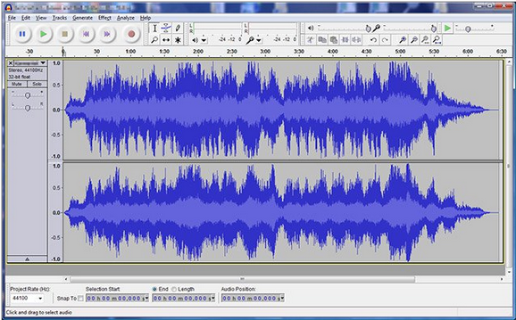
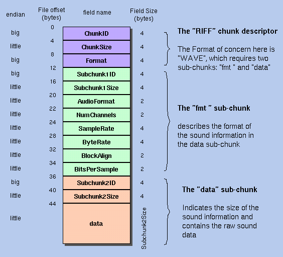

**Main Source:**

- **[WAV — Wikipedia](https://en.wikipedia.org/wiki/WAV)**

**WAV (Waveform Audio File)** is a file extension for storing digital audio data, typically without any compression method.

:::info
Common sample rate and bit rate for WAV audio is 44.1 kHz and 16-bit respectively.
:::

:::tip
See also [sound representation](/cs-notes/computer-and-programming-fundamentals/data-representation#sound).
:::

Uncompressed WAV is in linear pulse-code modulation (LPCM) format, which is the same standard for audio CDs. The LPCM format correspond to the technique for encoding and decoding audio data without any loss of information. In LPCM, digital values are proportional to the instantaneous amplitudes of the audio waveform, this means that digital values represent the exact amplitude.

  
Source: https://tipsmake.com/data/images/what-file-is-wav-and-wave-how-to-open-edit-and-convert-wav-and-wave-files-picture-1-bzrVmZO8B.jpg

### WAV Structure

WAV is a subset of Resource Interchange File Format (RIFF), meaning WAV follows the structure of RIFF format that consists of a file header, a sequence of data chunks, and a trailer. Each chunk has a unique identifier (FourCC — Four Character Code) and a size field that indicates the length of the chunk's data.

1. **RIFF Header**: The RIFF header serves as the starting point of the WAV file. It identifies the file as a RIFF file and specifies the overall file size. It consists of the following fields:

   - **Chunk ID**: A four-byte identifier indicating the type of chunk (usually "RIFF").
   - **Chunk Size**: A four-byte value specifying the size of the entire file in bytes.
   - **Format**: A four-byte identifier indicating the file format (usually "WAVE").

2. **Format Chunk**: The format chunk provides information about the audio format used in the WAV file. The format chunk consists of:

   - **Chunk ID**: A four-byte identifier indicating the type of chunk (usually "fmt ").
   - **Chunk Size**: A four-byte value specifying the size of the format chunk in bytes.
   - **Audio Format**: A two-byte value indicating the audio format (e.g., PCM = 1).
   - **Channels**: A two-byte value specifying the number of audio channels or the output source of the audio.
   - **Sample Rate**: A four-byte value indicating the audio sample rate.
   - **Byte Rate**: A four-byte value representing the average number of bytes per second.
   - **Block Align**: A two-byte value specifying the number of bytes for each audio block (sequence of bytes).
   - **Bits Per Sample**: A two-byte value indicating the number of bits used to represent each audio sample.
     :::note
     PCM (Pulse Code Modulation) specify that audio is sampled at uniform intervals.
     :::

3. **Data Chunk**: The data chunk contains the actual audio samples. It includes the audio waveform data in binary format. The data chunk consists of:

   - **Chunk ID**: A four-byte identifier indicating the type of chunk (usually "data").
   - **Chunk Size**: A four-byte value specifying the size of the audio data chunk in bytes.
   - **Audio Data**: The actual audio samples, stored as binary data.

4. **Optional Metadata Chunks**: WAV files may include optional metadata chunks that provide additional information about the audio file. These chunks can contain details like track titles, artist names, album information, and more. Common metadata chunk types include "LIST" and "INFO".

     
   Source: http://soundfile.sapp.org/doc/WaveFormat/
