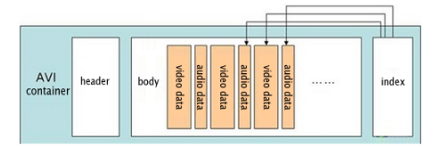

**Main Source:**

- **[AVI Format: Should You Still Use AVI? — Cloudinary](https://cloudinary.com/guides/video-formats/avi-format-should-you-still-use-avi)**
- **[Audio Video Interleave — Wikipedia](https://en.wikipedia.org/wiki/Audio_Video_Interleave)**

**AVI (Audio Video Interleave)** is a multimedia container format that supports both audio and video files. AVI is an older video format developed by Microsoft in 1992. An AVI file can include compression using various codecs, such as DivX, XviD, or MPEG-4.

There are two types of AVI: Type 1, where audio and video data are [multiplexed](/cs-notes/digital-signal-processing/multiplexing), meaning they are stored and combined in the same file without wasting extra space; and Type 2, where the audio data is saved in a separate audio stream file.

  
Source: https://www.samsung.com/in/support/tv-audio-video/what-is-avi-format/

### AVI Compression

AVI is simply a media [container](/cs-notes/digital-media-processing/ogg-vorbis#media-container) for audio and video data. It can use many codecs to compress both the audio and video.

#### DivX Codecs

DivX is the codec for video with lossy compression.

- **Interframe Compression**: Interframe compression is a technique, where the current frame of a video is encoded based on its differences from the previous frame. It takes advantage of the idea that each frame in a video sequence typically doesn't change abruptly from the previous frame, but rather changes gradually over time.
- **[Quantization](/cs-notes/digital-signal-processing/quantization)**: DivX codecs use quantization to reduce the precision of video data. The range of original video data are compressed into a smaller set of values.
- **Variable Bit Rate (VBR) Encoding**: Variable bit rate encoding allocates a higher bit rate to complex or high-motion scenes and a lower bit rate to less complex or static scenes.
- **[Huffman Encoding](/cs-notes/digital-signal-processing/compression#huffman-encoding)**: A [lossless compression](/cs-notes/digital-signal-processing/compression#lossless-compression) technique that assigns shorter codes to frequently occurring data patterns and longer codes to less frequent patterns.

### AVI Structure

AVI is a subset of the Resource Interchange File Format (RIFF), meaning it follows the structure of a RIFF format. The data is divided into chunks, with each chunk identified by a FourCC (four-character code).

1. **AVI Header**: This is the first section of the file and contains information about the overall structure and properties of the AVI file, such as the file size, duration, and the number of streams (audio and video).
2. **Main AVI List**: This section contains various lists and chunks that define the structure of the AVI file. It includes:
   - **hdrl (Header List)**: This list contains information about the streams, such as their format, codec, and properties. It typically includes a Stream Header (strh) chunk for each stream.
   - **movi (Movie Data)**: This list stores the actual audio and video data. It contains chunks called "chunks" that store the media samples. Each chunk is identified by a FourCC (four-character code) that indicates the type of data it contains.
3. **Index**: The index section of the AVI file contains an index table that allows for efficient seeking and playback of the media content. It consists of index entries that map the file offsets of the data chunks to their corresponding timestamps.
4. **Optional Lists**: AVI files may include additional optional lists that contains additional information such as the maximum file size, frame rate, and segment information. An example is odml (OpenDML) list, which provides support for files larger than 2GB or non-standard frame rates.

  
Source: https://www.filefix.org/format/avi.html
