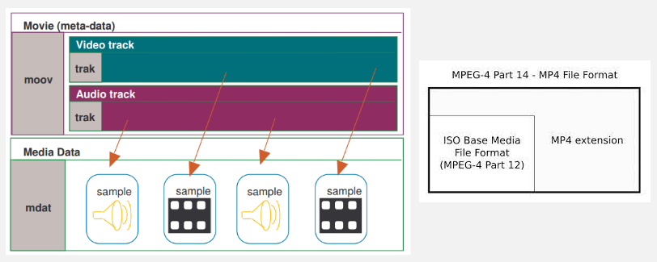
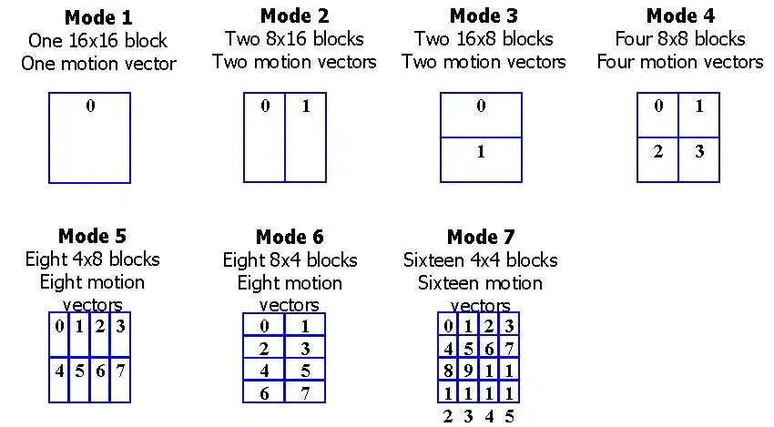
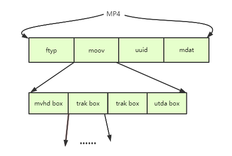

**Main Source:**

- **[MP4 file format — Wikipedia](https://en.wikipedia.org/wiki/MP4_file_format)**

**MP4 (MPEG-4 Part 14)** is a digital [multimedia container](/digital-media-processing/ogg-vorbis#media-container) format, commonly used to store audio and video data.

  
Source: https://www.filefix.org/format/mp4.html, https://en.wikipedia.org/wiki/MP4_file_format

### MP4 Compression (H.264)

H.264, also known as AVC (Advanced Video Coding), is the most commonly used [lossy video compression](/digital-signal-processing/compression#lossy-compression) standard.

H.264 process each frame as "block," which is a fixed-size rectangular region within a frame of video. The block size can vary, such as 4×4, 16×16, or 32×32 pixels.

In H.264, there two main compression techniques.

- **Spatial compression** compresses each frame of video individually, similar to compressing an image.
- **Temporal compression** compresses multiple frames together, taking advantage of similarities between consecutive video frames. The idea is that not all pixels within each frame change. This property allows us to reference the same block of pixels from previous or future frames.

Other techniques used in H.264:

- **Transform Coding**: H.264 uses transform coding, specifically the [discrete cosine transform (DCT)](/digital-signal-processing/discrete-cosine-transform), which converts image data from the spatial domain to the frequency domain. This conversion allows for analysis of the signals in the frequency domain, which can result in additional compression by representing the video content with fewer frequency components.
- **Rate Control**: H.264 can adjust bit rate dynamically. For example, we can use higher bit rate to complex or high-motion scenes and a lower bit rate to less complex or static scenes.

  
Source: https://www.eetimes.com/emerging-h-264-standard-supports-broadcast-video-encoding-2/

### MP4 Structure

MP4 consists of a file header and multimedia data that are organized into containers called atoms or boxes. These atoms represent the actual multimedia data and can also contain other nested atoms.

Atoms have variable sizes and specific types. The minimum size of an atom is 8 bytes. The first 4 bytes of an atom indicate its size, while the following 4 bytes specify the atom's type.

1. **File Header**: This contains the file type, version, and other information about the file.
2. **Atoms**: The main components of an MP4 file comes after the header, it could contain many atoms such as:
   - **ftyp (file type)**: Specify the file type and the common data structures used.
   - **moov (movie)**: Contains the movie metadata, such as the video and audio tracks, the timecode, and the tracks properties.
   - **mdat (media data)**: Contains the media data, such as the video and audio samples.
   - **udta (user data)**: Contains the user-defined metadata.
   - **trak (track)**: Contains information about a single track, such as the track's type, the track's timecode, and the track's samples.

  
Source: https://www.trekview.org/blog/2022/injecting-camm-gpmd-telemetry-videos-part-2-mp4-overview/
