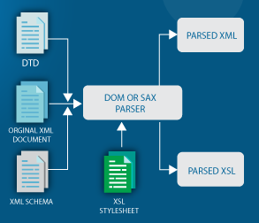

**Main Source:**

- **[XML — Wikipedia](https://en.wikipedia.org/wiki/XML)**

**XML (Extensible Markup Language)** is a markup language that is used to store arbitrary data in a structured format that is both human-readable and machine-readable.

A markup language stores information with specific rules or format, typically with elements in tags. The angle brackets (opening `<` and closing `>`) are commonly used as tags. The closing tag is typically preceded by a forward slash `/` to indicate the end of the element. For example, `<text></text>` specify a "text" element.

### XML Component

Suppose we want to list an employee data. With XML, it can be defined as follows.

```xml
<employee>
  <name gender="male">John Doe</name>
  <age>30</age>
  <department>Engineering</department>
</employee>
```

XML allows for an element included within another element. `employee` element act as the root element; and `name`, `age`, and `department` are the child elements.

Actual data can be included between the tags. A tag can also have attributes, which is additional information or metadata about the element. The `gender="male"` is the attribute of `name` element, which in this case specify the gender of the employee with the name of "John Doe."

### Document Type Definition (DTD)

We need to specify how an element can be used correctly in an XML file. A DTD is a specification file that defines the correct structure and usage of markup elements in a markup language like XML.

DTD is declared within the XML document using the `<!DOCTYPE>` declaration. For example, the previous XML example may contain this DTD:

```xml
<!DOCTYPE employee [
  <!ELEMENT employee (name, age, department)>
  <!ELEMENT name (#PCDATA)>
  <!ATTLIST name gender (male|female) #REQUIRED>
  <!ELEMENT age (#PCDATA)>
  <!ELEMENT department (#PCDATA)>
]>
```

- **`<!DOCTYPE>`**: Define the root element as `employee`.
- **`<!ELEMENT>`**: Declaration that define the structure of elements. For example, the element declaration for `employee` states that it must contain `name`, `age`, and `department` elements. The `<!ELEMENT>` declarations for `name`, `age`, and `department` specify that they contain parsed character data `(#PCDATA)`, which are text contents.
- **`<!ATTLIST>`**: Specifies that the element has an attribute, the `name` has attribute called gender and must be either "male" or "female" using the `(|)`. The attribute is required `(#REQUIRED)`.

### XML Schema

XML Schema, also known as XML Schema Definition (XSD), is the successor to DTDs and is far more powerful. XSD offers more features for defining XML structure, including data types, strong typing, complex data structures (such as nested elements and sequences), and the ability to define custom data types and complex constraints.

XSD also provides a way to distinguish between similar XML schema definitions by ensuring that elements, attributes, and types within a specific schema are uniquely identified. This unique identifier is called an **XML namespace**.

A schema is defined with `<xs:schema></xs:schema>` and namespace is specified with `xmlns:xs=`.

```xml
<xs:schema xmlns:xs="http://www.w3.org/2001/XMLSchema">
  <!-- Schema definition goes here -->
</xs:schema>
```

The namespace value `http://www.w3.org/2001/XMLSchema` means that the XML file is associated with that mentioned [URI](/internet-and-web/web-url).

A schema for the employee example.

```xml
<?xml version="1.0" encoding="UTF-8"?>
<xs:schema xmlns:xs="http://www.w3.org/2001/XMLSchema">
  <xs:element name="employee">
    <xs:complexType>
      <xs:sequence>
        <xs:element name="name" type="xs:string">
          <xs:complexType>
            <xs:attribute name="gender" type="xs:string" use="required"/>
          </xs:complexType>
        </xs:element>
        <xs:element name="age" type="xs:positiveInteger"/>
        <xs:element name="department" type="xs:string"/>
      </xs:sequence>
    </xs:complexType>
  </xs:element>
</xs:schema>
```

- **`<xml>`**: An XML file begins with `xml` tags specifying version and the encoding used to encode the text.
- **`<xs:schema>`**: Act as the root of the schema with the namespace attribute.
- **`<xs:element>`**: Define an element with the attribute `employee` as the name. We can also specify attribute `type` for the data types.
- **`<xs:complexType>`**: Defines the complex type for the `employee` element. It allows for the specification of the child elements attributes.
- **`<xs:sequence>`**: Define the sequence or order in which child elements should appear within a complex type.
- **`<xs:attribute>`**: Define the attribute of element name with attribute `use` to mark it as required.

### XML Parsing

XML file follows a hierarchical tree-like structure. It consists of elements, attributes, and text content. The [parsing](/compilers-and-programming-languages/parsing) process includes:

1. **Lexical Analysis**: XML parser reads the raw XML data character by character and breaks it down into small piece called tokens.
2. **Syntax Analysis**: Parser analyzes the tokens to ensure they conform to the XML syntax rules. It checks for correct opening and closing tags, balanced nesting of elements, proper attribute syntax, and other rules defined by the XML specification.
3. **[Document Object Model (DOM)](/internet-and-web/html#html-dom) Construction**: The parser construct a [tree](/data-structures-and-algorithms/tree) with the token as the node. The tree aligns with XML structure, as it is structured hierarchical like a tree.

     
   Source: https://www.w3schools.com/xml/xml_tree.asp

4. **Validation**: If DTD or XML Schema is specified, the parser can perform validation to ensure the XML document adheres to the specified structure and constraints. This step involves checking element and attribute types, data formats, required fields, and other rules defined in the DTD or XML Schema.
5. **Application Processing**: Once the XML data is parsed and validated, the application can access and process the structured XML representation stored in memory (such as the DOM tree) such as extracting information, performing computations, storing data, or generating output based on the XML content.

     
   Source: https://www.edureka.co/blog/java-xml-parser/

:::info
Another approach to parse XML is **event-based parsing**. In event-based parsing, the parser generates events as it encounters XML tokens. An event can be the start of an element, end of an element, attribute values, and text content. This approach can be more memory-efficient compared to traditional tree-based parsing, especially in cases where the application does not need to process the full XML content, but only needs to extract specific information.
:::
