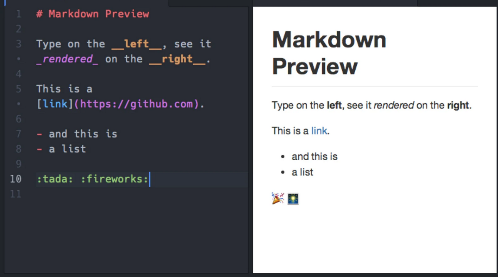

**Main Source:**

- **[Markdown — Wikipedia](https://en.wikipedia.org/wiki/Markdown)**

**.md** file format or Markdown is a markup language used to style plain text with format elements, such as heading, list, images, bold, italic, underlined text, hyperlinks, etc. Markdown can be easily converted into [HTML](/cs-notes/internet-and-web/html). In fact, it supports HTML and CSS styling within it.

Markdown uses a set of symbol to indicate which part of the plain text to be formatted. For example, surrounding a text around double `*` like `**Hello**` will make the text bold. Using `#` will create a heading based on the amount of `#`.

  
Source: https://dev.to/developer_anand/learn-basic-markdown-33nl

### Markdown Parsing

Markdown files with its format element is [parsed](/cs-notes/compilers-and-programming-languages/parsing) and converted into the corresponding styled HTML elements.

1. **Tokenization**: Markdown text is broke down into tokens. Tokens are the elements of the Markdown syntax, such as headers, lists, paragraphs.
2. **Parsing**: Tokens are identified and analyzed to build a hierarchical representation of the document. It identifies the nesting of elements, such as nested lists, and creates a data structure (usually [tree](/cs-notes/data-structures-and-algorithms/tree)) to represent the document's structure.
3. **Conversion**: The Markdown processor applies transformation rules to convert the Markdown tokens and structure into the desired output format. For example, when it sees `#` behind a text, it may generate HTML heading tags (`<h1>`), and fill the corresponding text inside it.
4. **Rendering**: The converted HTML is rendered and displayed by [web browser](/cs-notes/internet-and-web/web-browser).

  
Source: https://accu.org/journals/overload/26/146/balaam_2532/
