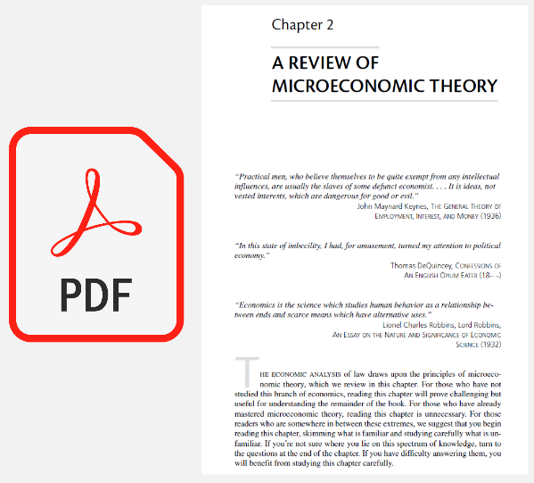
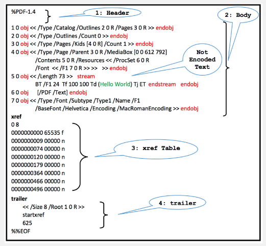

**Main Source:**

- **[PDF — Wikipedia](https://en.wikipedia.org/wiki/PDF)**

**PDF (Portable Document Format)** is a file format developed by Adobe in 1992 used to present documents, text formatting, images, and other interactive media such as, annotation, form-fields, video, etc. PDF is designed to be cross-platform, meaning they can be viewed and accessed on different operating systems and devices with the appropriate PDF reader installed.

The content of PDF itself is in binary format with the ASCII encoding for text contents. PDF uses a variety of compression algorithm such as LZW (Lempel-Ziv-Welch), FLATE (ZIP, in PDF 1.2), and JPEG. PDF also supports encryption with 256-bit [AES encryption](/computer-security/aes) for securing the content of the file.

  
Source: https://en.wikipedia.org/wiki/PDF

### PDF Structure

PDF has 4 main components, where the body is the actual content of the document.

1. **Header**: The header is the starting point of a PDF file and contains information about the version of the PDF specification. The header format looks like `%PDF-1.x` where `x` is a version number.
2. **Body**: The content of PDF file is self-contained in a container called object. The object can be text, images, fonts, or other types of data, it also supports other nested object.
3. **Cross-Reference Table (xref)**: The cross-reference table contains a list of all objects in the file, their byte offsets, and their status (whether they are still in use or not). This table allows for efficient random access and updating of the file.
4. **Trailer**: The trailer section provides essential information about the PDF file, including the location of the cross-reference table, the total number of objects in the file, the root object of the document, and the end of file marker.

  
Source: https://www.researchgate.net/figure/An-example-of-a-simple-PDF-file-structure-that-consists-of-one-page-that-contains-a_fig1_326102942
