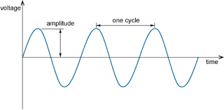
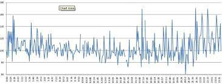
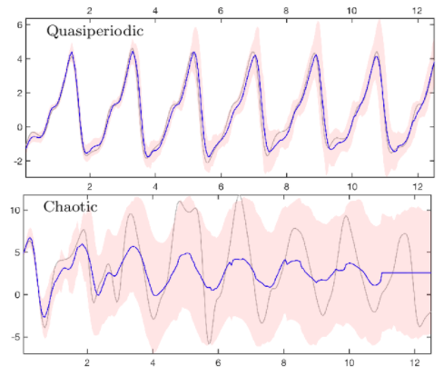
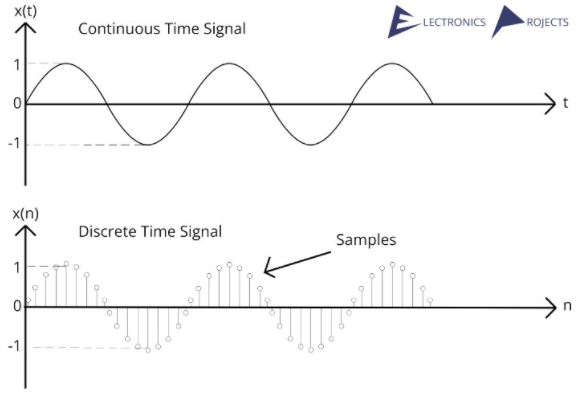
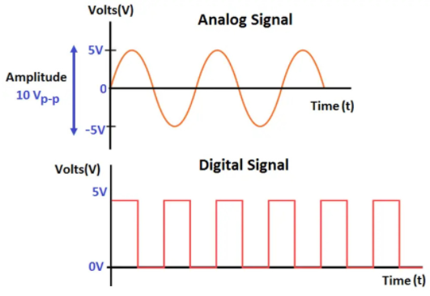

**Main Source:**

- **[Signal — Wikipedia](https://en.wikipedia.org/wiki/Signal)**

**Signal** refers to a function, variable, or quantity that carries information. It can represent different types of data or information, such as electrical, acoustic, optical, or digital information.

Example of signal:

- Audio signal from sound wave.
- Voltage signal from electronic devices.
- Image, can also be represented in signal by their pixels color.

### Types of Signals Based On Periodicity

- **Periodic signal**: A periodic signal repeats its pattern over time at regular intervals. This means that the signal waveform or pattern recurs identically after a specific time duration called the period.

    
  Source: https://www.open.edu/openlearn/science-maths-technology/exploring-communications-technology/content-section-1.1

  Examples of periodic signals include sine waves, square waves, sawtooth waves, triangle waves, semicircle waves, etc.

    
  Source: https://byjus.com/maths/fourier-series/

- **Non-periodic signal**: Also known as aperiodic signal or transient signal, it doesn't exhibit repetitive patterns over time. Examples of non-periodic signals include a single pulse, a burst of noise, or a speech signal.

    
   Source: https://www.k-space.org/Class_Info/EE470/SigSys_chapter1_lec.pdf

- **Quasi-periodic signal**: Quasi-periodic signal exhibit a pattern that is similar to periodic signals, but not exactly identical. They have a repetitive nature, but with slight variations or irregularities.

    
   Source: https://www.researchgate.net/figure/Predictability-Periodic-quasi-periodic-and-chaotic-regimes-Prediction-Zt-x-of_fig2_341395962

### Types of Signals Based On Continuity

- **Continuous Time Signal**: Continuous-time signal are defined and exist for all values of time within a specified interval. They are represented by a continuous function of time. Examples of continuous-time signals are typically encountered in analog systems or natural phenomena including audio signals, analog electrical signals, sine waves, etc.
- **Discrete-Time Signal**: Discrete-time signal are defined only at specific instances or discrete points in time. They are represented by a sequence of values called _sample_, which is taken at specific time intervals or time instances. Discrete-time signal are commonly encountered in digital systems including digital audio signals, sampled analog signals, and sequences of numbers representing measurements or data such as image colors.

    
   Source: https://electronicsprojects.in/signals_and_systems/continuous-time-signal-and-discrete-time-signal-difference-diagram-and-information/ (with modification)

### Types of Signals Based On Representation

- **Analog signals**: Analog signals are continuous-time signals that represent physical quantities with a continuous range of values. They can take on any value within a specified range. Analog signal typically represent varying voltage or current levels. Examples of analog signals commonly encountered in natural phenomena including audio signals, analog electrical signals, and continuous variations of physical quantities such as temperature, pressure, or light intensity.
- **Digital signals**: Digital signals are discrete-time signals that represent information using a finite set of discrete values or levels. These discrete values are typically represented by binary digits, or bits, such as 0s (low voltage) and 1s (high voltage). Digital signal are commonly encountered in digital world example of it includes digital audio signals, binary data streams, and sequences of discrete values representing measurements or data.

    
  Source: https://instrumentationtools.com/what-are-analog-and-digital-signals-differences-examples/
