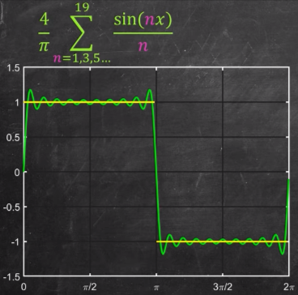

**Main Source:**

- **[Intro to FOURIER SERIES: The Big Idea — Dr. Trefor Bazett](https://youtu.be/wmCIrpLBFds)**

**Fourier series** is a mathematical method for representing (approximating) a periodic function as a sum of sine and cosine functions with different frequencies.

Common types of waves exhibit sine or cosine-like pattern. With Fourier series, we can even represent a square or triangle waves.

  
Source: https://byjus.com/maths/fourier-series/

### Approximating Square Wave

A function is called periodic when it satisfies the following: $f(t + T) = f(t)$. This means the function will repeat its values at some intervals or periods.

  
Source: https://www.analyzemath.com/function/periodic.html

A square wave like below is considered as a periodic function.

  
Source: https://youtu.be/wmCIrpLBFds?t=89

We will attempt to create a function that behaves similarly like that square wave using just sine waves. With a single sine wave, we will get a pretty bad approximation. We see that the square waves always output -1 or 1, while our sine wave output a continuous value between them, so our approximation is still inaccurate.

  
Source: https://youtu.be/wmCIrpLBFds?t=131

Here, a closer look at the approximation using $\frac{4}{\pi} \sin(x)$ function. We should aim to match the sine wave with the square wave's pattern.

  
Source: https://youtu.be/wmCIrpLBFds?t=195

To improve our approximation, we will add another sine wave ($\frac{1}{3} \sin 3x$) by multiplying them. This will cause some amplitude to decrease and increase where they are required (we must add the appropriate wave). This is the constructive and destructive interference property of waves, in which two waves added together will either add up (constructive interference) or cancel each other out (destructive interference).

  
Source: https://youtu.be/wmCIrpLBFds?t=221

The addition results in better approximation.

  
Source: https://youtu.be/wmCIrpLBFds?t=257

We can keep adding sine wave until we are satisfied with the result.

  
Source: https://youtu.be/wmCIrpLBFds?t=312

#### Gibbs Phenomena

Now that our function looks square-ish, we encounter a problem in our series of sine wave. While approximating a discontinued function, such as the square wave, the Fourier series attempts to "fill in" the gaps with the sum of the sine and cosine functions, so that a continuous function can look like a discontinuous function. However, the sum of the infinite number of sine and cosine functions is not able to perfectly match the discontinuous function, resulting in the overshoot or ringing effect.

  
Source: https://youtu.be/wmCIrpLBFds?t=384

This is a fundamental limitation in representing discontinuous functions using Fourier series. Some method, such as [filtering](/cs-notes/digital-signal-processing/filtering) can dampen the oscillations near the discontinuities.

### Fourier Series Formula

The formula for Fourier series for a periodic function $f(x)$ with period of $2\pi$.

  
Source: https://www.cuemath.com/fourier-series-formula/

So, with a given function $f(x)$, we can compute this formula to obtain the approximation of that function with the sum of sine and cosine function.

### Complex Fourier Series

Fourier series is represented as sum of sine and cosine wave. We may also represent this as a sum of complex exponential functions, utilizing the Euler's identity.

The formula for complex Fourier series with period of $2\pi$:

  
Where $n$ is frequency and $i$ is the imaginary terms.

  
Source: https://pidlaboratory.com/4-complex-fourier-series/ (With modification)
