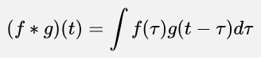

**Main Source:**

- **Various source from Google and YouTube**

**Convolution** is a mathematical operation that is often used in signal processing to combine two functions in the time-domain to produce a third function that describes their interaction.

The convolution of two signals in the time domain can represent the overlap between the two signals.

  
Source: https://www.statisticshowto.com/convolution-integral-simple-definition/

Convolution of two function $f(t)$ and $g(t)$ is defined as follows:

- $\ast$ is the convolution operator
- $\tau$ is just a placeholder variable.

The formula represents the infinite sum (integration) of the product between two function at different time delays. When we multiply two function at different time delays, we are essentially adding together the waves of the two signals at different frequencies.

### Convolution Theorem

Convolution and [Fourier transform](/digital-signal-processing/fourier-transform) is related, which is described by the following property:

The Convolution theorem tells us that Fourier transform of a convolution between two function is the equal to the product of their individual Fourier transforms. This theorem provides a way of relating the time domain and frequency domain representations of signals.

The Fourier transform of a signal is a mathematical representation of the signal in the frequency domain. The frequency domain is a way of looking at a signal that breaks it down into its constituent frequencies.

By multiplying both Fourier transform of the signals together, we are essentially multiplying together the frequencies of those two signals. Multiplying frequencies together means we are adding them up.

According to the theorem, that product is the same as the convolution of two signals in the time domain, which is then transformed into the frequency domain.

  
Source: https://www.sharetechnote.com/html/RF_Handbook_TimeDomain_FrequencyDomain.html

:::note
This theorem can be useful to efficiently compute the convolution of two function in the frequency domain, that is by multiplying the Fourier transform of each function, then doing an inverse Fourier transform.
:::
