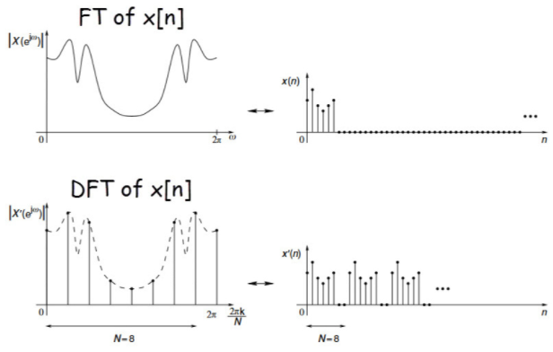
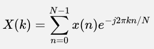

**Main Source:**

- **Various source from Google and YouTube**

**Discrete Fourier transform (DFT)** is the discrete signal version of the [Fourier transform](/digital-signal-processing/fourier-transform). DFT is widely used in digital signal processing because computers can only process discrete signals. One application of DFT is removing noises or filtering specific frequencies from digital signal.

  
Source: https://www.ee-diary.com/2023/05/what-is-discrete-fourier-transformdft.html#

### How does it work

The formula for DFT is:

- $n$: Sample index
- $N$: Number of samples
- $k$: Frequency bin index
- $X(k)$: The k-th frequency component of the signal
- $x(n)$: The n-th sample of the input sequence
- $j$: The imaginary unit
- $e^{-j2 \pi k n / N}$: The exponential term involving $2\pi k n /N$ to convert frequency from cycles per second to radians per sample.

A discrete signal is made by [sampling](/digital-signal-processing/sampling) a continuous signal. The sampling process takes a sequence of equally spaced point of the continuous signal. The number of sample is called $N$ and the number of samples must be an integer power of 2.

In FT, we multiply the exponential term (representation of sine and cosine waves) with $f(t)$, the signal function. While in DFT, the signal function is replaced by the n-th sample $x(n)$, which increase up to the number of sample $N$. The sample is represented as complex-number vector.

The resulting product is a complex number that represents the contribution of that specific sample to the k-th frequency component of the signal in the frequency domain. It has a magnitude and a phase angle that depend on the value of the sample $x(n)$ and the frequency bin index $k$.

#### Computation

FT is a continuous-time transform that involves integration over an infinite time interval. Its computation is typically performed using numerical integration techniques. FT can be computationally expensive for large bandwidth or a complex frequency structure.

In DFT, with input signal and the exponential term being represented in vector, the multiplication between them result in a matrix multiplication. With a straightforward algorithm, DFT can be computed in $O(N^2)$ time, where $N$ is the number of samples in the signal.

Next topic is an improvement for DFT algorithm which is the [Fast Fourier transform (FFT) algorithm](/digital-signal-processing/fast-fourier-transform).
