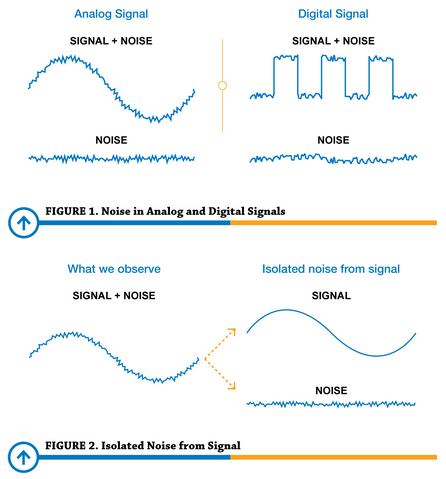
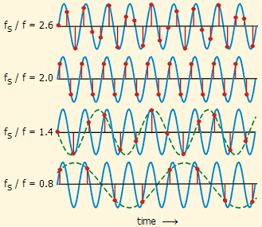

**Main Source:**

- **[Sampling, Aliasing & Nyquist Theorem — 0612 TV w/ NERDfirst](https://youtu.be/yWqrx08UeUs)**
- **Other sources from Google and YouTube**

**Sampling** is the technique of taking some number of representative data from a group of data. In digital signal processing, sampling is used to convert a continuous-time signal into a discrete-time signal.

A continuous signal can contain an infinite amount of information within the time it's defined. In the digital world, processing an infinite amount of information is impractical. Digital signal processing overcomes this by taking a finite number of data points from the original signal to create its finite version. This process is what we call sampling, and the number of samples taken affects the accuracy of the reconstructed signal.

  
Source: https://en.wikipedia.org/wiki/Sampling_%28signal_processing%29

Given some continuous signal, we choose the number of sample and the method to sample it. For example, we may take one data point on each second of the signal. Using this, we will know the amplitude or the value of the continuous signal every second.

### Sampling Rate

Sampling rate, also known as **sampling frequency**, is the number of samples taken per unit of time (usually second (s)) during the sampling process. It is typically measured in samples per second and is denoted in hertz (Hz).

If we are taking just one data point on each second of the signal, this mean our sampling rate is 1 Hz. However, a 1 Hz sample rate is extremely low, and would result in a very poor reconstruction of the original continuous signal. We would not be able to determine what happens during the milliseconds or microseconds within that 1-second period.

A high sampling rate means more samples are taken per unit of time, resulting in a more detailed and accurate representation of the original signal, at the cost of more data set that needs to be stored, transmitted, and processed. For example, in audio applications, 44.1 kHz is a common sampling rate. This means that every second, we will take 44,100 data point.

  
Source: https://routenote.com/blog/what-is-sample-rate-in-audio/

#### Sampling Problems

Sampling signals could introduce several challenges:

- **[Noise](/cs-notes/digital-signal-processing/denoising)**: Noise is an unwanted signal that gets added to the desired signal during the sampling process. This noise can come from various sources, including the sampling device, the environment, or the signal itself. For example, a microphone record the analog sound wave and converts it into a discrete digital signal. While recording, we may unintentionally capture sounds like traffic, people talking, or household appliances.

    
   Source: https://www.predig.com/whitepaper/reducing-signal-noise-practice

- **Aliasing**: Aliasing is a phenomenon where we fail to reconstruct the original signal accurately. This occurs when the sampling rate is insufficient, making loss of detail in the reconstructed signal.

    
   Source: https://www.physik.uzh.ch/local/teaching/SPI301/LV-2015-Help/lvanlsconcepts.chm/Aliasing.html

### Nyquist Theorem

#### Nyquist-Shannon Sampling Theorem

Also known as **Nyquist rate**, it's a fundamental principle in digital signal processing to accurately reconstruct a continuous analog signal from its discrete samples. The theorem states that sampling rate should be greater than or equal to twice the bandwidth of the signal.

Mathematically, this is written as: $\text{Sampling rate} \ge 2B$, where $B$ is the highest frequency in the signal.

  
Source: http://195.134.76.37/applets/AppletNyquist/Appl_Nyquist2.html

#### Nyquist Frequency

Also known as **folding frequency**, represents the maximum frequency that can be accurately represented in a discrete digital signal without introducing aliasing.

It is written as: $f_{\text{Nyquist}} = \frac{\text{Sampling rate}}{2}$

Nyquist rate and Nyquist frequency are related. Nyquist rate specifies the required sampling rate, while the Nyquist frequency represents the highest frequency that can be accurately reproduced from the sampled data, by sampling as much as the Nyquist rate. They both provide principle to avoid aliasing, while also avoiding oversampling.

For example, Audio CDs have a sampling rate of 44.1 kHz. This means that the Nyquist frequency, or the highest frequency that can be perfectly reconstructed is 22.05 kHz. In other word, any frequency higher than that may be aliased. However, this is enough to represent the human hearing range, which is up to 20 kHz.

### Upsampling & Downsampling

Upsampling and downsampling are signal processing operations that involve changing the sampling rate of a discrete signal.

- Upsampling increases the sampling rate of a signal by inserting additional samples between existing samples. A common method to do this is by taking an average of two data sample, to get the third sample as an addition.
- Downsampling reduces the sampling rate of a signal by removing samples from the original signal. It can be done by applying a **low-pass filter**, also known as an **anti-aliasing filter**, which can remove high-frequency components above the new Nyquist frequency.

    
  Source: https://www.divilabs.com/2014/07/upsampling-interpolation-of-discrete.html

:::tip
See also [sampling in digital image](/cs-notes/computer-graphics/sampling).
:::
