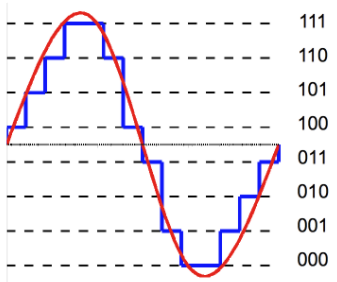
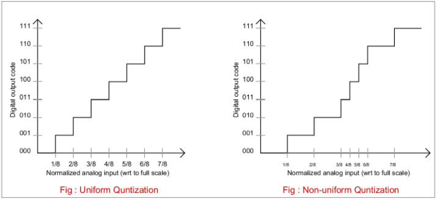

**Main Source:**

- **[5. Quantization - Digital Audio Fundamentals — Akash Murthy](https://youtu.be/1KBLguIXL30)**

**Quantization** is the process of simplifying a set of values by grouping them into intervals. It works by dividing the range of possible values into smaller intervals and assigning each value to the nearest interval. This process helps to reduce the complexity of the data, thus reducing the amount of data that needs to be stored.

In the image below, the signal is sampled and limited to just 8 data values.

  
Source: https://www.differencebetween.com/difference-between-uniform-and-nonuniform-quantization/

However, quantization may introduce some inaccuracy during reconstruction. We can see that some blue lines, representing the sampled points, deviate from the original red signal. Some data samples have to be rounded up or down to the nearest defined data point, resulting in inaccuracy.

### Quantization Level

Typically, the number of possible values is expressed as a power of 2, as this simplifies the digital representation and processing (allows for easy representation using [binary](/computer-and-programming-fundamentals/number-system#binary)). The number of bit is called the **bit depth**, which determines the resolution or precision of the quantized representation.

The number of possible output or representation is mathematically written as: $\text{quantization levels} = 2^{(\text{bit depth})}$.

The difference between the actual analog signal value with the nearest quantization level is called **quantization error** or **quantization noise**.

### Uniform & Non-uniform Quantization

These two are techniques to quantize signals.

- **Uniform quantization**: Intervals between the quantization levels are evenly spaced. In other words, the range of all possible values is divided into equal intervals.
- **Non-uniform quantization**: Intervals between quantization levels are not evenly spaced. Instead, the intervals are non-uniformly spaced to allocate more quantization levels in regions of higher signal importance or sensitivity, and fewer quantization levels in regions of lower importance.

  
Source: https://analogquantized.wordpress.com/tag/non-uniform-quantization/
