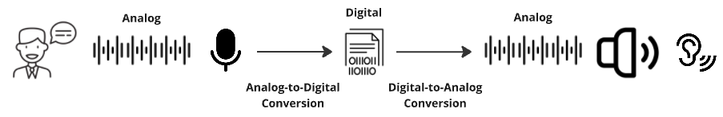
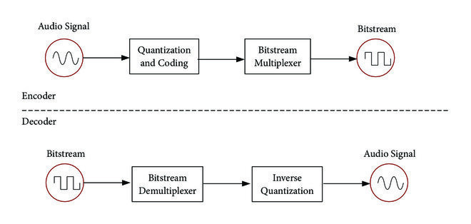
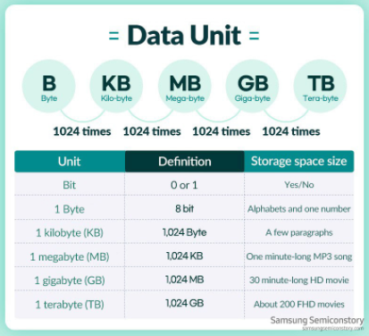

**Main Source:**

- **[Processing: Encoding & Decoding Analog & Digital Signals — Christopher Kalodikis](https://youtu.be/qSEmEpv5ct8)**
- **Other sources from Google and YouTube**

Signals are sent and received by digital systems. They go through conversion process during the transmission.

- **Encoding**: Encoding refers to the process of converting a signal or data into a specific format or code suitable for transmission, storage, or processing.
- **Decoding**: Decoding, on the other hand, is the reverse process of encoding. It involves recovering the original signal or data from its encoded representation.

For example, when we record sound using a microphone, it captures the sound wave as an analog signal. To store it on a computer, the signal needs to be converted into digital form. This conversion process is called encoding, where the analog signal is transformed into a format that computers can understand. Once saved in digital form, the data can be decoded or converted back into a continuous analog signal, such as through a speaker, so that we can hear the sound.

  
Source: https://www.sltinfo.com/the-encode-decode-model-of-communication/

### Media Coding

Other media data, such as video or images are also represented with binary data, which we can consider as digital signal. They are a collection of discrete digital values that collectively represent something.

After the encoding process, the data can be further processed in its encoded form. This can be a technique like [compression](/digital-signal-processing/compression), which may remove redundancies in its encoded representation to represent it more efficiently.

In the decoding process, the encoded media will be converted back into its original format. In the case of an audio player, the received audio file should be decoded, which may include decompressing specific compression algorithm (i.e., doing their inverse process).

  
Source: https://www.researchgate.net/figure/The-structure-of-encoding-decoding-audio-signal-in-MPEG_fig1_325993251

### Unit of Data

In the digital world, any sort of information is represented as [binary](/computer-and-programming-fundamentals/number-system#binary) data. Binary is a number system where a digit can only be 0 or 1. A digit of binary is often called **bit**.

:::note
Complex information is possible to be represented in digital world because of each bit is combined to represent a wide range of values and information. For example, a bit can only represent two information (i.e., 0 or 1). If we have two bits, we are able to represent 4 different information (i.e., 00, 01, 10, or 11). As we increase the number of bits, the amount of information possible to be represented increase exponentially by the power of two.
:::

Multiple bits are grouped together to form a **byte**. A byte is a group of 8 bits, and it can represent 256 different values (i.e., $2^{8} = 256$). A group of 1024 bytes is equal to 1 kilobyte. A group of 1024 kilobytes is equal to 1 megabyte, and so on.

With 1 megabyte, there are 8,388,608 bits. The possible unique information that can be represented is $2^{8,388,608}$, which is an incredibly large number. This shows how it is possible to store and represent information in digital systems using just binary (0s and 1s).

  
Source: https://semiconductor.samsung.com/support/tools-resources/dictionary/bits-and-bytes-units-of-data/

### Data Representation

#### Information Interchange

ASCII (American Standard Code for Information Interchange) is a character encoding standard for electronic communication. ASCII was first published in 1963 by the American Standards Association (now known as ANSI).

ASCII is a way for digital systems to represent character, such as alphabet or number. It is considered as an encoding scheme because it converts original information (the character) into other code.

ASCII works by assigning a unique 7-bit binary number to each character. This mean every character in the ASCII will have different combination of binary digits. This allows for a total of 128 different characters, including letters, numbers, punctuation marks, and control characters, possible to be represented.

Below is an ASCII table, which serve as reference table that shows how the 128 characters that are defined based on the standard. Based on the table, if we were to encode character "A", we would need to represent it in its binary equivalent, which is "01000001".

  
Source: https://youtu.be/H4l42nbYmrU

ASCII has limited uses due to only being able to represent 128 different characters. These days, ASCII is no longer used, instead we use other standard called [Unicode](/computer-and-programming-fundamentals/data-representation#unicode).

:::info
The amount of data transferred in a unit of time is called **bandwidth** or **bit rate**.
:::

#### Image & Color Representation

Image is represented by a grid pixel. Pixel is the smallest unit of information in an image. A pixel typically owns 3 color values which are red, green, and blue. Each color is represented as 1 byte or 8 bit (0-255), which means there are 256 different combination for each color. These three colors are combined to construct a single pixel in an image, making it able to represent 16.777.216 different color.

:::tip
Find out more about [image and color](/computer-graphics/computer-images-part-1) and about [data representation in computer](/computer-and-programming-fundamentals/data-representation)
:::
