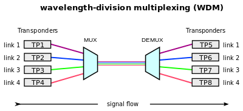
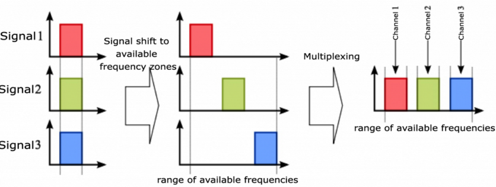
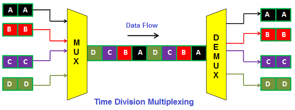
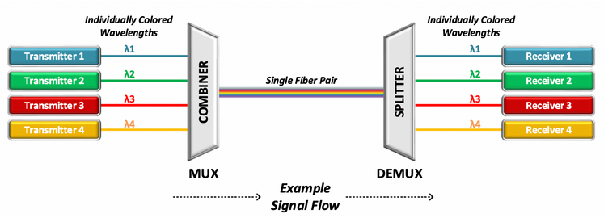
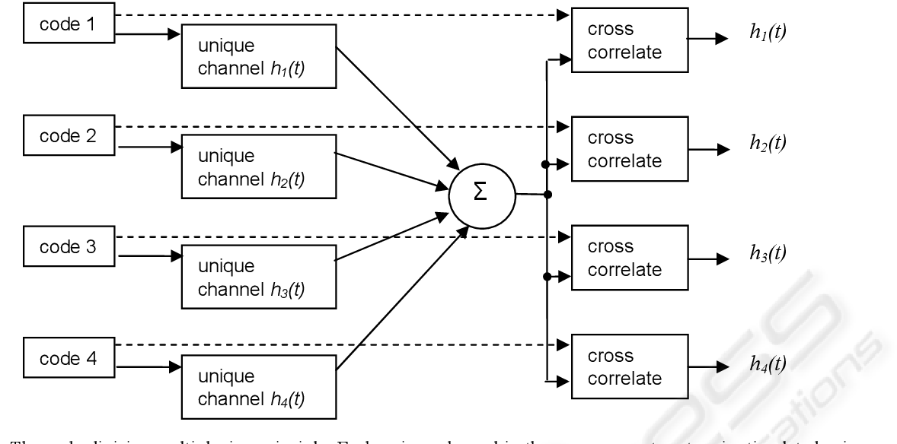

**Main Source:**

- **[Frequency Division Multiplexing (FDM) Explained — ALL ABOUT ELECTRONICS](https://youtu.be/UwWmDwbsDBs)**
- **[Multiplexing — Wikipedia](https://en.wikipedia.org/wiki/Multiplexing)**
- **[Frequency-division multiplexing — Wikipedia](https://en.wikipedia.org/wiki/Frequency-division_multiplexing)**
- **[Time-division multiplexing — Wikipedia](https://en.wikipedia.org/wiki/Time-division_multiplexing)**
- **[Other sources from Google and YouTube]**

**Multiplexing** is a method to combine multiple signals into a single signal for transmission. It is a way to efficiently transmit signal by transmitting them together. On the receiving end, **demultiplexing**, which is reverse process of multiplexing is done to extract the original individual signals.

  
Source: https://en.wikipedia.org/wiki/Multiplexing

Only a single [medium](/digital-signal-processing/signal-transmission-medium) (also called a channel) is needed to transmit multiple signals. This saves bandwidth, capacity, and the cost of the physical infrastructure required for transmission.

When combining multiple signals through multiplexing, there is a risk of losing the original individual signals if the process is not done carefully. For the demultiplexer to correctly separate the combined signals back into their original individual signals, it needs to have information about how the signals were originally combined during the multiplexing process.

### Frequency Division Multiplexing (FDM)

FDM is a multiplexing technique that combines signals by separating each signal based on their frequency. Signals with the same frequency will be shifted to make sure they don't overlap with each other.

In the actual application, each channel or receiver in an FDM system is assigned a specific range of frequencies that they are tuned to receive. This frequency assignment is known to both the transmitter and the receiver, allowing them to communicate without interference from other signals.

FDM are typically used by analog signals such as FM radio, analog television, or analog telephone. For example, multiple radio signals are transmitted together, but each of them has their own particular FM.

  
Source: https://electronicspost.com/what-is-multiplexing-frequency-division-multiplexing-fdm-and-time-division-multiplexing-tdm/

### Time Division Multiplexing (TDM)

TDM combines multiple signals onto a single transmission medium by allocating specific time slots to each signal. Similar to FDM, each individual signal is assigned a specific time slot within the overall time frame. At the receiving end, the demultiplexer uses the timing information to identify and then extracts the appropriate signal from each time slot and routes it to the correct destination.

TDM is used in:

- Traditional telephone (T1 and E1 carrier)
- Digital Subscriber Line (DSL)
- GSM telephone system (2G networks)

  
Source: https://www.spiceworks.com/tech/networking/articles/what-is-tdm/

### Wavelength Division Multiplexing (WDM)

WDM combines multiple signals onto a single transmission medium by separating each signals by their wavelength. WDM is typically transmitted together through an [optical fiber](/digital-signal-processing/signal-transmission-medium#guided-transmission).

WDM is used in:

- High-speed internet infrastructure
- Cable Television (CATV)
- Submarine Communication Systems

  
Source: https://www.wwt.com/article/how-does-wdm-technology-work

### Code Division Multiplexing (CDM)

CDM combines multiple signals onto a single transmission medium by separating all signals using unique code identifier.

Each signal is encoded using some unique codes, the encoded signals are then combined. At the end, the signals are separated and extracted using the corresponding codes. The separated signals are then decoded to recover the original data or information.

CDM is used in:

- 3G and 4G Networks
- Wireless communication
- Satellite Communication

  
Source: https://www.semanticscholar.org/paper/Wide-Bandwidth%2C-High-Frame-Rate-Electrical-a-Code-McEwan-Holder/551f0f673fa93e8cfa3a9deee0ea2189ff057b12/figure/0
