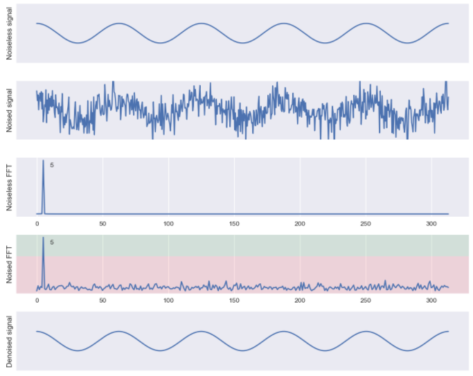
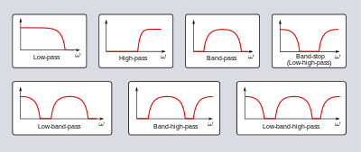

**Main Source:**

- **Various source from Google and YouTube**

In digital signal processing, **filtering** refers to the process of modifying or manipulating a digital signal to remove unwanted components or extract specific information. For example, unwanted components can be removed by applying techniques like the [Fourier Transform](/cs-notes/digital-signal-processing/fourier-transform), which separates signals based on their frequency components, allowing the removal of a particular frequency.

  
Source: https://towardsdatascience.com/the-fourier-transform-4-putting-the-fft-to-work-38dd84dc814

Applying filter works by selectively reducing or amplifying certain frequency components based on the desired filtering characteristics.

Some common filtering includes:

- **Low-pass filter**: Allows low-frequency components of a signal to pass through while reducing higher-frequency components.
- **High-pass filter**: Allows high-frequency components of a signal to pass through while or reducing lower-frequency components.
- **Band-pass filter**: Filters out both low and high-frequency content, allowing only the frequencies within the desired range to be present in the output signal.
- **Band-stop filter**: Reduces a specific range or band of frequencies while allowing frequencies outside that range to pass through.

  
Source: https://en.wikipedia.org/wiki/Filter_(signal_processing)
