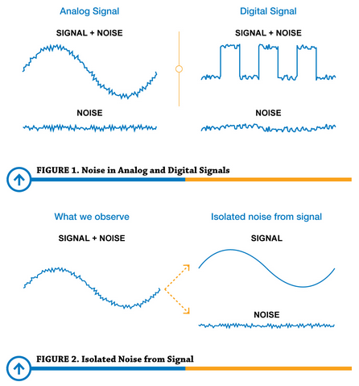
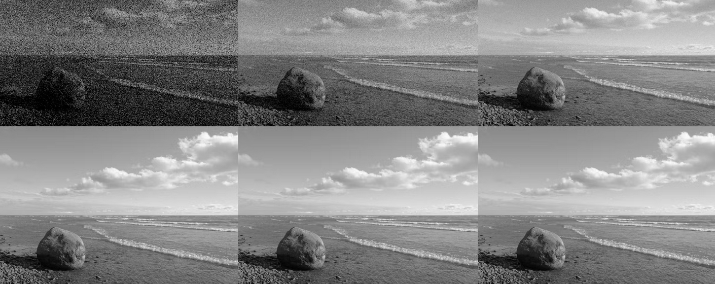
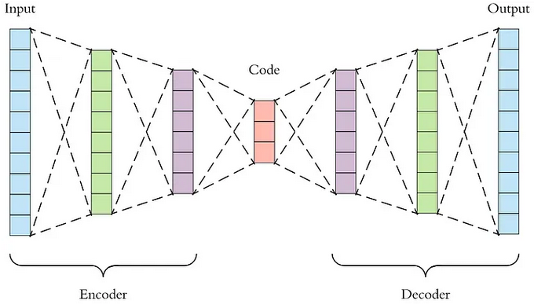

**Main Source:**

- **Various source from Google and YouTube**

**Noise** is any unwanted or interfering signal that is added to the original signal while it is being processed, transmitted, or captured. This noise can come from a variety of sources, including the sampling device, the environment, or the signal itself.

For example, a microphone record the analog sound wave and converts it into a discrete digital signal. While recording, we may unintentionally capture sounds like traffic, people talking, or household appliances.

  
Source: https://www.predig.com/whitepaper/reducing-signal-noise-practice

  
Source: https://www.pixop.com/blog/image-noise-causes

**Denoising**, also known as **noise reduction** is the process of reducing or removing unwanted noise or interference from a signal. The idea of denoising is to identify the difference of characteristics, such as frequency, amplitude, and phase between the legit signal and the unwanted signal.

For example, in an audio signal, while a relaxing music plays in the background, a sudden jump in amplitude of another background sound may be considered a noise.

Method of denoising depends on the noise characteristics, some common denoising method includes:

- **[Filtering](/digital-signal-processing/filtering)**: Applying filter like low-pass would filter out the high frequency noise.
- **Transform Function**: Transform function such as [DFT](/digital-signal-processing/discrete-fourier-transform), [DCT](/digital-signal-processing/discrete-cosine-transform), or [wavelet](/digital-signal-processing/wavelets) transform the signal on their time-domain into frequency domain, which we can identify the noise by analyzing signal that is separated by their frequency.
- **Statistical Methods**: Statistical methods involve exploiting statistical properties of the signal and noise to estimate and remove the noise. Example of statistical methods are mean filter, median filter, Bayesian filter. For example, mean filter works by replacing each signal value by the average of that signal's neighbor value. This will introduce blur or smooth out edges in the signal.

### Machine Learning Denoising

Involves the use of machine learning algorithms to remove noise from signals. Machine learning algorithms can learn the characteristics of noise and signal, and use this knowledge to remove the noise without distorting the signal.

The idea of this is the same as general machine learning technique. A model is trained to be able to identify pattern and make prediction. Machine learning technique has advantages due to the adaptability to different noise types and able to recognize complex noise patterns.

Some techniques are:

- **[Autoencoders](/deep-learning/autoencoder)**: Autoencoders are neural networks that are trained to reconstruct a signal from its noisy version. The autoencoder learns to identify the noise in the signal and remove it, leaving the signal intact.
- **[Generative Adversarial Networks (GANs)](/deep-learning/gan)**: GANs are a type of neural network that can be used to generate realistic images. GANs can also be used to remove noise from images by training them to generate images that are similar to the noisy image, but without the noise.

  
Source: https://towardsdatascience.com/applied-deep-learning-part-3-autoencoders-1c083af4d798
