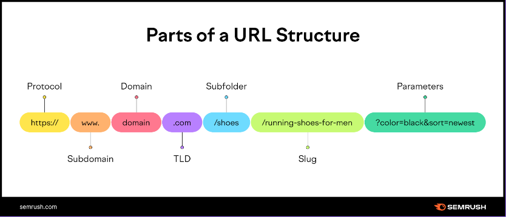

**Main Source:**

- **[URL — Wikipedia](https://en.wikipedia.org/wiki/URL)**

**URL (Uniform Resource Locator)** also the same as **web address** is a string of characters that identifies a web page or resource on the internet. URL provide a standard way of identifying and accessing resources on the internet also is flexible enough to accommodate a wide range of resource types, while also being easy to parse and interpret by software.

### URL Syntax

The syntax of a URL consists of several parts, separated by special characters. Here is a breakdown of the main components of a typical URL:

- **Scheme**: The scheme is the protocol or scheme used to access the resource. It specifies the rules and format for transferring data between the client and the server, and it determines the type of connection that will be established. The most common schemes are `http://` and `https://`, but there are many others, such as `ftp://` for file transfer protocol, and `mailto:` for email addresses.

- **Subdomain**: Subdomain separate different sections or areas of a website or to create separate websites that are related to the main website. For example `mail.google.com` and `maps.google.com` which are subdomain of `google.com`

- **Domain**: The domain name is the name of the website or server that hosts the resource. It is the main part of a website and typically uses a name that is easy to remember. The domain name is then translated into an [IP address](/computer-networking/ip-address) by the [domain name system (DNS)](/computer-networking/dns), which allows the client to locate the server on the internet.

- **TLD (Top Level Domain)**: TLD is the part of domain that is used to classify domain names by their purpose or geographic location. There are two types of TLD:

  - Country Code TLDs: These are TLDs that are tied and commonly used for a specific country or region, such as `.uk`, `.jp`, and `.ca`.
  - Generic TLDs: These are TLDs that are not tied to any specific country or region, such as `.com`, `.org`, `.net`, and `.edu`. Generic TLDs are commonly used for commercial, organizational, and educational websites.

- [**Ports**](/computer-networking/ports): The port number is an optional parameter that can be used to specify the network port to use for the connection. It is typically used when the server is running multiple services or applications on different ports. The default port number for a scheme is usually implied if no port number is specified, such as port 80 for HTTP and port 443 for HTTPS.

- **Path**: The path is the location of the resource on the server, represented as a series of directories or files separated by forward slashes `/`. It specifies the location of the file or resource that the client wants to access, and it can include additional parameters and subdirectories as needed. For example, `/path/to/resource.html` might refer to an HTML file located in the `resource.html` file, which is located in the `to` directory, which is located in the `path` directory.

- **Query String**: The query string is an optional string of parameters that can be appended to the end of the URL, separated by a question mark. It is used to provide additional information or data to the server, such as search terms or user preferences. The query string consists of one or more key-value pairs, separated by an ampersand `&`, and each key-value pair is separated by an equals sign `=`. For example, `?id=1234&name=example` might represent a query string with two parameters, `id` and `name`, with values of `1234` and `example`, respectively.

- **Fragment**: The fragment is an optional component of a URL that specifies a specific location or section within a web page. It is indicated by a hash symbol `#` followed by the name of the anchor or section. The fragment is used to provide a direct link to a specific section of a web page, such as a heading or paragraph, and it can be useful for navigating long or complex pages. For example, clicking [this](/internet-and-web/web-url#url-syntax) will take you the the beginning of this lists.

This is an example URL that brings them all together:
`https://www.example.com:8080/path/to/resource.html?id=1234&name=example#section1`

  
Source: https://www.semrush.com/blog/what-is-a-url/

### Internationalized URL

An internationalized URL (also known as an IDN or Internationalized Domain Name) is a URL that includes non-ASCII characters, such as accented letters, non-Latin scripts, or other characters that are not part of the ASCII character set.

The use of internationalized URLs allows websites to use domain names that are more easily recognizable and memorable to users in different regions and languages. For example, a website in Japan might use a domain name that includes Japanese characters, such as "日本語ドメイン.テスト", which translates to "Japanese domain.test" in English.

Internationalized URLs are encoded using the Punycode system, which allows non-ASCII characters to be converted into ASCII-compatible characters that can be used in a domain name. For example, the Japanese domain name "日本語ドメイン.テスト" would be encoded as "xn--wgv71a119e.xn--zckzah".
