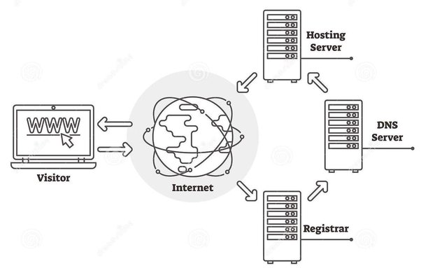
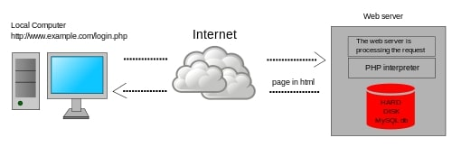

**Main Source:**

- **[What is web hosting? — HOSTINGER](https://www.hostinger.com/tutorials/what-is-web-hosting/)**
- **[Static web page — Wikipedia](https://en.wikipedia.org/wiki/Static_web_page)**
- **[Dynamic web page — Wikipedia](https://en.wikipedia.org/wiki/Dynamic_web_page)**

**Web hosting** is a service that allows you to store your website's files and data on a server that is connected to the internet. A web is typically hosted in a [server](/cs-notes/computer-networking/server), a web hosting service means that we pay someone to keep their computers on and process request and respond to any user who wants to visit our website. This make anyone who communicate with the server possible to access or visit your website.

When someone access a server from their web browser, it sends a request to the server where your website is hosted, and the server responds by sending the necessary files and data back to the user's browser, which displays the website on their screen.

There are several types of web hosting services available, these are some of the most common types:

- **Shared Hosting**: This is the most popular type of web hosting, where multiple websites share the same server resources. Shared hosting is typically the most affordable option, but it can also be slower and less secure than other types of hosting.

- **Virtual Private Servers (VPS)**: VPS hosting is similar to shared hosting, but each website is hosted on a virtual server that has its own dedicated resources. VPS hosting is faster and more secure than shared hosting, but it can also be more expensive.

- **Dedicated Hosting**: With dedicated hosting, you get an entire server to yourself. This option is the most expensive, but it also provides the highest level of performance, security, and flexibility.

- **Cloud Hosting**: Cloud hosting uses a network of servers to host your website, which provides better scalability and redundancy than traditional hosting options.

  
Source: https://www.quora.com/How-does-web-hosting-work

### Static & Dynamic Site

A website can be categorized into two based on how website content is generated and served to user.

#### Static Website

**Static Website** are made up of pre-built HTML, CSS, and JavaScript files that are served to the user's browser as they are. Browser communicate to server to request such files and will render its content and never communicate with the server again. Static website doesn't need to connect to server to compute what to do next. This mean that the content is fixed and will never change, it will only change because of JavaScript interactivity.

  
This site is an example of static site

#### Dynamic Website

**Dynamic Website** on the other hand, are websites that generate content on the fly in response to user requests. Dynamic websites are built using server-side programming languages such as PHP, Ruby, Python, or JavaScript, and are typically backed by a database.

When a user requests a page on a dynamic website, the server processes the request, retrieves the necessary data from the database, and generates the HTML code for the page on the fly. This allows dynamic websites to provide more advanced functionality, such as user authentication, content management, and e-commerce capabilities.

Dynamic Website can be further classified into two:

- Client-Side: Client-side is similar to static as it doesn't involve server, but in client-side website aren't pre-built, the content are generated on the fly.
- Server-Side: Server-side relies on server processing the data and generate the HTML before sending it to the user's browser.

  
Source: https://en.wikipedia.org/wiki/Dynamic_web_page

#### Static Site Generator

**Static site generators** are engines that is able to generate static HTML, CSS, and JavaScript files from a collection of source files, typically written in a markup language such as Markdown or HTML.

Static site generators are often used for websites that do not require frequent content updates or complex functionality, such as blogs, documentation sites, or portfolios.

##### How does it work?

Docusaurus is one of the popular static site generator used to make documentation website made using React JS and some other tools. Docusaurus is basically a template website that is customizable by user, it has pre-made react component and other site functionality. Docusaurus only needs the document from user in markdown template.

The markdown will then be processed and HTML file containing the markdown content will be generated. Docusaurus also provides customization such as theme or other functionality like blog and sidebar. This mean that Docusaurus will just change their default site depending on user desire.

  
Source: https://cloudcannon.com/blog/what-is-a-static-site-generator/
