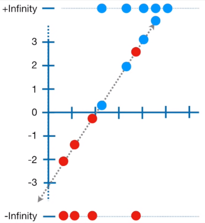

**Main Source:**

- **[The Mathematics of Machine Learning - Zach Star](https://youtu.be/Rt6beTKDtqY?si=2f4Rge2IA_uRCd_1)**
- **[StatQuest: Logistic Regression](https://youtu.be/yIYKR4sgzI8?si=ESKWBDZx7GtPBQGN)**
- **[Logistic Regression [Simply explained] — DATAtab](https://youtu.be/C5268D9t9Ak?si=pLsGLNnww7pq1VRF)**
- **[Logistic Regression Details Pt 2: Maximum Likelihood — StatQuest](https://youtu.be/BfKanl1aSG0?si=6Ec-t_B3m_RL88di)**

### Logistic vs Linear Regression

**Logistic Regression** is another form of regression, which relate to the study of the relationship between dependent variable (the variable we are trying to measure) and independent variable (the variable we believe affect the dependent variable).

Logistic regression is commonly used when the dependent variable is binary or categorical with two outcomes. The goal of logistic regression is to model the relationship between the independent variables and the probability of the binary outcome.

For example, logistic regression can be used to predict whether an email is spam or not based on the independent variable such as email's subject, sender, and content. The model would estimate the probability of the email being spam based on the values of the independent variables.

Logistic regression differs with [linear regression](/machine-learning/linear-regression), while linear regression model the linear relationship between dependent and independent variable using a line, logistic regression uses **logistic function** to model the non-linear relationship to obtain the probability of the binary outcome.

Using a best fit line to solve logistic regression problem is not suitable because the underlying relationship between the independent variables and the binary outcome is not linear. Logistic function instead model the relationship using an S shaped curve.

  
Source: https://youtu.be/Rt6beTKDtqY?si=_mR1DjREpVnYX014&t=533

### Logistic Function

Logistic function, also known as sigmoid function takes any input value and produce 0 or 1 output. As the input approach negative value, the output will approaches 0 which indicate a low probability for the event to occur. Same as the opposite, as the input approach positive value, the output approaches 1, it indicates a high probability of the event occuring.

However, if input is 0, the output probability is 0.5 which means it has equal chance for the event to occur or not.

  
Source: https://medium.com/@shiny_jay/logistic-regression-a9a8749e1e68

The steepness or the slope of the logistic function at any given point represents the rate at which the probability changes with respect to the input. Steeper slopes indicate more significant changes in probability for small changes in the input, while flatter slopes indicate smaller changes in probability.

The z variable in logistic regression is used to adjust the sigmoid function to suit the relationship between dependent and independent variable. The z variable uses the same formula as linear regression:

  
Source: https://youtu.be/C5268D9t9Ak?si=axLEF6TXBSy572Cn&t=243

Where:

- $x_1 ... x_k$: are the independent variable (often referred as weight), the variable that we believe affect the dependent variable. These variables are used to predict the binary outcomes.
- $b_1 ... b_k$: $b_n$ will be multiplied by corresponding $x_n$, these are the independent variable coefficient that measures how "strong" does a particular variable affect.
- $a$: the a is same as y-intercept in a line, it capture the offset of the relationship.

Depending on the case, we could have just 1 independent variable.

### Adjusting Logistic Function

Same as linear regression, the logistic function error will be calculated first and will be adjusted through an optimization process to minimize the error. The common optimization technique used in logistic regression is **Maximum Likelihood Estimation (MLE)**. The point of optimization is to find the best coefficient for the logistic formula.

#### MLE

In the first step, the probability of the event is expanded from 0 to 1 to negative infinity to positive infinity. We then plot each data, where the true value (1) is in positive infinity and the false value (0) is in negative infinity. We also draw a line which is constructed by the z variable in logisitc formula, it's based on the coefficient that we are looking to optimize.

  
Source: https://youtu.be/BfKanl1aSG0?si=BBCqyjSVBspkTKn_&t=286

We will then project each data to the line, and we will observe the y value that correspond to it. The y value for it will be plugged in into a function called logit or log odds:

  
Source: https://www.google.com/search?q=what+is+log+odds

Where we input the y value as p here.

The result will be a number that becomes x-axis value in the logistic function:

  
Source: https://youtu.be/BfKanl1aSG0?si=OP0oSeGGvjfp2JH9&t=317

#### Likelihood

We will then project each point again to the logistic function and get the corresponding y-axis value. Except for the false value (red point), it will be calculated by 1 minus the y-axis value. The result for each data point will be multiplied, and it is called **likelihood**. We can also take the log of the probability and sum all of them, this is called **log likelihood** instead.

  
Source: https://youtu.be/BfKanl1aSG0?si=1hHmHRgzLxAGiBgs&t=481

The result of this likelihood value measure how well does the logistic regression with the specific coefficient performs to predict the data.

We then try again several times using different coefficient to construct the line. We can even use optimmization algorithm such as [gradient descent](/machine-learning/linear-regression#gradient-descent) in linear regression.

  
Source: https://youtu.be/BfKanl1aSG0?si=EsbYzBJ8SSa2bYgC&t=513

In linear regression, we try constructing a line with particular slope and calculate the error, we then use gradient descent to optimize the error function by obtaining the smallest error possible. In logistic regression, instead of error, we use the likelihood value. Also, the MLE which is the maximum likelihood estimation, we maximize the gradient descent instead of minimizing it.

  
Source: https://d2l.ai/chapter_appendix-mathematics-for-deep-learning/maximum-likelihood.html (with modification)

Overall the loss function (function used to measure how well a model performs) used for logistic regression is the log likelihood. The log likelihood is also known as the [binary cross entropy loss](/deep-learning/deep-learning-foundation#binary-cross-entropy-loss).
