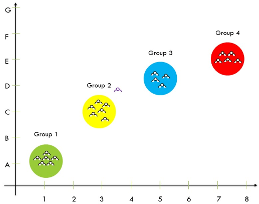
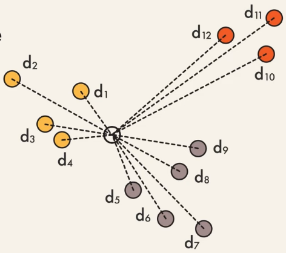
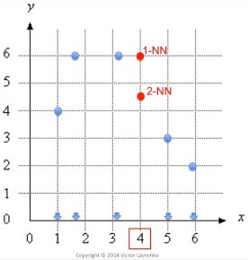
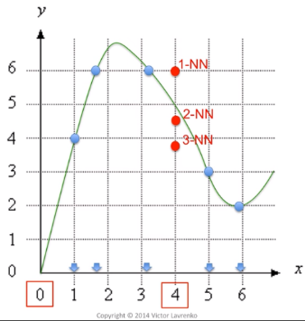

**Main Source:**

- **[K Nearest Neighbors | Intuitive explained | Machine Learning Basics — Intuitive Machine Learning](https://youtu.be/0p0o5cmgLdE?si=FWlD_jYDPkSEFAqY)**
- **[kNN.8 Nearest-neighbor regression example — Victor Lavrenko](https://youtu.be/3lp5CmSwrHI?si=I9SxT8RPXxxPfu6h)**
- **[KNN Regression — Analytics University](https://youtu.be/1ETPnTG2mLg?si=mOg4CRz16njO5b1e)**

**K-Nearest Neighbors (k-NN)** is machine learning algorithm used for both classification and regression tasks. k-NN itself doesn't inherently have features, it doesn't make prediction on the independent variable, it instead makes prediction based on similarities or attributes between each data.

### Classification

The first thing we do in k-NN is to plot the data point. The data point are plotted based on their features. We also need to know what are the points labeled as, in other word, what category do they belong to. The category is often referred as class.

  
Source: https://www.codespeedy.com/k-nearest-neighbor-algorithm-knn/

To classify which groups does a data belongs to, we will calculate distance to each nearest neighbors observed. The number of how many neighbors we want to calculate the distance is the "k". It is called **hyperparameter**, a parameter that doesn't depend on the data itself, it is set by machine learning practitioner.

  
Source: https://youtu.be/0p0o5cmgLdE?si=sv97dptk2tx5TKIt&t=30

We will sort the distance between each points and decide which group should the new data belongs to. Choosing k is very important as it directly influences how the algorithm makes predictions.

  
Source: https://youtu.be/0p0o5cmgLdE?si=aafjE06Goa3atf4B&t=44

### Regression

k-NN can also be used for regression tasks, where the goal is to predict the output of a new unseen data points based on the known output for similar feature values. To do that, we take the features of the k nearest neighbor and take the average of it.

Here is an example for 1-d k-NN where we only consider the feature on x-axis and the 2-d k-NN where we also consider the y-axis.

  
Source: https://youtu.be/3lp5CmSwrHI?si=eYKactnqqBtxBs-7&t=125

If we draw a curve that approximate what should the next data point will be at based on the specific features:

  
Source: https://youtu.be/3lp5CmSwrHI?si=uuU8ht_VprtTEX4Y&t=161
