**Main Source:**

- **[Decision Tree Classification Clearly Explained! — Normalized Nerd](https://youtu.be/ZVR2Way4nwQ?si=tx3IEid6R97igFpY)**
- **[Decision Tree Regression Clearly Explained! — Normalized Nerd](https://youtu.be/UhY5vPfQIrA?si=cis0NaIiQysElvcp)**

**Decision Trees** is a machine learning algorithm also used to solve both classification and regression tasks. A decision tree is a flowchart-like structure where each internal node represents a feature or attribute, each branch represents a decision rule, and each leaf node represents the outcome or class label. The tree is built by recursively partitioning the data based on the values of different features, aiming to create homogeneous subsets of data at each internal node.

A decision tree is like a flowchart or a series of yes-or-no questions that helps make decisions or predictions. It consists of nodes that begins with the root node. At each step, the decision tree asks a question based on a feature (charateristics) and uses the answer to decide which path to follow.

The goal is to ask the most informative questions that help separate the fruits into different categories as accurately as possible. By following the path of questions, the decision tree eventually reaches a leaf node (the last node that has no children), which provides the final classification or prediction.

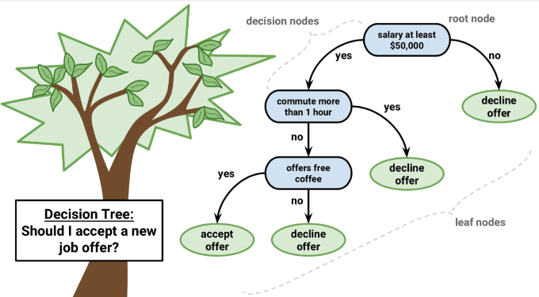  
Source: https://regenerativetoday.com/simple-explanation-on-how-decision-tree-algorithm-makes-decisions/

### Classification

Decision tree is used to classify data with no linear relationship between the features. To begin, we need to have a data with some features and their label (in case of classification, which group they belong to).

For example, the following image has 2 features which is $x_0$ in x-axis and $x_1$ in y-axis, the label or the group are red and green points.

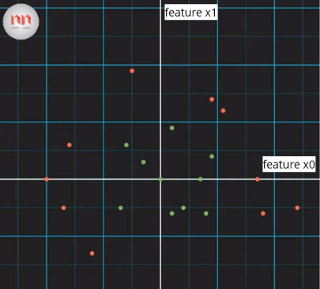  
Source: https://youtu.be/ZVR2Way4nwQ?si=KnrjjRrUxcUb423p&t=126

We will then make a decision tree which will decide if a point should belong to red or green points. The goal of making the decision tree is to classify a new data with unknown label by asking several question until it can be distinguished by any group based on features of data observed before.

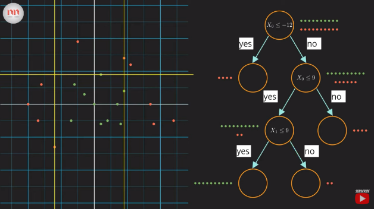  
Source: https://youtu.be/ZVR2Way4nwQ?si=IL5ETPFD168sA8I5&t=201

In this case, the question we are asking is whether the features are greater than or lower than some values (marked by straight line in the plot). By creating this decision tree, we can decided an unknown labeled data.

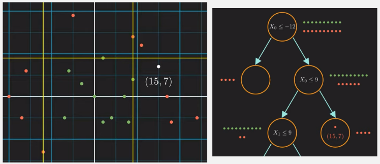  
Source: https://youtu.be/ZVR2Way4nwQ?si=cDHANAN3Xw9o0nfr&t=247

As the problem get more complex, this may be not enough, there are also many possible decision tree we can make to classify the data that result the same with before.

#### Entropy

For example, we can choose to either split the data based on feature $x_1 \le 4$ or $x_0 \le -12$, using the first one, we obtained a fully distinguished red point.

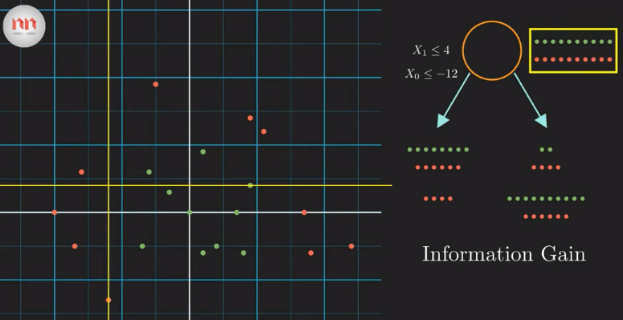  
Source: https://youtu.be/ZVR2Way4nwQ?si=HRwBlguUln_WyG-J&t=387

We need to determine the best feature to split the data at each node of the tree. They help in selecting the most informative features that provide the most significant reduction to fully distinguish the data (remember we need to classify data).

We can measure the impurity of the data in something called **Entropy**. It quantifies the randomness or unpredictability of the target labels in a given set of examples. The entropy is calculated using the formula:

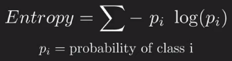  
Source: https://youtu.be/ZVR2Way4nwQ?si=mtRqZ92xXOGmF63W&t=414

The entropy formula is the sum of the probability of all label within the group of data. The first group (root node), has equal red and green point, the probability will be a 0.5. Subtituting 0.5 for the green probability to the entropy formula and summing it with the red probability, we will obtain 1. The result of entropy measure of how unpredictable our data is. The higher entropy means the more unpredictable.

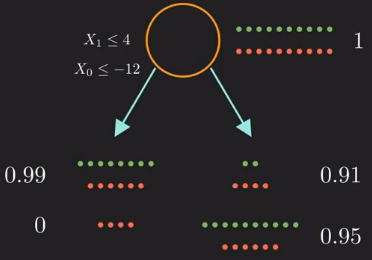  
Source: https://youtu.be/ZVR2Way4nwQ?si=JLeix7YIUmRlxqPE&t=474

#### Information Gain

And now we can measure how useful is the splitting the dataset based on specific feature by using **information gain**. A higher information gain indicates that the feature is more useful in separating the examples into different classes. Here is the formula:

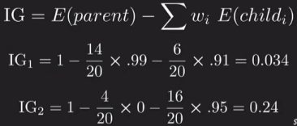  
Source: https://youtu.be/ZVR2Way4nwQ?si=SLLEhq-fNUcLhXuX&t=508

Using the formula, we achieve a higher information gain for the second decision (the $x_o \le -12$), we will then choose to use this question to split at the root node. We will keep doing this until we reached the maximum depth of branch or until we can finally fully distinguish all the data if possible.

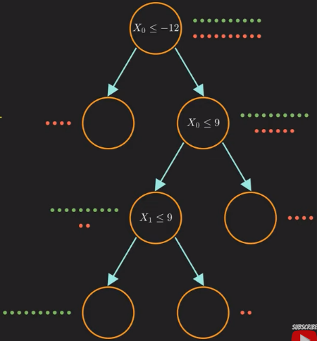  
Source: https://youtu.be/ZVR2Way4nwQ?si=0Z2d9Lfye5MEXgQu&t=602

### Regression

Decision trees can also be used for regression tasks, the goal is to predict a continuous numerical value rather than a categorical label. When applying decision trees to regression, the basic structure and principles are similar to decision trees for classification, but with some differences in the way splits and predictions are made.

Instead of using measures like entropy or information gain, decision trees for regression uses variance as the measure of the impurity of the data. The higher variance means the higher impurity, the variance is calculated using the following formula:

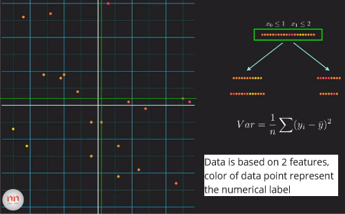  
Source: https://youtu.be/UhY5vPfQIrA?si=FXGyFY6aCQPYlYZy&t=424

After calculating the variance, we can then calculate the variance reduction, it is similar to what information gain is in classification. The higher variance reduction means the better split we have. We will keep doing this again until certain conditions are satisfied.

The splitting process in a regression decision tree involves selecting a feature and a split point that minimizes the chosen error metric. The quality of the split will be measured in mean squared error (MSE) or mean absolute error (MAE).

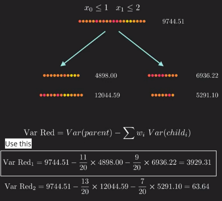  
Source: https://youtu.be/UhY5vPfQIrA?si=S5jc_TZ0jmgT3ceS&t=496
