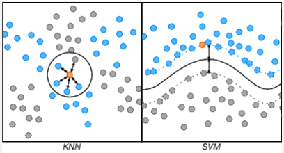
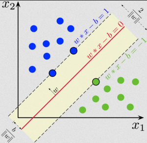
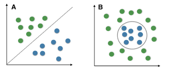
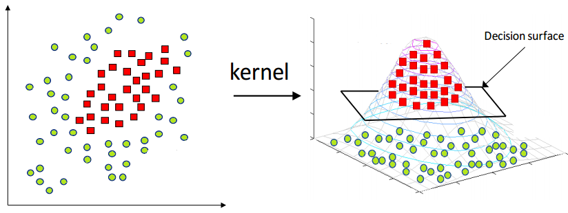

- **[Support Vector Machine (SVM) in 2 minutes — Visually Explained](https://youtu.be/_YPScrckx28?si=edQvatjww_qJvbB_)**
- **[What is kernel trick? — Grace Zhang medium blog](https://medium.com/@zxr.nju/what-is-the-kernel-trick-why-is-it-important-98a98db0961d)**
- **[Support Vector Machines: All you need to know! — Intuitive Machine Learning](https://youtu.be/ny1iZ5A8ilA?si=4BtBGRCTUSJ_d3og)**

**Support Vector Machine (SVM)** is a machine learning algorithm used for classification and regression. SVM is similar to [k-NN algorithm](/cs-notes/machine-learning/k-nearest-neighbors), but instead of assigning which groups does a data belongs to, SVM instead assign a boundary (called hyperplane) that separates the data points of different categories as best as possible.

  
Source: https://www.researchgate.net/figure/Examples-of-classification-of-a-test-vector-using-k-nearest-neighbor-KNN-support_fig1_290525297

Same as k-NN, the data will be plotted in some space, location of where the data should be depends on the feature it has. The goal of SVM is to maximize margin, which is the distance between the boundary (hyperplane) and the nearest data points of each category, known as **support vectors**. By maximing these margin, we can achieve a certainty while classifying data.

  
Source: https://youtu.be/_YPScrckx28?si=cWw7hyFp4UNhjGeJ&t=50

The hyperplane consists of two additional hyperplanes, one on each side of the decision boundary (near the support vectors). These hyperplanes are defined by the equations $wx + b = -1$ and $wx + b = +1$. And the $\frac{2}{||w||}$ represent the width of the margin.

The objective of SVM is to find the optimal weight vector w and bias term b that maximize the margin while satisfying the constraint $wx + b \ge +1$ and $wx + b \le -1$ for the other category.

  
Source: https://en.wikipedia.org/wiki/Support_vector_machine

### Hard vs Soft Margin

In real scenario, sometimes the data can't be perfectly separable from different categories.

- **Hard Margin**: In hard margin, the margin constraint is strictly enforced, meaning that the SVM aims to find a decision boundary that perfectly separates the data points of different classes with no misclassifications. This is applicable when the data is linearly separable and there are no sudden or unexpected data points that are significantly different from the rest.

- **Soft Margin**: In soft margin, a more relaxed approach is taken by allowing a certain degree of misclassification or violation of the margin constraint. This is applicable when the data is not perfectly separable or contains outliers.

  It introduces a slack variable ($\xi$) (pronounced as "xi") for each data point, which quantifies the degree of misclassification or violation of the margin constraint.

    
   Source: https://www.quora.com/What-are-the-objective-functions-of-hard-margin-and-soft-margin-SVM

### Kernel Trick

A data may not always be linearly separable, this mean they can't always be separated by a line or plane in higher dimension. Here is an image that show linearly and non-linearly separable data.

  
Source: http://www.tarekatwan.com/index.php/2017/12/methods-for-testing-linear-separability-in-python/

SVM has a technique called **kernel trick** to handle non-linear boundaries by implicitly mapping the data into a higher-dimensional feature space. By using this trick, we are able to separate the data better.

This works by multiplying each data point by some mathematical function (called kernel function) that measures the similarity between two data points. The result of multiplication will represents the data points in the higher-dimensional. There are many types of kernel function, different functions capture different types of relationships.

For example, a 2-dimensional data may be non-linearly separable, by using kernel trick, we added another dimension implicitly and it becomes 3-dimensional. Turns out the data is separable at 3-dimension.

  
Source: https://medium.com/@zxr.nju/what-is-the-kernel-trick-why-is-it-important-98a98db0961d
