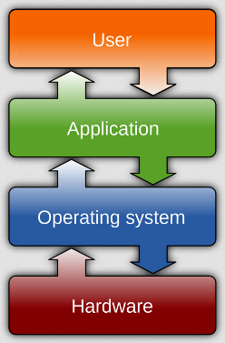
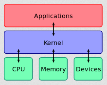
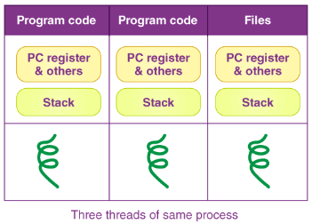
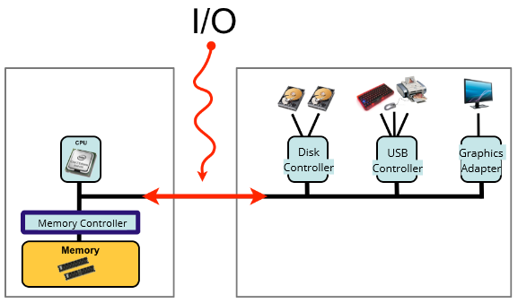
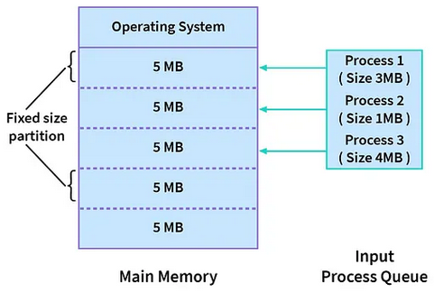
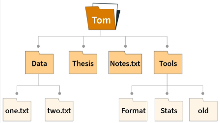
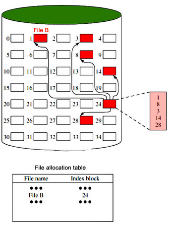
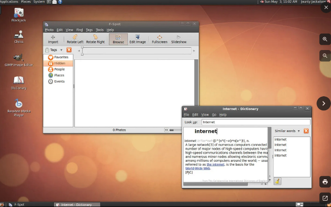
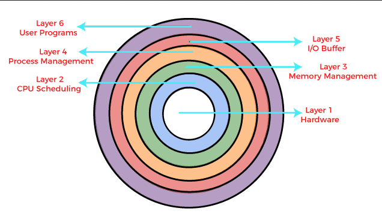

**Main Source:**

- **[Operating system — Wikipedia](https://en.wikipedia.org/wiki/Operating_system)**
- **Various Google searches**

**Operating System (OS)** is a software that provide a layer of abstraction between the computer hardware and application. Running application require computer resources such as processing unit and memory. OS manages the computer's hardware resources, provides essential services to programs, and facilitates the execution of tasks.

OS has a very crucial role in computer systems. It allows high-level software programs, such as application to run without needing the direct interaction to the hardware or low-level computer operations. For example, in an application that loads a file from computer, instead of the application issues a low-level operation to the physical hard disk, the OS can provide a file system API. The file system abstracts the details of disk access, translating high-level file operations (e.g., "open," "read," "write") into low-level disk operations.

If there were no layer of abstraction, applications would have to directly issue low-level commands that could vary depending on the specific hardware being used. An OS cannot be used interchangeably on arbitrary devices (e.g., you can't use Windows OS on mobile). The reason for this limitation is that operating systems interact closely with the underlying hardware, and different devices have unique hardware configurations. By having an OS to abstract the hardware, high-level application can be hardware-agnostic.

  
Source: https://en.wikipedia.org/wiki/Operating_system

### Component of OS

OS is a large software systems, it is built on many components that works together.

#### Kernel

**Kernel** is the core component of OS, it is responsible for managing hardware resources (e.g., CPU, memory, I/O). Kernel typically has complete control over everything in the system, it has direct access to the computer's hardware. It provides a set of low-level services and interfaces that enable software applications to interact with the hardware.

  
Source: https://en.wikipedia.org/wiki/Operating_system#Kernel

#### Process & Thread

Running a program or an application require loading the program into the memory. A running instance of program that is loaded into the memory is called a **process**. The OS, specifically the kernel, will take care of managing and controlling the processes, this includes allocating some portion of memory for the process and assigning system resources. The program's code contains sequence of instruction and logic in the form of binary instructions which can be executed by CPU. The execution of program goes through the [fetch-decode-execute cycle](/computer-organization-and-architecture/control-unit#fetch-decode-execute-cycle).

Process contains the program's instructions, these instructions can be divided into smaller set of instructions. The purpose of dividing them is to enable multiple unit of execution within the CPU, making it possible to execute the instruction concurrently, potentially faster execution. A single "worker" or single component that can execute instructions is called a **thread**. A process can be executed by one or more threads. These threads have different memory for their execution, but they operate within the same context.

  
Source: https://byjus.com/gate/what-is-thread-in-operating-system-notes/

#### Interrupt

**Interrupt** is an event that occurs during the execution of program, it indicates a time-sensitive events that require attention or special handling from the operating system. The CPU will temporarily suspend its current activity and will transfer its control to an **interrupt handler**. Before transferring its control, the CPU typically store the state of the program execution, making it possible to continue the execution after the interruption is handled, this is called **context switching**.

Interrupt can be produced by:

- **Software**: Interrupt can be produced by program or the OS itself, they can be software exceptions, such as division by zero, illegal instructions, or memory access violations.
- **Hardware**: These are produced by hardware, they are typically events that are triggered by external I/O devices, such as, keyboards, mice, disks. For example, user moving their mice expect their cursor on the screen to move immediately, this is an example of time-sensitive event.
- **System Call**: System call is an interrupt issued by program to request services from the operating system, such as file operations, network communication, or process management.

#### IPC

**Inter-process Communication (IPC)** is the mechanism used by processes or threads to exchange information, synchronize their activities, and coordinate their execution in a computer system. Some programs running in distinct process may need to collaborate or share data to accomplish a common task. This requires a proper coordination between two process, depending on the tasks, one process may need to notify other process of specific events, and the other process will respond to that event.

#### Input/Output

**Input/Output (I/O)** is communication and interaction between the computer system and external devices. External devices include mice, keyboards, monitor, printers, speakers, disks, etc. There are many mechanisms to handle I/O events, an example is an interrupt-driven I/O, which trigger an interruption whenever I/O events are produced. The OS will interact with the hardware, typically through a software that provides a layer of abstraction between the hardware, called **device drivers**.

  
Source: http://www.it.uu.se/education/course/homepage/os/vt18/module-1/definitions/ (with modification)

#### Scheduling

**Scheduling** is the process of determining the order of which tasks or process should be executed next and how long, by considering factors such as fairness, efficiency, and availability of system resources. The goals of scheduling are to minimize idle and response time and maximizing the amount of work done in some unit of time. There are many policies and strategies to implement scheduling, one of simple strategy is doing whatever task that is ready to be executed.

#### Memory Management

OS is responsible for the management and organization of computer memory resources. This includes tracking, allocating, and deallocating memory to processes. The OS need to ensure the efficient utilization of available memory and safe access to memory, memory used by a program can't be used by different program (unless required). There are many memory access violation that can happen during the execution of program, the OS is responsible for resolving this issue, to prevent it from causing further harm.

  
Source: https://medium.com/@TheAnshuman/memory-management-in-os-450655fbc338

#### Multitasking

CPU executes tasks in a scheduled manner, different programs have different execution time, which mean they are not being executed simultaneously. Computer is able to run multiple program at the same time due to multitasking. Multitasking works by creating an illusion of parallel execution, under the hood, the CPU switches rapidly between tasks. When trying to switch to different tasks, current state of a task or process will be saved (called **context switch**), and will be restored later after doing the other tasks.

#### File System

The file system is a component of OS that is responsible for managing and organizing files on storage devices. File system uses many techniques to organize file for easy and fast access, as well as efficient utilization of storage. Files are typically organized into hierarchical structure in the form of directories or folders. These files are also included with specific attributes such as name, size, date, etc. The OS also provide a set of API to interact with the file system, such as creating, opening, closing, reading, and writing files.

  
Source: https://www.scaler.com/topics/file-systems-in-os/

#### Storage Management

If file system is concerned about managing files, storage management is concerned about the management of physical storage devices such as hard disk drives (HDDs), solid-state drives (SSDs), optical drives, and tape drives. These devices are accessed through device drivers. In disks, files are divided into smaller units called **blocks**, contiguous blocks will be allocated to store the contents of a file. The OS is responsible for managing the allocation of storage space on storage devices. It tracks available space, assigns storage blocks to files, and keeps track of allocated and free storage blocks.

  
Source: https://lemp.io/what-is-disk-space-management-in-operating-system/

#### Networking

Typically, an OS will provide API (socket APIs) to allow applications to establish network connections to send and receive data from the network. The OS will handle the low-level networking capabilities including implementing various network protocols, providing specific network tools for configuring network settings, such as IP addresses, etc.

#### Security

An OS consists of many components, from the highest-level that interact with application, to the lowest-level that interact with the hardware. OS need to ensure that only privileged component in the system is allowed to make change. Many techniques are implemented for securing a system, such as encrypting file and having permission mechanism to prevent unauthorized access.

#### User Interface

**User Interface** is a visual and interactive elements that enable users to interact with a system. Computer system provide a way for user to input commands and receive feedback. In modern computer system, user interface is often provided with visual elements such as windows, icons, menus, buttons, etc. This is called **Graphical User Interface (GUI)**, the user will interact with the GUI through input devices like a mouse or keyboard. Once the user provides input, the application processes it and then forwards it to the operating system for further handling.

  
Source: https://www.britannica.com/technology/graphical-user-interface

### OS Architecture

**OS Architecture** is the overall design and structure of an operating system. It defines how different components and modules of the OS are organized and interact with each other. Some common approaches to OS architecture:

- **Monolithic Kernel**: In a monolithic kernel architecture, the entire OS operates as a single, large program running with special privileges and has direct control over the computer's hardware. All OS services, such as process management, memory management, file systems, and device drivers, are tightly integrated into a single executable. This architecture provides fast performance but lacks modularity and can be challenging to maintain and extend.

- **Layered Architecture**: A layered OS architecture divides the OS into multiple level of layers, each providing a specific set of functionalities. Each layer communicates with the layer above or below it through defined interfaces. The interface is a contract between the components, it specifies how they can interact and what functionalities they can expect from each other.

  The lower layers handle hardware-specific operations, such as device drivers and memory management, while higher layers provide more abstract services, such as file systems and networking.

    
  Source: https://www.javatpoint.com/layered-structure-of-operating-system

- **[Client-Server Architecture](/software-engineering/client-server)**: A client-server architecture is a design model in which a client and server processes exist. The component within an OS with client-server architecture treat each other just like a client and server. Client is the one that provide user interface and request specific services or resources from the OS. The server is responsible for providing those services or resources by executing the requested operations and returning the results to the client processes. For example, a file explorer can be thought as a client, which request file information to the file system, acting as a server. This architecture is typically used for distributed computing or peer-to-peer network, which may use communication protocol like [RPC](/operating-system/inter-process-communication#rpc).
