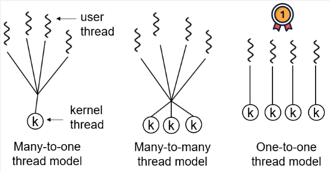
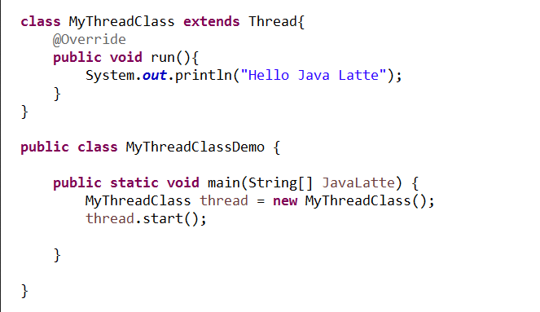
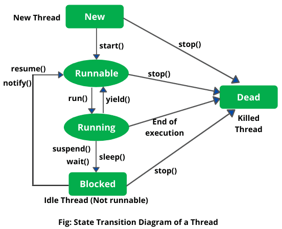
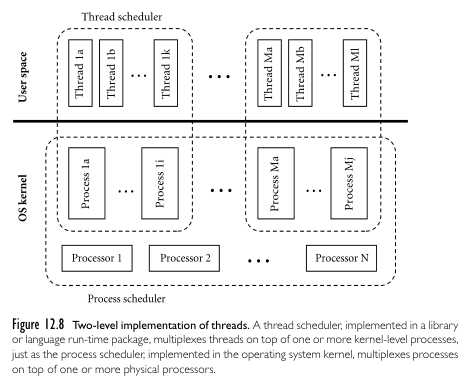
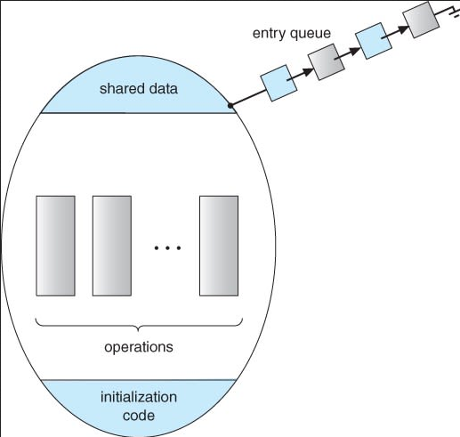
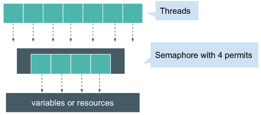
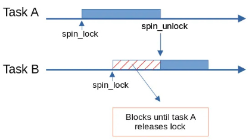
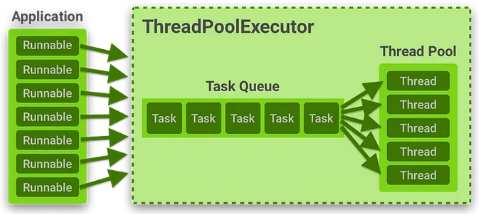
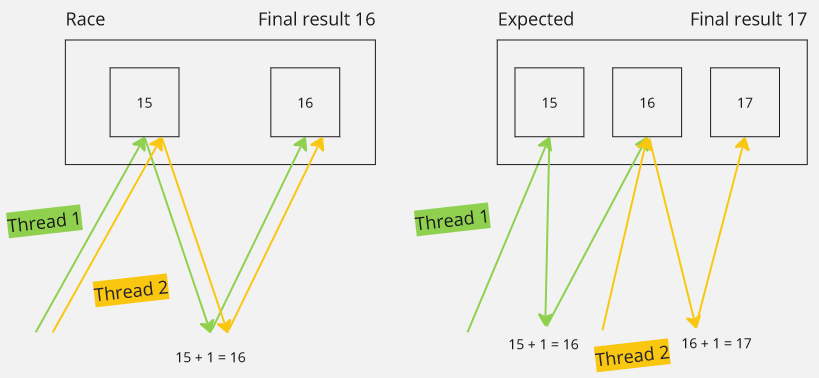
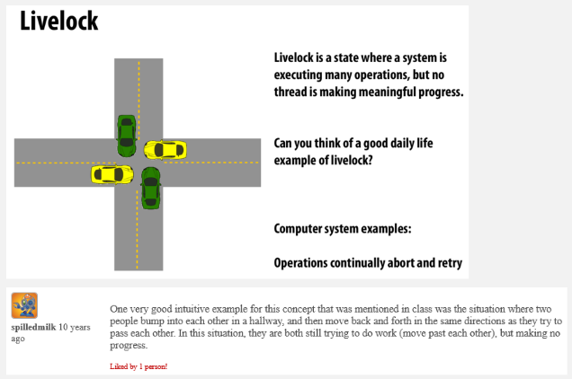

**Main Source:**

- **[Chapter 4 Threads - Abraham Silberschatz-Operating System Concepts (9th,2012_12)]**
- **[Chapter 5 Process Synchronization - Abraham Silberschatz-Operating System Concepts (9th,2012_12)]**
- **[Multithreading (computer architecture) — Wikipedia](<https://en.wikipedia.org/wiki/Multithreading_(computer_architecture)>)**
- **[Thread (computing) — Wikipedia](<https://en.wikipedia.org/wiki/Thread_(computing)>)**
- - **Chapter 12, Programming Language Pragmatics - Michael L. Scott**

**Multithreading** is a concept that enable us to use multiple thread to execute tasks. See [concurrency](/computer-and-programming-fundamentals/concurrency) for an introduction to concurrency.

### Thread

Thread is a unit of execution in CPU, it can execute a set of instruction. Basically, it is a "worker" in a CPU. Thread exist within a [process](/operating-system/process-management#process--thread) and has its own data including thread ID, program counter, a register set, and a stack.

In multithreading, instead of just one thread or one worker in a process, multiple thread is utilized. The benefit is we are not limited to complete a single task at a time. For example, a mobile app can fetch data from remote server while also loading data from local storage. If possible, we can also divide a computationally intensive task into smaller, parallelizable subtasks, and use multiple threads to speeds up the overall execution time (achieving parallelism).

A thread can also be **blocked**, which means the thread is unable to make progress or continue its execution because it is waiting for a certain event such as I/O results or condition to occur. Blocked thread can be inefficient, as it is unable to perform any useful work.

  
Source: https://towardsdatascience.com/multithreading-and-multiprocessing-in-10-minutes-20d9b3c6a867

The image above shows the illustration of multithreading. Each thread holds different data, but they share the same memory space and resources of the parent process. In contrast, multiprocessing is when we utilize a processor that has several cores. Each core would have their own data and thread that will execute simultaneously.

Utilizing multiple threads is typically more efficient than making multiple process that execute the same tasks ([multiprocessing](/computer-and-programming-fundamentals/concurrency#multiprocessing)). Threads have a smaller memory footprint, require less time for [context switching](/operating-system/process-management#context-switch), and have lower scheduling overhead. Also, separate process means [IPC](/operating-system/inter-process-communication) is required to communicate between processes, whereas thread shares the same memory within a process, thus communication will be easier.

### Multithreading Model

#### User & Kernel Thread

There are two types of thread, **user thread** and **kernel thread**.

User threads, also known as **green threads**, are implemented and managed by a thread library or runtime system at the user level, without direct involvement of the operating system kernel. The creation, scheduling, utilization, and synchronization of user threads are handled entirely in the user space (memory space where user applications run). They may not be able to access the memory used by kernel.

On the other hand, kernel threads, which is also known as **native threads**, are managed directly by the operating system kernel. Each kernel thread is represented as a separate entity within the operating system and has its own program counter, stack, and thread control block.

User threads are generally lightweight, however, they are not fully aware of the underlying thread management mechanisms. If a user thread blocks or performs an operation that blocks, it can potentially block the entire process, including all other user threads.

Kernel threads are heavyweight, they require system calls and interaction with the operating system kernel for creation and management. The benefit of kernel thread is that they are fully managed by the OS, this allows for better utilization of system resources and efficient scheduling across multiple processors (achieving true parallelism).

#### Relationship Model

Relationship model between user and kernel thread describe how they are associated with each other.

- **Many-to-One**: This model involves mapping multiple user-level threads to a single kernel-level thread. The thread management and scheduling are performed by a thread library or runtime system at the user level. From the programming language, we can see and use multiple thread, but under the hood the operating system sees only a single thread. This model has efficient management, but may not take full advantage of multiprocessor systems as the execution of multiple threads is handled by a single kernel-level thread.
- **One-to-One**: In this model, each user-level thread is mapped to a separate kernel-level thread by the operating system. This model provides more concurrency and true parallelism to the kernel-level. However, the overhead of creating and managing kernel-level threads can be higher compared to other models.
- **Many-to-Many**: This model combines the aspect of many-to-one and one-to-one. Many-to-many model consist of many kernel threads and smaller or equal number of user thread. The operating system can create multiple kernel-level threads, while the thread library manages and schedules the user-level threads across the available kernel-level threads.

    
   Source: https://www.researchgate.net/figure/Three-types-of-thread-models-Popular-operating-systems-5-22-24-adopt-the_fig1_346379550

### Thread Management

Multithreading implementation depends on the programming language used. Threading process involves thread creation, execution and scheduling, synchronization, and termination.

#### Thread Creation & Termination

The thread library provided by programming languages have specific function or method to create and manage threads. For example, in Java, we can create a thread by implementing the `Thread` class or the `Runnable` interface and then invoking the `start()` method. In C++, you can use the `std::thread` class or the threading utilities provided by libraries like POSIX threads (`pthread_create()` function).

When creating thread, we can specify thread attributes such as stack size, thread priority, CPU affinity. After a thread is created, it is assigned a unique identifier called the thread ID.

  
Source: http://java-latte.blogspot.com/2015/07/create-thread-using-method-reference-in-java-8.html

Thread can be stopped explicitly using function like `stop()` in Java. Sometimes, the thread may not stop immediately due to specific logic or condition that is required to execute before it can safely terminate. Thread can also terminate naturally when it finishes its execution, where it automatically exits, and its resources are released by the system (or saved to [thread pool](#thread-pool)).

It is important to note that thread termination should be handled carefully. For example, a thread may have used some data structure, but when it is not freed before the termination, this can cause [memory leak](/computer-security/other-attack-and-exploit#memory-leak).

##### Example

One reason to implement the `Thread` class is to encapsulate application logic that is intended to be run in separate thread. In a server app, it is expected that the server handle multiple request in parallel. Let's say server is trying to read and write an input.

```javascript
public class ClientHandlerThread extends Thread {
    private Socket clientSocket;

    public ClientHandlerThread(Socket clientSocket) {
        this.clientSocket = clientSocket;
    }

    public void run() {
        try {
            // Get the input stream from the client
            InputStream inputStream = clientSocket.getInputStream();

            // Read the client's request
            byte[] buffer = new byte[1024];
            int bytesRead = inputStream.read(buffer);

            // Process the request (example: convert to uppercase)
            String request = new String(buffer, 0, bytesRead);
            String response = request.toUpperCase();

            // Get the output stream to send the response to the client
            OutputStream outputStream = clientSocket.getOutputStream();

            // Send the response back to the client
            outputStream.write(response.getBytes());
        } catch (IOException e) {
            e.printStackTrace();
        } finally {
            // Close the client socket
            try {
                clientSocket.close();
            } catch (IOException e) {
                e.printStackTrace();
            }
        }
    }
}
```

This implementation of thread encapsulate the logic of reading, processing, and responding back to user request. We can use it like below.

```javascript
public class Server {
    public static void main(String[] args) {
        try {
            // Create a server socket
            ServerSocket serverSocket = new ServerSocket(8080);
            System.out.println("Server listening on port 8080");

            while (true) {
                // Accept client connections
                Socket clientSocket = serverSocket.accept();
                System.out.println("Client connected: " + clientSocket.getInetAddress());

                // Create a new thread to handle the client connection
                ClientHandlerThread clientHandlerThread = new ClientHandlerThread(clientSocket);
                clientHandlerThread.start();
            }
        } catch (IOException e) {
            e.printStackTrace();
        }
    }
}
```

For each client connection, we create a new thread through the `ClientHandlerThread` and start it to handle the connection.

#### Thread Execution & Scheduling

In Java, we can start the execution of a thread, by calling the `start()` method on the `Thread` object. The `start()` method internally calls the thread's `run()` method, which contains the code that will be executed by the thread. The JVM manages the execution of threads and ensures that the `run()` method is executed concurrently with other threads.

Thread scheduling in Java is handled by the JVM and the operating system. The JVM uses a [preemptive scheduling algorithm](/operating-system/process-management#multitasking), where the operating system decides when to switch between threads. Similar to process scheduling, this involves [context switch](/operating-system/process-management#context-switch) to save the thread state, determining based on some [scheduling algorithm](/operating-system/process-management#scheduling-algorithms).

Java provides methods like `yield()` and `sleep()` to influence thread scheduling. The `yield()` method allows a thread to voluntarily give up its remaining time slice, allowing other threads to run. The `sleep()` method pauses the execution of a thread for a specified period of time.

  
Source: https://medium.com/spring-boot/multithreading-in-java-with-examples-25b0bc80831b

#### Thread Implementation

The [relationship model](#relationship-model) of thread relates to how they are implemented. One process correspond to one kernel thread that executes tasks for that process. The language runtime or library implement a **thread scheduler** that will schedule the execution of thread as well as managing thread pool for the process. The OS kernel implements a **process scheduler** that will schedule the physical processor to execute certain process. This implementation is known as the **two-level implementation of thread**.

  
Source: Programming Language Pragmatics - Michael L. Scott page 614

#### Thread Communication

Multiple threads exist within the same process, external threads can communicate using the [IPC mechanism](/operating-system/inter-process-communication). There are two method, the first method is [shared memory](/operating-system/inter-process-communication#shared-memory), where each thread read and write data in the same region of memory. The other method is [message passing](/operating-system/inter-process-communication#message-passing), where they send messages or signals to each other. One thread can send a message to another thread, which then receives and processes the message.

:::note
Although they are for process communication, it may be used to communicate between thread if they are running in separate processes. If threads were to communicate between the same process, typically they would directly access and communicate with each other through shared variables or data structures.
:::

#### Thread Synchronization

Synchronizing threads is crucial to ensure proper coordination and consistency when multiple threads access shared resources and communicate. This helps prevent [concurrency issues](#multithreading-problems).

When a code or data structure can be safely accessed and modified by multiple threads concurrently without causing unexpected or incorrect behavior, this is called **[thread safe](/computer-and-programming-fundamentals/concurrency#thread-safe)**.

##### Synchronization Primitives

These are fundamental, low-level mechanism used in multithreaded environment to synchronize.

###### Locks / Mutex

**Mutex (mutual exclusion)** is a synchronization primitive that ensure only one thread to access a shared resource. It works by having a lock, a thread that wants to access the resource must _acquire_ the lock first. If the lock is already held by another thread, the requesting thread will be blocked until the lock is _released_. If the thread that access the resource has finished, only then the lock will be released.

The mutex technique can be implemented in the software-level by memory synchronization instructions provided by the hardware architecture.

There are three types of locks:

- **Shared lock**: Multiple thread is able to read same data simultaneously.
- **Exclusive lock (mutex)**: When a thread acquire an exclusive lock, it has exclusive access to the data until the lock is released.
- **Update lock**: Combination of shared and exclusive locks, allowing multiple thread to read, but only one thread to update the data at a time.

  
Source: https://www.javatpoint.com/mutex-vs-semaphore

###### Monitor & Condition Variables

**Condition variables** are synchronization primitives that allow threads to wait for a specific condition to become true before proceeding with their execution. Condition variables are typically used together with lock, forming another construct, **monitors**.

**Monitors** is a higher-level synchronization construct that combines mutex and condition variables. The mutex is used to ensure only one thread is accessing the resource, while the condition variables is used for additional coordination between the threads.

In a sense, condition variable is actually a [queue](/data-structures-and-algorithms/queue). Threads will be kept in the queue until a condition is met. The condition variable has three operations:

- **Wait**: The "wait" operation temporarily release the associated mutex and enter a wait state on a condition variable, effectively blocking its execution. It is typically called when the thread or process encounters a condition that prevents it from proceeding.
- **Signal**: The "signal" operation is used to awaken one waiting thread or process that is blocked on a particular condition variable, such as wait state. It notifies a single waiting thread or process that the condition it was waiting for may have changed. The awakened thread or process can then reacquire the associated lock or mutex and continue its execution.
- **Broadcast**: The "broadcast" operation is used to awaken all waiting threads or processes that are blocked on a particular condition variable.

Monitors work like following:

1. When a thread wants to access the shared data, it first needs to acquire the monitor's lock. If the lock is already held by another thread, the requesting thread will be blocked until the lock becomes available.
2. Once a thread has acquired the lock, it enters the monitor and gains exclusive access to the shared data. The thread can then perform operations on the data inside a critical section.
3. In the case of success operation, once a thread completes, it releases the monitor's lock, allowing other threads to acquire it. The thread exits the monitor, making it available for other threads to enter.
4. In the case when the thread encounter whatever condition that prevent it from proceeding, such as a specific state of the shared resource, it may signal or broadcast the other threads.
5. Another thread, which are signaled, can modify the shared data in a way that affects the other waiting threads' conditions, in which it can signal or broadcast again.

  
Source: https://dev.to/l04db4l4nc3r/process-synchronization-monitors-in-go-4g4k

###### Semaphores

Semaphore allows specified number of thread to access a shared resource. A semaphore maintains a count, and when a thread wants to access resource, it attempts to acquire the semaphore. If the count is greater than zero, the thread is allowed to proceed, and the count is decremented. If the count is zero, indicating that the resource is currently in use, the thread will be blocked until another thread releases the semaphore, which increments the count.

  
Source: https://stackoverflow.com/questions/34519/what-is-a-semaphore

###### Barriers

Barrier is a way to synchronize a group of threads at a specific point in code. Threads reach the barrier and wait until all participating threads have arrived. Once all threads have reached the barrier, they are released simultaneously, allowing them to continue their execution.

It is typically used in parallel tasks where they need to synchronize their progress at certain stages of execution, such as dividing a larger computation into smaller parts and waiting for all parts to complete before proceeding to the next stage.

  
Source: https://www.ictdemy.com/java/threads/multithreading-in-java-barrier-countdownlatch

###### Spinlocks

A thread *spins*, which means that it continuously executes a loop that frequently checks a condition, waiting for a certain state to be reached.

The basic idea of a spinlock is that a thread attempting to acquire the lock repeatedly checks if the lock is available in a tight loop, spinning until it becomes available. The thread keeps spinning until it successfully acquires the lock, at which point it can proceed with the critical section of code or the shared resource it wants to access.

This differs from traditional locks where the thread would be put to sleep if the lock is unavailable. Spinlocks are useful in situations where the expected wait time for acquiring a lock is very short, and the overhead of putting a thread to sleep and waking it up is considered too costly.

  
Source: https://www.quora.com/What-are-the-advantages-and-disadvantages-of-using-a-spinlock-in-the-kernel-of-an-operating-system-keep-in-mind-there-may-be-multiple-processors

##### Scheduler-based & Busy-waiting

Locks, monitors, and semaphores are considered **scheduler-based synchronization** mechanisms. With these mechanisms, threads are required to yield CPU time to a scheduler and depend on it to schedule their execution. Barriers and spinlocks are considered **busy-waiting synchronization** mechanisms, in which threads repeatedly check for synchronization conditions to be satisfied in a loop.

Scheduler-based synchronization introduces potential delays due to [context switches](/operating-system/process-management#context-switch) that occur when a thread is switched during scheduling. When a thread encounters a synchronization point and needs to wait for a condition to be satisfied (e.g., acquiring a lock or waiting for a signal), it enters a blocked or waiting state. The thread is then removed from the set of active threads that can execute, and the scheduler performs a context switch to switch to another eligible thread that can make progress.

In contrast, without relying on the scheduler, the busy-waiting mechanism can achieve lower latency, but it may consume more CPU resources as the thread continuously loops.

##### Atomic Operation

Atomic operations are operations that are guaranteed to be executed atomically without interruption. They provide a way to perform thread-safe operations on shared variables without the need for locks or synchronization primitives. Atomic operations are typically used for simple operations like incrementing or decrementing a variable. Atomic operations are supported directly by the OS or hardware with specific instructions. For example, we may be able to write to a memory location and return the old value, this is often called **test-and-set** instruction.

#### Thread Pool

Thread pool is a technique to improve performance and resource management in multithreaded applications.

When there are pre-allocated threads which are waiting and ready to be used to execute tasks, they are stored in **thread pools**. Thread pool isn't just a place where you store thread after their creation, it is a place where you maintain a set of reusable threads. These threads are created in advance and added to the pool. When a task arrives, a thread from the pool is assigned to execute it. Once the task is completed, the thread is returned to the pool for reuse. Thread pool allows for efficient resource management, it helps to reduce the resource exhaustion when creating new thread.

  
Source: https://dip-mazumder.medium.com/how-to-determine-java-thread-pool-size-a-comprehensive-guide-4f73a4758273

### Multithreading Problems

- **Race conditions**: Race conditions occur when multiple threads access shared data concurrently and try to modify it simultaneously. This can lead to unpredictable and incorrect results, because each thread may observe the data differently, some may access it after modification, and so may not.

  

- **Starvation**: Starvation occurs when a thread is blocked from gaining access to required resources. This can lead to a thread not making progress and adversely affect overall system performance.

- **Deadlocks**: Deadlocks occurs when two or more threads are blocked indefinitely waiting for each other.

    
   Source: https://en.wikipedia.org/wiki/Deadlock

- **Livelock**: Livelock is similar to a deadlock, but in a livelock, the processes or threads are not blocked or waiting for a resource explicitly. Instead, they are continuously reacting to each other's actions in a way that prevents any of them from making forward progress.

    
  Source: http://15418.courses.cs.cmu.edu/spring2014/lecture/snoopimpl1/slide_021

:::tip
In relation to concurrency, see also [concurrency](/computer-and-programming-fundamentals/concurrency).
:::
