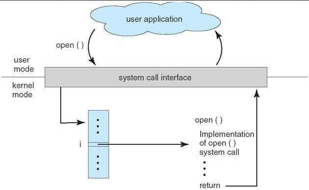
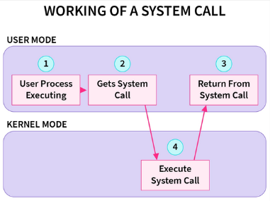

**Main Source:**

- **[Chapter 2 Operating-System Structures - Abraham Silberschatz-Operating System Concepts (9th,2012_12)]**
- **[System call — Wikipedia](https://en.wikipedia.org/wiki/System_call)**
- **[Introduction of System Call — GeeksForGeeks](https://www.geeksforgeeks.org/introduction-of-system-call/)**

Applications primarily run in **user mode**, which is a restricted environment with limited access to system resources. Certain operations, such as interacting with hardware devices or modifying critical system data, are prohibited in user mode to maintain system stability and security.

**System calls** is the way for applications to request privileged operations from the operating system [kernel](/cs-notes/operating-system/kernel), which operates in a higher privileged mode called **kernel mode**.

### System Call Interface

System calls are provided by the operating system kernel, this mean each OS may have different way to request access. They are achieved through calling a set of defined function or method provided by the operating system. For example, functions with descriptive names like `open()`, `read()`, `write()`, are used to manipulate file.

  
Source: https://stackoverflow.com/questions/60136893/what-is-system-call-interface

The application that calls doesn't need to know the low-level details of how the operating system implements that system call. The application only needs to know the interface provided by the operating system and how to use the system call correctly.

The use of interface allows for a simple development, application developers can write portable code that can run on different operating systems without modifications, as long as the system call interface is consistent.

In [Unix-like systems](/cs-notes/operating-system/unix), system calls are included in the C language, specifically the **libc** library. In other OS like [Windows NT](/cs-notes/operating-system/windows), system calls are commonly referred to as "Windows API functions", and it has different interface with the libc.

### Type of System Calls & Example

System calls can be categorized into several types based on the services they provide. In the example, the system calls are associated with [Unix-like](/cs-notes/operating-system/unix) operating systems.

  
Source: https://www.scaler.com/topics/operating-system/system-calls-in-operating-system/

#### Process Control

They are related to the management of processes and their execution.

- **Process Creation**: System call like `fork()` duplicates the existing process, creating a new child process with a new ID, the child process also inherits some of the attributes and resource such as memory space from the parent process. The `exec()` system call replaces the current process's memory with a new program, loading a new executable file.
- **Process Termination**: The `exit()` system call terminates a process, returning an exit status. The `wait()` system call allows a parent process to wait for its child process to terminate and retrieve its exit status.
- **Process Status**: System calls like `getpid()`, `getppid()`, and `getuid()` provide process-related information such as process ID, parent process ID, and user ID.
- **Process Scheduling**: The `yield()` system call allows a process to voluntarily release the CPU and let other processes run. The `nice()` system call adjusts process scheduling priority, with lower values indicating higher priority. These system calls manage process scheduling and priorities.

#### File Manipulation

System calls in this category are used for working with files and file systems.

- **File Operations**: System calls with descriptive names such as `open()`, `read()` to, `write()`, and `close()` are used for manipulating files.
- **File and Directory Management**: System calls like `mkdir()` to create a new directory, `rmdir()` to removes an empty directory, and `rename()` for renaming a file or directory.
- **File System Information**: System calls such as `stat()` to retrieve file metadata, such as size and timestamps, while `chmod()` is used to change file permissions, such as read, write, and execute permissions.

#### Device Manipulation

System calls related to devices and device drivers are used for interacting with hardware devices.

- **Device I/O**: System calls such as `ioctl()`, `read()`, and `write()` are used for device input/output operations. `ioctl()` allows for performing device-specific control operations, while `read()` and `write()` are used to read data from and write data to devices.
- **Device Control**: System calls like `open()`, `close()`, and `poll()` are used to control device access and manage device connections. `open()` is used to open a device and obtain a file descriptor for it, `close()` is used to release the device and close the file descriptor, and `poll()` is used to monitor the status of multiple devices for events or data availability. These system calls provide mechanisms for managing device interactions and controlling device access.

#### Information Maintenance

System calls in this category are used to retrieve and manipulate system information.

- **Time and Date**: System calls such as `time()`, `gettimeofday()`, and `clock_gettime()` provide access to system time and date. They allow programs to retrieve the current time, measure time intervals, and receive a precise timestamp.
- **System Configuration**: System calls like `uname()` retrieve system config information such as the operating system name and version.
- **System Resource Usage**: System calls such as `getrusage()` provide information about resource usage by processes. They allow programs to retrieve statistics on CPU time, memory usage, and other resources consumed by a process.

#### Communications

System calls in this category are used for inter-process communication (IPC) and network communication (socket operations).

- **Socket Operations**: System calls such as `socket()`, `bind()`, `listen()`, `accept()`, `connect()`, `send()`, and `recv()` are used for network communication using sockets. Sockets provide an interface for processes to communicate over a network. These system calls allow processes to create network sockets, bind them to specific addresses and ports, listen for incoming connections, establish connections to remote hosts, and send/receive data over the network.
- **Inter-Process Communication (IPC)**: System calls like `pipe()`, `shmget()`, `semget()`, and `msgget()` are used for various forms of IPC, including shared memory, semaphores, and message queues. These mechanisms facilitate communication and synchronization between different processes running on the same system. Processes can share data through shared memory, coordinate access to shared resources using semaphores, or exchange messages through message queues using these system calls.

:::tip
See also [message passing](/cs-notes/operating-system/inter-process-communication#message-passing) and [IPC](/cs-notes/operating-system/inter-process-communication).
:::

#### Protection

System calls in this category are related to process and system security, including mechanisms for access control, user authentication, and cryptographic operations.

- **Access Control**: System calls such as `chmod()`, `chown()`, and `setuid()` are used to modify file and process permissions and ownership. These system calls allow processes to change the access permissions and ownership of files, directories, and processes, providing control over who can read, write, or execute them.
- **User Authentication**: System calls like `getpwuid()` and `getpwnam()` retrieve user account information. They allow processes to retrieve user details, such as username, user ID, and other account information, which can be used for authentication and access control purposes.
- **Cryptography**: System calls such as `encrypt()`, `decrypt()`, and `hash()` provide cryptographic functionality for data security. These system calls allow processes to perform encryption and decryption operations on data, as well as generate cryptographic hashes for data integrity verification and password storage.

:::tip
See also [OS security](/cs-notes/operating-system/protection-and-security).
:::

### System Call Implementation

Implementation vary of the operating system kernel, the general steps are:

1. **System Call Number & Table**: Each system call is assigned a unique number or identifier by the operating system. The number is used to identify the requested system call, they are maintained in a table that maps the system call numbers to their corresponding kernel functions or handlers.
2. **User-Space to Kernel-Space Transition**: When a user program invokes a system call, it triggers a transition from user mode to kernel mode. This transition is typically done through a [software interrupt](/cs-notes/operating-system/interrupt-handling) or a special instruction, which transfers control from the user program to the kernel.
3. **System Call Handler**: The kernel receives the system call request and identifies the requested system call using the system call number provided by the user program. The system call handler corresponding to the system call number is then invoked.
4. **Kernel Validation**: The system call handler validate the system call, ensuring that the parameter is valid, the caller has necessary permission, memory address is valid, and checks through other potential security risk.
5. **Kernel Execution**: If the system call is valid, the handler executes the requested operation on behalf of the user program, depending on the request.
6. **Result Return**: After the system call handler completes its execution, the kernel returns the result of the operation back to the user program. This can include return values, error codes, or other relevant information.
7. **User-Space Resumption**: The control is transferred back to the user program, and it continues execution from where it left off, now with the result of the system call available.
