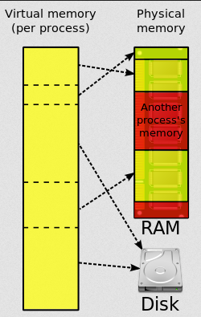
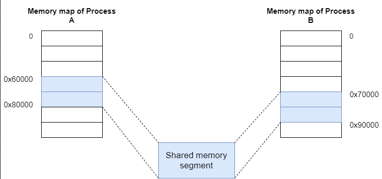
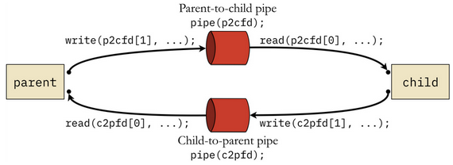
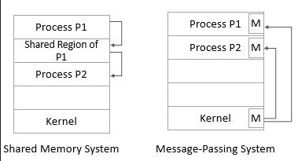

**Main Source:**

- **[Inter-process communication — Wikipedia](https://en.wikipedia.org/wiki/Inter-process_communication)**
- **[Interprocess communication(IPC) using shared memory by Pratik Parvati — Linkedin blog](https://www.linkedin.com/pulse/interprocess-communicationipc-using-shared-memory-pratik-parvati)**
- **[Remote procedure call — Wikipedia](https://en.wikipedia.org/wiki/Remote_procedure_call)**
- **Chapter 12, Programming Language Pragmatics — Michael L. Scott**
- **[How can you choose between message passing and shared memory for interprocess communication? — Linkedin](https://www.linkedin.com/advice/0/how-can-you-choose-between-message-passing-shared)**

**Inter-process Communication (IPC)** is the mechanism used to communicate between processes.

Processes are isolated from one another, meaning they cannot directly access each other's memory. This isolation ensures that one process cannot corrupt or interfere with the resources of another process.

IPC enables processes to share data and coordinate actions in a controlled manner. IPC uses [various synchronization primitives](/cs-notes/operating-system/multithreading#synchronization-primitives) to avoid conflicts and ensure proper sequencing of operations.

:::note
Although they are for process communication, it may be used to communicate between thread if they are running in separate processes. If threads were to communicate between the same process, typically they would directly access and communicate with each other through shared variables or data structures.
:::

### IPC Mechanism

There are two main techniques to communicate, shared memory and message passing.

#### Shared Memory

In **shared memory**, a portion of memory is allocated and made accessible to multiple processes for read and write. However, this communication mechanism may require [additional synchronization technique](/cs-notes/operating-system/multithreading#thread-synchronization) to prevent [concurrency issues](/cs-notes/operating-system/multithreading#multithreading-problems).

Sharing memory is possible through [virtual memory mapping](/cs-notes/operating-system/memory-management#virtual-addressing). When a process is created, they are given some memory addresses space, which is the region of memory they have access to read/write. Behind the scene, the memory is not an actual physical memory, they are just some range of addresses that maps to the actual memory, which is called **virtual memory address**. When the process accesses the virtual memory space, the OS will translate the memory they are referring to the actual memory address located in the physical memory.

For example, when a process want to access some data in the address "0x05", the actual data located on the physical memory may not be in that address. It could exist on address "0x08", or "0xFF", or any other address. This is why the memory address is called virtual, because the process treat the memory as if it's their own memory, but it is not.

  
Source: https://en.wikipedia.org/wiki/Virtual_memory

The same concept applies to shared memory, where multiple processes each have their own isolated virtual memory. When a process wants to share memory, the operating system allocates some shared memory. Then, the process attaches the shared memory to each process. This means that every process is given a range of addresses on their virtual address space that they can use to access the shared data.

  
Source: https://www.linkedin.com/pulse/interprocess-communicationipc-using-shared-memory-pratik-parvati

The shared memory is located in a single place somewhere in the physical memory, but each process access it as if it's located on their memory space. For example, process A may own its shared memory in the address "0x60000" to "0x80000", while the process B own its shared memory in address "0x70000" to "0x90000".

After all the mapping, the process can now read/write to the shared memory as usual.

#### Message Passing

Message passing is an act of communication between processes or thread without using shared memory, it is inherently associated with sending a message. It is typically used in scenario where communication is done across different machine or platform (such as across different process in distributed systems). When a communication happens on the same machine or high speed is required, shared memory can be used.

Some example of message passing:

- **Pipes**: Pipes are a form of IPC that allows the output of one process to be used as the input of another process. In a pipe, data flows in a unidirectional manner from the writer process to the reader process. Pipes can be either named or unnamed, with the latter typically used for communication between related processes (e.g., parent-child processes).

    
   Source: https://w3.cs.jmu.edu/kirkpams/OpenCSF/Books/csf/html/Pipes.html

- **[Sockets](/cs-notes/computer-networking/socket)**: Sockets are a communication endpoint that enables bidirectional communication between processes over a network. They can be used for IPC within the same machine (domain sockets) or across different machines (network sockets). Socket is responsible for commonly heard transport protocol like [TCP](/cs-notes/computer-networking/tcp-protocol) and [UDP](/cs-notes/computer-networking/udp).
- **[Message Queues](/cs-notes/backend-system/message-broker)**: Message queues is where processes exchange messages through a shared [queue](/cs-notes/data-structures-and-algorithms/queue) in the operating system. Each message has a specific format and is placed into the queue by the sending process. The receiving process can then retrieve messages from the queue in a first-in-first-out (FIFO) order.
- **Channels**: Channels is a higher-level concept for message passing. Channels typically provide a set of operations, such as sending and receiving messages, and may incorporate synchronization mechanisms like blocking or non-blocking operations. Channels can be implemented using various underlying mechanisms, including shared memory, pipes, or sockets.

    
   Source: https://beingintelligent.com/difference-between-shared-memory-and-message-passing-process-communication.html

Message passing can be synchronous or asynchronous. In the synchronous model, the sender process blocks until the message is received by the recipient process. In the asynchronous model, the sender process continues execution immediately after sending the message, without waiting for a response from the recipient. The recipient process can receive the message at a later time.

It is common for message to be placed in temporary storage while being received or processed. It is known as [buffering](/cs-notes/computer-and-programming-fundamentals/memory#buffer). There are two types of buffering.

- **Zero Buffering (without buffer)**: Without using buffer, the sender waits until the receiver retrieves the message. The sender and receiver synchronize their actions, and the message is directly transferred from the sender to the receiver without being stored in a buffer.
- **Bounded Buffering**: Bounded buffering uses a fixed-size buffer to store messages. The sender can deposit a message in the buffer even if the receiver is not ready to receive it. If the buffer is full, the sender may need to wait until there is space available. The receiver can retrieve messages from the buffer at its own pace.
- **Unbounded Buffering**: The buffer has an unlimited capacity to store messages. This approach decouples between the sender and receiver, allowing for asynchronous communication. However, it may lead to memory consumption issues if messages accumulate faster than they are consumed.

### RPC

**Remote Procedure Call (RPC)** is an IPC that specifically facilitates communication between processes or programs running on different computers or networked systems. RPC typically used for system that adopts the client-server architecture. It is an architecture where exist a client, someone who request something, and the server, the entity that respond to the request.

The primary purpose of RPC is to request a server to execute a particular instruction for you. In RPC, when you make a request, you would send a message containing a procedure or function including its parameter to the server. The server will receive the message and will execute the procedure. After that, the server will send back the result to us.

The server will know how to execute the procedure through a defined interface. The client specifies the available procedures or functions that the client can invoke on the server. The interface defines the method signatures, input parameters, and return types of these procedures.

The difference between RPC with [HTTP requests](/cs-notes/computer-networking/http-https) is, HTTP is a general communication protocol, while RPC is a specific communication that lets you execute a procedure and get its result back from a server. In fact, RPC can use HTTP protocol under the hood. RPC is typically used in distributed computing, it enables applications to run something on remote systems as if it's running on user's machine.

:::tip
See also [RPC](/cs-notes/backend-system/rpc)
:::
