**Main Source:**

- **[Chapter 11 File-System Interface - Abraham Silberschatz-Operating System Concepts (9th,2012_12)]**
- **[Chapter 12 File-System Implementation - Abraham Silberschatz-Operating System Concepts (9th,2012_12)]**
- **[File system — Wikipedia](https://en.wikipedia.org/wiki/File_system)**
- **[Directory structure in OS — SCALER Topics](https://www.scaler.com/topics/directory-structure-in-os/)**
- **[File Allocation Table — Wikipedia](https://en.wikipedia.org/wiki/File_Allocation_Table)**
- **[Design of the FAT file system — Wikipedia](https://en.wikipedia.org/wiki/Design_of_the_FAT_file_system)**
- **[NTFS — Wikipedia](https://en.wikipedia.org/wiki/NTFS)**
- **[Extended file system — Wikipedia](https://en.wikipedia.org/wiki/Extended_file_system)**

**File System** is a logical construct, a method, or structure used by an operating system to organize and store data on the storage.

At the lowest level, disk stores data in binary 0s and 1s, grouped together into sectors and blocks. Having file system provide a more convenient way to access data, it serves as an abstraction layer between the physical storage medium and the operating system when doing file operation.

### File

File is a named collection of related data that is stored on a storage medium. File contains information, depending on the file format, it can either be binary data (machine-readable) or plain text data (human-readable), which is encoded in specific encoding format such as [ASCII](/computer-and-programming-fundamentals/data-representation#ascii) or [UTF-8](/computer-and-programming-fundamentals/data-representation#utf).

Internally, a file is typically represented as a sequence of bytes or characters. File have specific format that explain how the file is structured. For example, image file format such as [PNG](/digital-media-processing/png) structure it's contents such that, computer know how to interpret it meaningfully. It may contain information about the file or the actual file information; in the case of images, it is the pixel data.

  
Source: [PNG file](https://twitter.com/likev/status/1395285523460083714), [TXT file](https://www.techtarget.com/whatis/definition/ASCII-American-Standard-Code-for-Information-Interchange)

The specific format or type of files is typically associated within the name as its extension. They are letters or symbols that appear after the dot in a file name (e.g., .txt for a text file, .jpg for an image file).

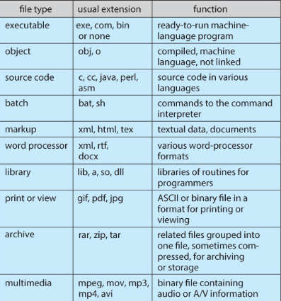  
Source: https://www.cs.uic.edu/~jbell/CourseNotes/OperatingSystems/11_FileSystemInterface.html

:::tip
More about the [structure of specific file format](/digital-media-processing)
:::

#### File Attributes

The file system keep track of the data information, file has many attributes:

- **Name**: Every file has a unique name, which is human-readable, that identifies it within the file system. The name is used to reference and locate the file.
- **Size**: The size of a file refers to the amount of storage space it occupies on the storage medium, usually measured in bytes, kilobytes, megabytes, or larger units.
- **Type/Format**: Examples include text files (e.g., .txt), image files (e.g., .jpg, .png), audio files (e.g., .mp3), video files (e.g., .mp4), and many more.
- **Location**: The location of a file refers to its physical position or address on the storage medium.
- **Metadata**: Other information about the file, such as creation and modification timestamps, file permissions, file owner, file attributes, and other relevant details.
- **Protection**: Security related information, such as, who is allowed to read or write, is it visible, is it read-only, etc.

#### File Operation

- **Create**: Create a new file entry along with information associated with the file, this requires allocating space for the file, and a directory to store the file.
- **Write**: The write operation is used to modify the contents of a file or append new data to it. Through [system call](/operating-system/system-call), we will specify the target file, starting position, and the data to be written. The OS translates the logical file address to a physical disk location and writes the data to the appropriate sectors or blocks on the storage medium.
- **Read**: The read operation retrieves data from a file and transfers it into memory. It involves specifying the file to read, the starting position, and the number of bytes to read. The OS translates the logical file address to a physical disk location, retrieves the requested data, and transfers it to the requesting process or buffer.
- **Reposition / Seek**: The seek operation is used to reposition the current read/write position within a file. It involves specifying an offset from a reference point (e.g., the beginning, current position, or end of the file) and a direction (forward or backward). The OS updates the file's read/write pointer accordingly, allowing subsequent read or write operations to occur at the desired location.
- **Delete**: The delete operation removes a file from the file system. It involves locating the file's metadata, freeing the associated disk space, and updating directory entries or file system structures to reflect the deletion.
- **Truncate**: Truncating a file adjusts its size by removing or discarding a portion of its contents, based on the specified target size. The OS updates file metadata and frees disk space as needed. Truncation can both shrink and expand a file, making discarded data inaccessible.
- **Open**: Establishes a connection or handle to a file, enabling subsequent operations on it. It involves specifying the file's name or identifier, access mode (e.g., read-only, write-only, or read-write), and other optional parameters. The OS verifies access permissions, allocates necessary resources (e.g., file descriptors), and prepares the file for subsequent operations.
- **Close**: The close operation terminates the connection or handle to an open file. It involves releasing any resources associated with the file, such as file descriptors or locks.

:::tip
Terminology:

- **File pointer** is reference or indicator that points to a specific location within a file, in which next read or write operation will occur. File pointer for read operation is called **read-pointer** and for write operation, it is called **write-pointer**.
- **File descriptors** are unique identifiers or numerical representations that represent access to a file, socket, or other I/O resources.
- **File locks** are mechanism to restrict access to a file or a portion of a file to a single process or thread, to prevent concurrent access. There are two types of locks, **shared lock**, which allows multiple processes to read concurrently, or **exclusive lock**, which grants exclusive access to a process for writing to the file.
- **File-open count** is a number of times a file has been opened by different processes or within the same process. It helps keeping track of how many processes currently have the file open.
 :::

#### File Security

To ensure only authorized processes have access to files, the OS provide a mechanism called **access control**. The OS maintains metadata about each file, including ownership and permissions. These permissions specify which processes are allowed to perform certain operations on the file, such as read, write, execute, append, delete, or list. Read, write, execute, and list are descriptive, append means writing new information at the end of the file, and list, list the name and attributes of the file.

In a multi-user environment where multiple users operate the same computer, meaning they may share access to files, this is where file security becomes even more critical. The operating system provides features to handle file sharing and control how files may be accessed by different users, not just processes.

In [Unix OS](/operating-system/unix), each file is assigned a 9-bit binary protection code, which consists of three 3-bit fields representing the **owner**, the **owner's group**, and everyone else (also called **universe**). These fields determine the level of access granted to different users or groups for a particular file.

The three permission bits for each field are:

- **Read (r)**: View the contents of the file.
- **Write (w)**: Modify or delete the file.
- **Execute (x)**: Grants the user or group the ability to execute the file, in the case of executable files or scripts, or to access the contents of a directory.

For example, a file with the permission code "rwxr-x--x" means that the owner has read, write, and execute permissions, the owner's group has read and execute permissions, and others have only execute permission.

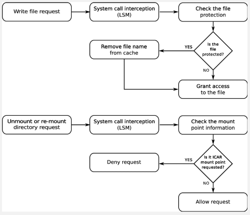  
Source: https://www.researchgate.net/figure/File-system-protection-algorithm_fig3_260525066

### File Organization

#### Directory

Within the file system on a disk, files are organized in **directories** or **folders**. A directory is a way of grouping files together, it is a container that holds related files and provides a hierarchical structure for organizing and managing these files. A directory itself does not represent a physical entity on the disk but rather serves as a logical container or organizational unit for files and subdirectories.

Directories create a hierarchy within the file system, forming a tree-like structure. At the top of the hierarchy is the **root directory**, which serves as the starting point for navigating the file system. **Subdirectories** can be created within the root directory, and further subdirectories can be created within those, forming a nested structure.

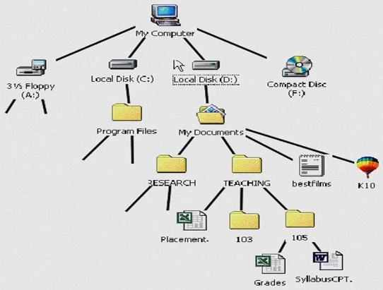  
Source: https://informationtechnologyja.wordpress.com/2020/10/19/information-technology-grade-9-lesson-2-tree-directory-structure/

#### Directory Levels

Directory can be categorized based on their organizational structure and the depth of their hierarchy:

- **Single-Level Directory**: All files are stored in a single directory without any subdirectories. While it's simple, it can be confusing to manage and locate specific files as the number of files increases.
- **Two-Level Directory**: Files are organized into multiple directories, with each directory having a unique name. Each file is associated with the name of the directory it belongs to, along with its own individual name.
- **Tree-Structured Directory**: This is the most commonly used directory. This directory structure its file in hierarchical tree-like structure. The top-level directory is the root directory, and from there, subdirectories can be created, each containing files or additional subdirectories.

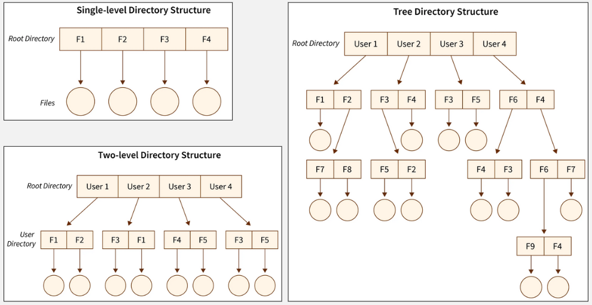  
Source: https://www.scaler.com/topics/directory-structure-in-os/

#### Pathnames

Files within the file system are identified by their **pathnames**, which specify their location within the directory hierarchy. A pathname typically includes the names of directories traversed from the root directory to the specific file, separated by slashes ("/") in Unix-like systems or backslashes ("\") in Windows systems.

For example, in Unix, a document file could be inside the Documents directory: `/home/user/Documents/file.txt`, where the root directory is just `/`. In Windows system, `C:\Users\user\Documents\file.txt`, where the root directory is `C:\`, the `C` is a drive letter which identify different disk partition in the storage.

There are three types of pathnames:

- **Absolute**: An absolute pathnames from the root to the file or directory. For example, in Unix-like systems, an absolute pathname could be `/home/user/Documents/file.txt`, where `/home/user/` represents the path to the `Documents` directory, and `file.txt` is the file name.
- **Relative**: Location of a file or directory relative to the current working directory. For example, if the current working directory is `/home/user/`, a relative pathname could be `Documents/file.txt` to refer to the file within the "Documents" directory.

  In the context of file system, the single dot "." and double dot ".." has a special meaning. The single dot represents the current directory, it is used to refer to the current working directory in relative pathnames. For example, if the current working directory is `/home/user/`, the pathname `./file.txt` refers to the file `file.txt` in the current directory.

  The double dot represents the parent directory, it is used to refer to the directory one level up in the directory hierarchy. For example, if the current working directory is `/home/user/Documents/`, the pathname `../file.txt` refers to the file `file.txt` in the parent directory of `Documents`, which is `/home/user/`.

- **Canonical**: Absolute pathname that has been simplified or normalized to its simplest form. It eliminates any unnecessary or redundant elements such as "." (current directory) and ".." (parent directory) references. For example, `/home/user/Documents/../file.txt` accesses the `file.txt` in the parent of `Documents` directory, this can be simplified to `/home/user/file.txt`.

#### Representation

Other than tree, there are other data structure can be used to represent directories. One of them is graph, using graph allows directories to have multiple parents, whereas trees enforce a strict hierarchical structure with a single parent for each directory. This can be useful when a directory needs to be logically linked or shared between multiple locations within the file system.

Multiple parents allow directory to have links, which are references or pointers to other files or directories.

- **Hard / Physical Links**: A hard link is a direct reference to a file or directory. When a hard link is created, it points to the same underlying data as the original file or directory. Changes made to the file through any of its hard links are reflected in all other hard links. Hard links can only be created for files within the same file system since they reference the underlying data blocks directly. While hard links can be used to create multiple references to a file, they cannot create cyclic dependencies or loops within a graph structure.
- **Soft / Symbolic Links**: On the other hand, soft link acts as a pointer or reference to another file or directory. Unlike hard links, soft links are separate files that contain a path to the target file or directory. When accessing a soft link, the file system resolves the link and redirects the request to the target file or directory. Changes made to the target file or directory are reflected in the soft link, but modifying the soft link itself does not affect the target. Soft links make it possible to create loops or cycles within a graph-like structure.

  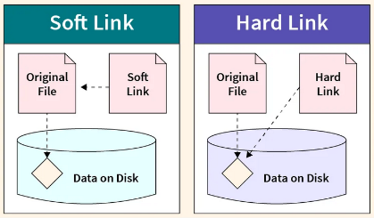  
   Source: https://www.scaler.com/topics/hard-link-and-soft-link-in-linux/

The two types of graph for directory representation:

- **[Acyclic Graph](/data-structures-and-algorithms/graph#acyclic)**: This directory structure uses a **directed acyclic graphs (DAGs)** to represent directories and their relationships. Directories can have multiple parents, and symbolic links can be used to create additional directory references. However, it is important to maintain acyclicity, meaning there should be no cyclic dependencies or loops in the graph.

  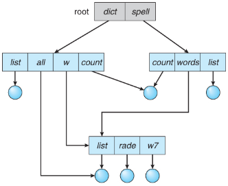  
  Source: https://www.cs.uic.edu/~jbell/CourseNotes/OperatingSystems/11_FileSystemInterface.html

- **[General Graph](/data-structures-and-algorithms/graph)**: In a general graph directory structure, directories are represented using a general graph data structure, which may have cycles and arbitrary relationships. Managing and navigating a general graph directory structure may require additional algorithms or mechanisms to handle cycles and resolve conflicts.

  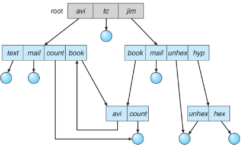  
  Source: https://www.cs.uic.edu/~jbell/CourseNotes/OperatingSystems/11_FileSystemInterface.html

:::note
[Tree](/data-structures-and-algorithms/tree) is a special case of graph where the properties are undirected and acyclic. It contains no cycles or loops and connected, meaning there is a path between any two vertices.
:::

### File System Implementation

#### File System Structure

File system is designed with multiple levels, forming a layered structure.

1. At the lowest level, the physical properties of the storage devices, such as disks, are dealt with. This level accesses data directly from the disk in the level of blocks. It is possible to access to any block of information on the disk directly.
2. The hardware is controlled by I/O control, through device drivers and interrupt handlers. It manages the flow of data between the application programs and the storage devices, also handles error detection and recovery in case of I/O failures.
3. A basic file system is implemented above the hardware. It is a logical file system on the physical storage devices that handles the low-level operations required to read and write data from and to the physical block of storage devices.
4. The file-organization module is responsible for managing how files are stored and organized. This includes determining allocated space ([free-space management](#free-space-management)), location of file, and translation between physical blocks and logical blocks.
5. The logical file system is the highest-level in the system. It is the level where a standardized and abstracted interface exist for applications to access and manipulate files without needing to know the details of the underlying physical storage devices. File organization is abstracted using [directory](#directory), file is also included with a **[File Control Block (FCB)](#file-control-block)**, which is a data structure used to maintain information about individual files, such as ownership, permissions, and location of the file contents.

   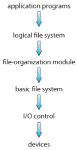  
   Source: https://www.cs.uic.edu/~jbell/CourseNotes/OperatingSystems/12_FileSystemImplementation.html

More about disk in [disk management](/operating-system/disk-management).

#### File Control Block

FCB holds important metadata about the file, such as its name, location, size, permissions, creation and modification timestamps, and other attributes. It acts as a reference point for the operating system to track and manipulate the file throughout its lifecycle.

When a file is created, the file system allocates a new FCB to represent it. The FCB is then updated with the necessary information, such as the file name and its associated data blocks. This FCB is then stored in the appropriate directory structure, allowing the operating system to locate and access the file.

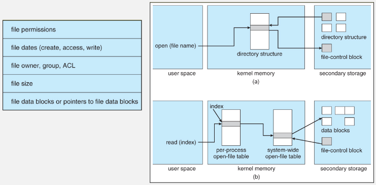  
Source: https://www.cs.uic.edu/~jbell/CourseNotes/OperatingSystems/12_FileSystemImplementation.html

The OS keep track a data structure called **open-file table**, to manage open files by processes or applications. Within a specific process, an **open-file table per-process** is used. On the other hand, the OS also keep track the **system-wide open-file table**, which maintains a global view of all open files and is accessible by all processes in the system.

When an application opens a file, the operating system scans the system-wide open-file table to determine if the file is already being used. If the file is indeed in use, the operating system creates a new entry in the per-process open-file table that references the existing entry in the system-wide open-file table. This approach helps minimize the overhead of opening a new file. After that, the process is assigned a **file descriptor** or **file handle**, which serves as a reference to the opened file.

If the file is not already open, the directory structure is searched, and the FCB associated with the file is copied into the system-wide open-file table. This table not only stores the FCB but also keeps track of the number of processes that have the file open, so that it know when to close the file.

After the process receive the file descriptor, either from the existing system-wide open-file or from per-process, the process can now perform file operation through it.

#### Partition & Mounting

**Partition** is the process of logically separating section of a physical disk drive. When a disk is partitioned, it is divided into multiple sections that can be treated as independent units. Each partition is typically formatted with a file system and can be used to store data and host a file system. Partition help to create boundaries so that the system doesn't overwrite important data when the disk is full.

**Mounting** is the process of making a file system accessible and associating it with a specific directory (called **mount point**). When a file system is mounted, the directory specified as the mount point becomes the entry point for accessing the files and directories within that file system.

For example, in Windows, mounting a drive is assigning a drive letter. Each storage device or partition is assigned a drive letter (such as `C:`, `D:`, `E:`) to represent it. If a file system is mounted at drive letter `C:`, users can access files within that file system by specifying the drive letter followed by the file path.

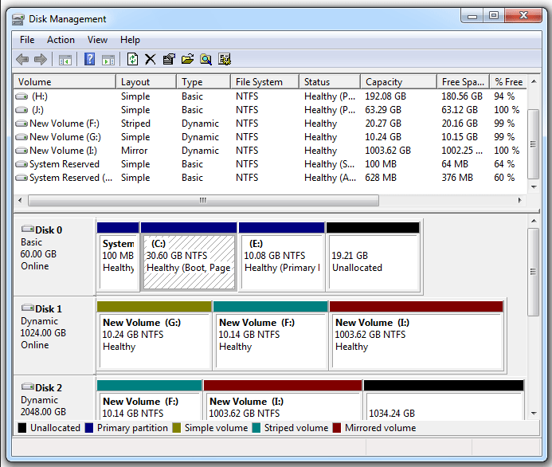  
Source: https://www.minitool.com/partition-disk/volume-vs-partition.html

#### Directory Implementation

Two common approaches are using a [linear list](/data-structures-and-algorithms/linked-list) and a [hash table](/data-structures-and-algorithms/hash-table).

- **Linear List**: The directory entries are stored in a sequential list. Each entry contains the file name and a pointer to the corresponding file data. This method is simple to program, but it may result in slower searching, especially for large directories.

  To find a specific file, the directory must be searched from the beginning until the desired entry is found. Similar to other operation where traversal is needed. This linear search can be time-consuming, especially if the directory is long. One way to improve is to use a sorted list, it can decrease the average search time by allowing a binary search. Additionally, a sorted list enables producing a sorted directory listing without a separate sorting step.

- **Hash Table**: In this approach, a linear list is still used to store the directory entries, but a hash data structure is employed as well. The hash table takes a value computed from the file name and returns a pointer to the corresponding entry in the linear list. This allows for faster directory search by greatly reducing the search time.

  When a file name needs to be looked up, it is hashed to generate a value within a given range. This value is then used to directly access the corresponding entry in the linear list, avoiding the need for sequential searching. However, [collisions](/computer-security/hash-function#collision) may occur when two file names hash to the same location, requiring collision resolution techniques, such as using a linked list within each hash entry.

  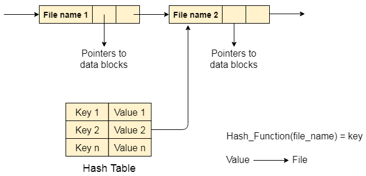  
  Source: https://www.javatpoint.com/os-directory-implementation

#### Allocation Methods

**Allocation Methods** are the methods of allocating space on a storage device to store files in a file system. It involves managing the storage resources and organizing the physical locations where files are stored on the storage medium.

See [storage allocation](/operating-system/disk-management#storage-allocation).

#### Free-Space Management

**Free-space Management** is the process of tracking and managing available space on a storage device. It involves keeping a record of which areas or blocks of the storage medium are free or allocated to files.

- **Allocation**: When a new file needs to be created, the system identifies and allocates a suitable portion of the storage medium to store the file. The system finds contiguous or non-contiguous set of free blocks that can accommodate the file's size.
- **Deallocation**: When a file is deleted or no longer needed, the system marks the previously allocated blocks as free, making them available for future allocations.

See [free-space management](/operating-system/disk-management#free-space-management).

### File System Example

#### FAT

**File Allocation Table (FAT)** is a file system used in the old Windows version. FAT has three versions, FAT12, FAT16, and FAT32, where each newer version accommodate larger storage capacities and file sizes.

- **Structure**:

  - The FAT file system organizes data on a storage device into **[clusters](/operating-system/disk-management#disk-structure)**, which are contiguous fixed-size units of allocation on the disk.
  - The file system consists of four regions: **reserved sectors**, **FAT region**, **root directory region**, and **data region**.
  - Reserved sectors is a portion of the file system that is reserved for the system file, it includes the boot sector, which contains information for booting the system.
  - The FAT is the main component, it is a table that keeps track of the allocation status of each disk block.
  - Root directory stores information about the files and directories located in the root directory.
  - Data region holds the actual data of files and directories, they are divided into cluster which are linked together through the entries in the FAT.

- **File Allocation Table**:

  - FAT is a table that keeps track of which clusters are allocated to files and directories.
  - Each entry in the table represents a cluster and contains information about the status of the cluster (such as whether it is free, allocated, or marked as bad). Entries are chained together forming a [linked list](/data-structures-and-algorithms/linked-list).
  - An entry of FAT depends on the version, FAT12 uses 12 bits, FAT16 uses 16 bits, and so on.
  - For example, an entry in FAT32 can be `0x00000000`, this represents a free cluster, a `0x0FFFFFFF` indicates an end-of-file marker or a special purpose value.

- **Directory Structure**:

  - The file system keep track of **directory table**, which is a centralized index that contains information about the files stored on the disk. It provides the necessary details to locate and access specific files. The directory table consists of a collection of directory entries, each representing a file or a subdirectory.
  - Each directory entry contains metadata about a file or a subdirectory, such as the file name, extension, attributes, creation/modification dates, and the starting of the cluster of the file's data.
  - The root directory is located in a fixed position on the storage device, and subsequent directories are stored as separate entries within their parent directories.

  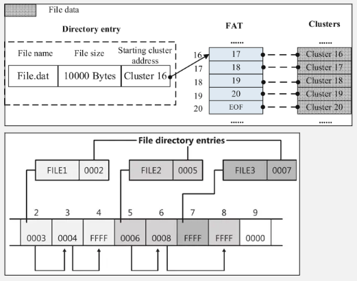  
  Source: [top](https://codes.pratikkataria.com/file-systems/), [bottom](https://networkencyclopedia.com/file-allocation-table-fat/)

  In the image above, FILE1 starts from the cluster 0002, it continues to cluster 0003 until the cluster 0004, where end of file mark is reached.

- **Limitations**:

  - The FAT file system has certain limitations, such as the maximum file size and the maximum number of files supported, which depend on the FAT version and cluster size being used. For example, the original FAT16 file system had limitations on file size (up to 2 GB) and the number of files in the root directory (up to 512 entries).
  - In FAT12 and FAT16, the file name is limited to 8 characters for the base name and 3 characters for the extension, to adapt with the limited resource of early days of computing. For example, `myfile.txt` is a valid file name, but `thisismyverylongfilename.txt` would be truncated to `thisismy.txt`.

To summarize, the FAT file system divides the disk into clusters and uses the FAT table to track the status of each cluster. Clusters store file data and are organized in a chain, the length of which varies depending on the file size. Files are grouped into directories, and information about directories and their entries is stored in the directory table. Each directory entry contains metadata and the starting cluster of the associated data. When reading a file, the system traverses the cluster chain until it reaches a specific end-of-file marker.

#### NTFS

**New Technology File System (NTFS)** is a file system for the newer Windows version. NTFS is a successor of FAT, it introduces support for long file names, advanced file and folder permissions, encryption, compression, and fault tolerance mechanisms.

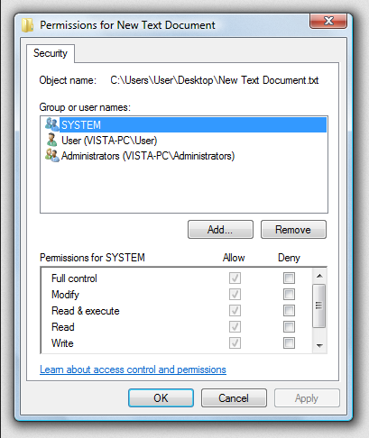  
Source: https://en.wikipedia.org/wiki/NTFS#/media/File:NTPermissions.png

The image above is the access control lists in Windows 7. Permissions can be assigned to file or directory. They are assigned to a parent folder are automatically inherited by its subfolders and files, reducing the need of assigning permission individually to each file or directory.

NTFS consists three important components **partition boot sector (PBS)**, **master file table (MFT)**, and **metafiles**. The fundamental data structure in NTFS is the MFT. MFT keeps track of the file's metadata and the address of file's blocks, eliminating the need for a separate table like in FAT. If a file is extremely large, it may require multiple MFT records to contain the list of its blocks.

- **PBS**: Located at the first sector of a disk partition. It contains essential information for the system to [boot](/operating-system/booting), such as the boot code that initiates the system's startup process, magic number that identifies NTFS file system, and the partition table that identifies the partition structure on the disk. In NTFS, the PBS includes the bootstrap code that loads the operating system's bootloader, which is responsible for starting the operating system.

  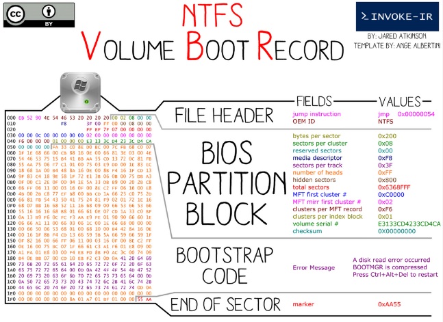  
  Source: https://twitter.com/jaredcatkinson/status/590333209495244801

- **MFT**: MFT is the centralized database that stores metadata about files and directories on an NTFS volume. MFT is a linear sequence of fixed-size 1-KB records, where each entry is file or directory on the volume. It contains information such as file names, timestamps, file attributes, security descriptors, and data allocation. The MFT is used file system operations, it enables quick access to file metadata and efficient management of file data.

  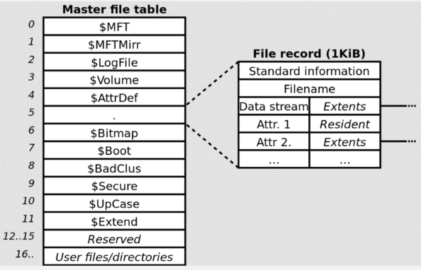  
  Source: https://andreafortuna.org/2017/07/18/how-to-extract-data-and-timeline-from-master-file-table-on-ntfs-filesystem/

- **Metafiles**: NTFS has several special system files that help structure and organize the file system. Some example:

  - **$MFT**: The Master File Table itself is a meta file that serves as a database of file and directory metadata, as mentioned earlier.
  - **$MFTMirr**: The MFT Mirror is a backup copy of the first few critical records of the MFT.
  - **$LogFile**: The Log File is used for transaction logging in NTFS. It records changes made to the file system before they are committed, allowing for system recovery when unexpected events such as power failures occurs.
  - **$Bitmap**: The Bitmap file keeps track of the allocation status of clusters on the disk, indicating which clusters are free and which are in use.
  - **$Volume**: The Volume file stores information about the NTFS volume itself, including its label, version, serial number, and other volume-specific details.

#### ext

**Extended file system (ext)** is a file system for [Linux kernel](/operating-system/linux-kernel), it consists of four versions, ext1, ext2, ext3, and the newest ext4. All of them are designed to be backward compatible of each other.

##### ext2

Starting from the ext2:

- **Disk Layout**: ext2 organizes data on the disk into fixed-size blocks. The default block size is 4 KB, although larger block sizes can be used. The file system divides the disk into block groups, each containing a fixed number of blocks. Each block group has its own metadata to track file system structures and data within that group.
- **Inodes**: **Inode (index node)** is a data structure in Unix-like system for describing file-system object, such as file or directory. An inode contains metadata about the file, including file permissions, ownership information, timestamps, and pointers to the data blocks that store the file's content. Inodes are arranged in a table structure.

  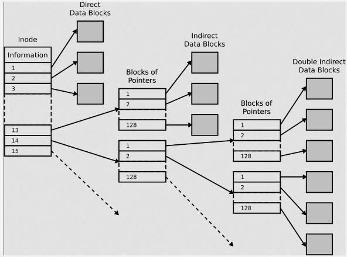  
  The inode can contain pointer to the file's content (direct data blocks), or a pointer to another block that contains pointer to the actual content (indirect data blocks).  
  Source: https://en.wikipedia.org/wiki/Inode_pointer_structure

- **Directory**: Directories in ext2 are organized as special files. A directory file contains a list of entries, where each entry represents a file or a subdirectory within that directory. Each entry consists of a name and an inode number that points to the corresponding inode.

  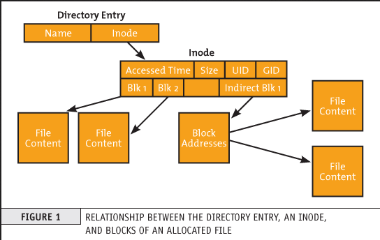  
  Source: https://premaseem.wordpress.com/2016/02/14/what-is-inode-in-linux-unit/

- **Block Allocation**: ext2 uses a block allocation bitmap to track the allocation status of data blocks. The bitmap keeps track of free blocks and allocated blocks within the file system. When a new file is created or an existing file is extended, ext2 searches for free blocks using the allocation bitmap and assigns them to the file. When a file is deleted in ext2, its inode and data blocks are marked as free in the allocation bitmap, making them available for reuse.

##### ext3

ext3 brought several improvements over ext2, such as the **journaling system**. The journaling system logs changes to the file system before committing them to the main file system structures. This journaling feature ensures that the file system can recover after a crash or an unexpected system shutdown.

There are three levels of journaling:

- **Journal (lowest risk)**: In data journaling, both metadata and file data modifications are logged in the journal before being committed to the file system. Can suffer from performance overhead due to the increased number of disk writes required.
- **Ordered (medium risk)**: Only metadata are logged in the journal, after it is logged, file content is modified after.
- **Writeback (highest risk)**: This level is similar to ordered, but logging metadata and writing the file content is done asynchronously. This means that there is a possibility that file content writing is completed first, and a system crash occurs before the metadata is written.

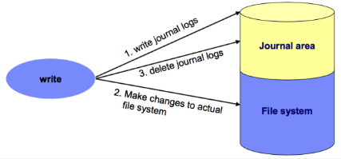  
Source: https://foxutech.com/journaling-filesystem/

##### ext4

ext4 supports larger file systems and file sizes compared to ext3. ext4 allows storage capacities up to 1 exabyte (1 billion gigabytes) and individual file sizes of up to 16 terabytes. ext4 does not limit the number of subdirectories in a single directory, in contrast, ext3 a directory can have at most 32,000 subdirectories.

ext4 enhances the allocation algorithms, it introduces **multiblock allocation**, which allows for allocation of multiple blocks at once. In contrast, ext3 calls block allocator, once for each block.

ext4 implements **delayed allocation**, also known as **allocate-on-flush**. This technique improves write performance by delaying the allocation and writing of data blocks until they are actually needed. This technique allow writing larger amount of data at once, reducing unnecessary disk I/O operations.
