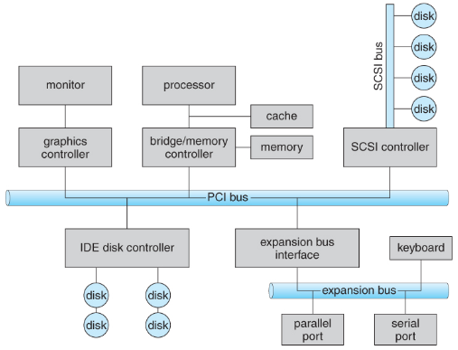
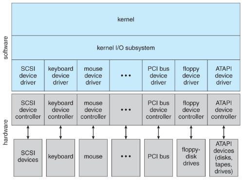
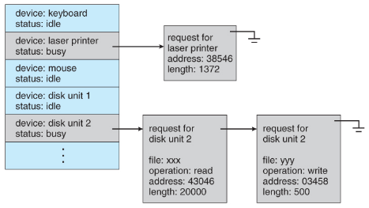
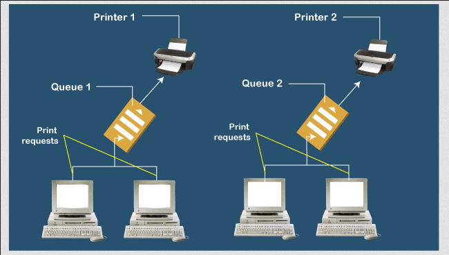
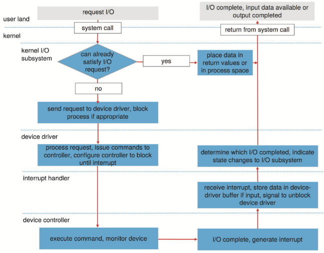

**Main Source:**

- **[Computer Organization & Architecture](/cs-notes/computer-organization-and-architecture)**
- **[Chapter 13 I/O Systems - Abraham Silberschatz-Operating System Concepts (9th,2012_12)]**
- **[Device driver — Wikipedia](https://en.wikipedia.org/wiki/Device_driver)**

**Device Management** is the activities of managing and controlling hardware devices connected to a computer system. It encompasses tasks such as device identification, configuration, allocation, and monitoring. The OS incorporates a **device driver**, they are software components that enable the OS to interact with hardware devices.

I/O devices such as keyboard, mice, hard disk, or network card are connected to the computer physically using **[I/O interfaces](/cs-notes/computer-organization-and-architecture/input-output#interfaces)**. They will be connected to the **[system buses](/cs-notes/computer-organization-and-architecture/von-neumann#system-buses)**, which is the communication pathway that allows data transfer between the CPU, memory, and I/O devices.

Between the buses and physical I/O connector, there exist a component called **[I/O controller](/cs-notes/computer-organization-and-architecture/input-output#io-controller)**, it is an intermediate hardware component that handles communication between the devices and the computer, protocol conversions, and device-specific operations.

  
Source: https://www.cs.uic.edu/~jbell/CourseNotes/OperatingSystems/13_IOSystems.html

### Device Driver

**Device driver** is a software component that acts as an intermediary between an operating system and a specific hardware device. Different type of hardware has different requirements, purpose of device driver is to create a standardized way to communicate between the higher-level applications and the hardware, abstracting away the complexities of the device.

Device drivers work by implementing the necessary software routines and algorithms to interact with the hardware device. The driver communicates with the device through the device's specific interface or protocol, which could be a bus interface (e.g., PCI, USB) or a network protocol (e.g., Ethernet). It uses device-specific registers, commands, and protocols to send and receive data to/from the device.

  
Source: https://www.cs.uic.edu/~jbell/CourseNotes/OperatingSystems/13_IOSystems.html

The driver exposes a standardized interface or API to the operating system and applications. This interface encapsulates the device's functionality and provides a set of functions or commands that the operating system and applications can use to interact with the device.

### I/O Technique

There are [methods and approaches](/cs-notes/computer-organization-and-architecture/input-output#io-technique) used to handle input and output operations between I/O devices and computer system.

- **Programmed I/O**: In this technique, the CPU directly controls the data transfer between the I/O device and memory. The CPU actively polls or checks the status of the I/O device to initiate or complete data transfers. Programmed I/O is simple to implement but can be inefficient as it ties up the CPU.
- **Interrupt-Driven I/O**: I/O device initiates an [interrupt signal](/cs-notes/operating-system/interrupt-handling) to the CPU when it is ready to transfer data. The CPU then suspends its current execution, saves its state, and transfers control to an interrupt handler routine. The handler reads or writes data between the I/O device and memory. Interrupt-driven I/O allows the CPU to perform other tasks while waiting for I/O operations to complete, the CPU doesn't need to check periodically.
- **Direct Memory Access (DMA)**: This technique enable data transfers between memory and I/O devices without CPU intervention. Data between I/O devices and CPU are sent to a DMA controller. The controller is responsible for coordinating the data transfer directly between the device and memory.
- **Memory-mapped I/O**: Memory-mapped I/O treats I/O devices as if they were memory locations. The I/O device is assigned a range of memory addresses, and the CPU can read from or write to these addresses to communicate with the device. Memory-mapped I/O simplifies the programming interface, as the CPU can use standard load and store instructions to access the device.

### I/O Devices Characteristics

To create a unified interface for I/O devices, each device is differentiated based on their characteristics, functionality, and purpose.

- **Data-transfer Mode**: Specific data formats in which they send or receive data, it could be a character, or a block of bytes as a unit.
- **Access Method**: How the device access and transfer data, it could be sequential access or random access. Sequential access reads or writes data sequentially, while random access allows for direct access to specific locations.
- **Transfer Schedule**: Determines when and how data transfers occur between the I/O device and the computer system, such as whether transfers are synchronous or asynchronous, whether they occur in real-time or in bursts, and how data is buffered during the transfer process.
- **Sharing**: Some devices support sharing, allowing multiple processes to access them simultaneously, while others may have exclusive access, allowing only one process to use the device at a time.
- **Device Speed**: Rate at which an I/O device can process and handle data, such as the latency, seek time, transfer rate, and delays.
- **I/O Direction**: Whether an I/O device is primarily used for input (receiving data into the computer system) or output (sending data from the computer system). Some devices, such as storage devices, support both input and output operations.

### I/O Scheduling

When there are multiple I/O requests, the I/O scheduler decides the sequence in which these requests are processed by the storage devices to optimize performance and fairness. [Some scheduling algorithm for CPU](/cs-notes/operating-system/process-management#scheduling-algorithms) such as FIFO, priority-based, SJF, RR, can also be used in I/O scheduling.

For scheduling, the OS keep track device status, it maintains a **device status table**. It is a data structure that contains essential details about I/O devices, such as whether it is available, busy, or in an error state, a queue that holds pending I/O requests for the device.

  
Source: https://www.cs.uic.edu/~jbell/CourseNotes/OperatingSystems/13_IOSystems.html

### Other Concepts

I/O requests from application can be made through [system calls](/cs-notes/operating-system/system-call). System call allows user-level processes to request services from the kernel, which operates at a privileged level, can then perform the requested I/O operations on behalf of the user-level process. Not only for abstraction, this also introduce isolation to prevent user-level processes from directly manipulating or interfering with critical system resources and devices.

#### Buffer

When transferring data between I/O devices, they potentially different speeds or data formats. When data is read from an I/O device, it is first stored in a buffer, which is a temporary storage area in memory, before being processed by the CPU or transferred to the application. Similarly, when data is written to an I/O device, it is first placed in a buffer before being transmitted.

Buffers help optimize I/O operations by allowing for asynchronous data transfer. They can reduce the impact of data rate mismatches between devices and provide a more efficient way to handle data transfers in chunks or blocks rather than individual bytes.

#### Cache

Caches are typically used in conjunction with storage devices, such as hard disk drives or solid-state drives, to reduce the latency associated with accessing data from slower storage media.

In I/O operations, a cache can be used to temporarily store recently accessed data or frequently used instructions. By keeping this data closer to the CPU, the cache reduces the need to access the slower storage media, resulting in faster data retrieval.

#### Spool

Spool is a temporary storage to hold output of a device, that cannot accept interleaved or concurrent data streams. Device such as printer can only handle one print job at a time. Spooling is a technique that incorporate spool by capturing the print jobs as they are submitted and stores them in the spool file. Each job is added to the queue in the order it was received.

The printer processes the print jobs one at a time, in the order they are stored in the spool file. It retrieves the next job from the spool file after completing the previous one. While the printer is working on one job, other jobs can continue to be spooled and added to the queue. The spooling system ensures that the printer receives the jobs sequentially, allowing it to print continuously without interruptions.

  
Source: https://www.javatpoint.com/what-is-a-print-spooler

### I/O Requests

There are several steps involve when I/O request is issued:

1. **I/O request issue**: The life cycle begins when a process initiates an I/O request by issuing a system call, such as a blocking `read()` or `write()`. The process specifies the file descriptor of the file to be accessed.
2. **Parameter Checking**: The system-call code in the kernel verifies the parameters of the I/O request for correctness. If the requested data is already available in the cache, the data are returned to the process, and the I/O request is completed.
3. **Device-Driver Buffering**: If the requested data is not available in the buffer cache, the kernel's device driver receives the I/O request. The device driver then stores the data in its buffer and schedules the I/O.
4. **I/O Processing**: The device driver sends command to the specific device controller. The controller receives the command and perform the requested operation. In this step, the driver may monitor the device's status or progress.
5. **Interrupt Handling**: When the I/O operation is completed, an interrupt is generated. The interrupt signals the completion of the I/O operation.
6. **Signal Completion**: After processing the completed I/O request, the device driver signals the completion of the I/O operation to the process that initiated the request. This signal indicates that the requested data is now available for the process to use.

  
Source: https://techlarry.github.io/OS/%E6%93%8D%E4%BD%9C%E7%B3%BB%E7%BB%9F%E6%A6%82%E5%BF%B5/12%20IO%20Systems/
