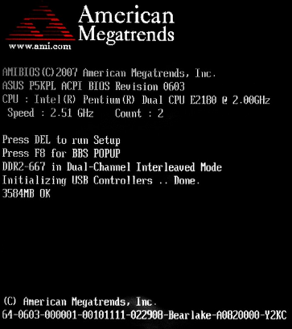
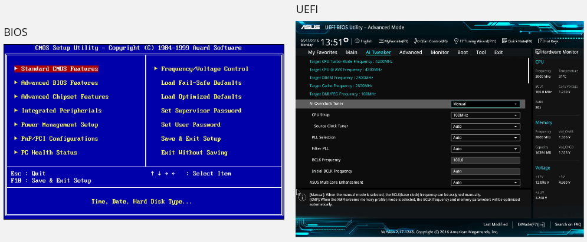
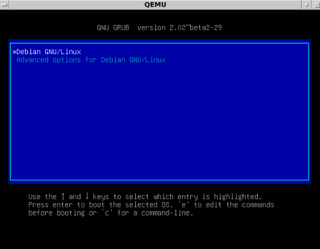
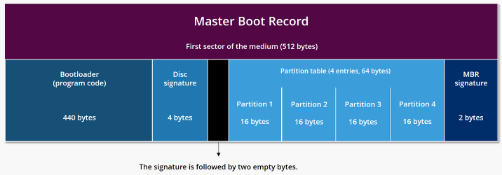

**Main Source:**

- **[Chapter 2.10, System Boot, Operating-System Structures - Abraham Silberschatz-Operating System Concepts (9th,2012_12)]**
- **[Booting — Wikipedia](https://en.wikipedia.org/wiki/Booting)**

**Booting** is the process by which a computer system is powered on and initializes its operating system. During booting, the computer goes through a series of steps to prepare itself for normal operation.

### Boot Process

When a computer is turned off, program can't run, this is because they are typically stored in RAM, which is a volatile memory that requires power. The goal of booting is to load the operating system into memory, including the kernel as its core component, which can execute user applications and provide various services.

When computer is turned off, it may be switched on via button. After that, series of process will occur:

1. **Power-on self-test (POST)**: Immediately after the computer is powered on, the computer's hardware components perform a Power-On Self-Test to check their functionality. This test ensures that essential hardware, such as the processor, memory, and storage devices, are working properly.

     
   Source: https://en.wikipedia.org/wiki/Power-on_self-test#/media/File:POST_P5KPL.jpg

2. **Bootstrap Program**: A small piece of code stored in a [read-only memory (ROM)](/computer-organization-and-architecture/coa-fundamentals#rom), known as the **bootstrap program**, **bootstrap loader**, or **bootloader** is executed. This program is responsible for locating the operating system's kernel and loading it into main memory. In a larger OS, the bootstrap loader retrieves a more complex boot program from the disk. This boot program is stored in a reserved block sector known as the [boot sector](/operating-system/disk-management#boot-sector).
3. **First-stage Boot Loader (Hardware Initialization)**: This stage is responsible for initializing essential hardware components and preparing the system for the operating system to take control. The first-stage bootloader often resides in firmware, such as the system **BIOS (Basic Input/Output System)** or **UEFI (Unified Extensible Firmware Interface)**. They are computer software stored in a non-volatile memory embedded within the hardware. They have low-level control with the system's hardware components.

     
   Source: [BIOS](https://sistem-komputer-s1.stekom.ac.id/informasi/baca/Perbedaan-UEFI-Dan-BIOS/a814197c359e9b098b07c33abcde7728e9b4f4c3), [UEFI](https://www.freecodecamp.org/news/uefi-vs-bios/)

4. **Second-stage Boot Loader (OS Initialization)**: The second-stage bootloader is responsible for loading the actual operating system into memory and initiating its execution. The second-stage bootloader is often specific to the operating system and may include additional functionalities such as device driver loading, system configuration, OS choice, dual boot, or other boot options.

     
   _GNU GRUB bootloader_  
   Source: https://en.wikipedia.org/wiki/Bootloader#/media/File:Debian_Unstable_GRUB2_(2015).png

After the operating system is loaded, the boot is considered done, as the operating system can now handle system or application programs.

### Master Boot Record (MBR)

MBR is a data structure located in the first sector (or [boot sector](/operating-system/disk-management#boot-sector)) of a storage device. The MBR contains essential information for the system to start up.

- **Bootloader Code**: The bootloader's code is stored in the MBR.
- **Partition Table**: The MBR stores a **partition table**, which is a data structure that describes the layout of partitions on the storage device. The partition table defines the starting and ending sectors of each partition, as well as the partition type.

  
Source: https://www.ionos.ca/digitalguide/server/configuration/what-is-mbr/
