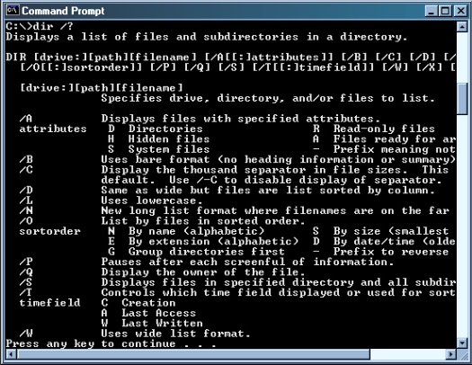
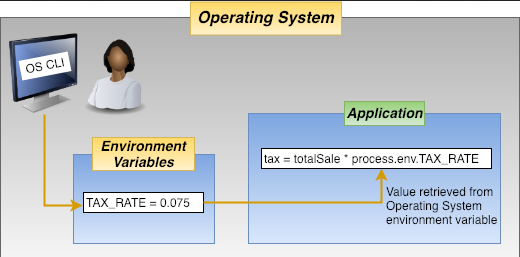
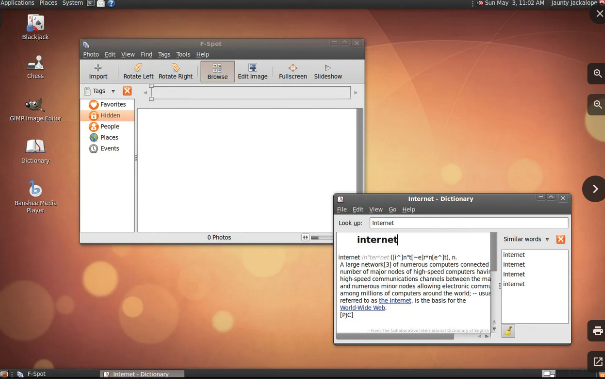
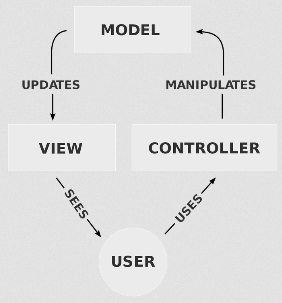

**Main Source:**

- **[Chapter 2 Operating-System Structures - Abraham Silberschatz-Operating System Concepts (9th,2012_12)]**
- **[Operating system, User interface — Wikipedia](https://en.wikipedia.org/wiki/Operating_system#User_interface)**
- **[Graphical user interface — Wikipedia](https://en.wikipedia.org/wiki/Graphical_user_interface)**
- **[Shell (computing) — Wikipedia](/cs-notes/<https://en.wikipedia.org/wiki/Shell_(computing)>)**

For human to operate with computer system, a user interface (UI) is required. The user interface serves as a bridge between the user and the underlying system, allowing users to issues command to the computer for performing tasks by providing input.

By user interface, it doesn't have to appear with visual element such as window, button, icons. A user interface can also be a pure text interface. A visual interface with graphical elements is called a **graphical user interface (GUI)**, whereas a pure text interface is called **command-line interface (CLI)**.

### CLI

CLI is a text-based interface, which means you enter specific command as text, and then the computer will execute the task associated with it. The output generated by the command is then displayed as text.

  
Source: https://avc.com/2015/09/the-return-of-the-command-line-interface/

When a command is entered, the computer will need to interpret the command. The program that interpret the command is called a **shell**. Example of shell in [Unix-like systems](/cs-notes/operating-system/unix) include **Bash**. The shell interpret the command by searching the corresponding executable program to execute that command. The command is typically the program's name. Once the program is found, the shell loads it into memory and executes it, passing any required arguments. The program performs its task and produces output, which is sent back to the terminal for display.

The programs for shell is typically stored in the directories specified in the system's PATH environment variable. Environment variables are dynamic values that can affect the behavior of the system or individual programs. Environment variables store information such as system paths, user preferences, or configuration settings.

  
Source: https://medium.com/chingu/an-introduction-to-environment-variables-and-how-to-use-them-f602f66d15fa

:::info
See also [command line vs shell](/cs-notes/computer-and-programming-fundamentals/computer-and-programming-terminology#command-line-command-prompt-shell-bash-terminal-console)
:::

### GUI

GUI presents computer system using graphical elements such as windows, icons, menus, buttons, and other visual controls. To interact with computer in a GUI system, those visual elements are directly manipulated by user using input devices like a mouse, keyboard, touchscreen, or other pointing devices.

For example, users can move the mouse cursor on the screen, click or double-click on icons, buttons, or other graphical elements to perform actions. Users can perform actions by pressing specific key combinations, such as Ctrl+C to copy selected text or Ctrl+Z to undo an action. GUI systems typically have menus that provide a list of options. Users can select menu items by clicking on them or by using keyboard shortcuts.

  
Source: https://www.britannica.com/technology/graphical-user-interface

GUI relies on a **windowing system**, which manages the display of graphical elements on the screen. The OS also interact with the graphics subsystem that handles the rendering and displaying graphical elements on the screen. It interacts with the graphics hardware to draw images, text, icons, and other visual components.

The GUI systems will monitor for user input such as mouse clicks, keyboard input, touch gestures, or stylus interactions. These events trigger actions within the GUI, it will be sent to the appropriate windows or applications.

#### MVC

One of the popular pattern for designing a GUI system is the **[Model-View-Controller (MVC)](/cs-notes/software-engineering/other-architecture-patterns#mvc)** pattern. This pattern design GUI system in three separate components.

The model represents the data and the logic within the application. It would handle tasks such as data retrieval, storage, manipulation, and any other operations specific to certain tasks.

The view represents the graphical interface that the user interacts with. It is responsible for presenting the data from the Model to the user and receiving user input.

The controller acts as an intermediary between the Model and the View. It receives user input from the View, processes it, and updates the Model accordingly. It also listens for changes in the Model and updates the View to reflect those changes.

  
Source: https://en.wikipedia.org/wiki/Model%E2%80%93view%E2%80%93controller
