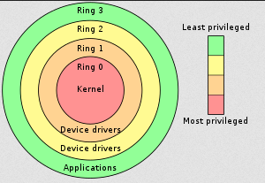
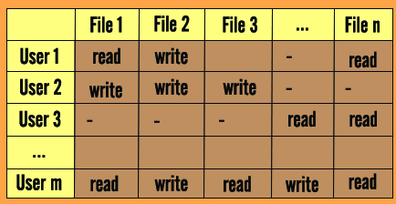

**Main Source:**

- **[Chapter 14 Protection - Abraham Silberschatz-Operating System Concepts (9th,2012_12)]**
- **[Chapter 15 Security - Abraham Silberschatz-Operating System Concepts (9th,2012_12)]**
- **[Protection ring — Wikipedia](https://en.wikipedia.org/wiki/Protection_ring)**
- **[Stoned — The Virus Encyclopedia](http://virus.wikidot.com/stoned)**

OS offers many protections and security mechanism, they are implemented at various levels throughout the entire structure. For example, at the kernel level, process are isolated from one another, memory access between process are restricted, kernel and application's memory is also separated. In the user level, access to files or directories are associated with specific permission. In the APIs level such as networking APIs, the OS implement protection mechanism such as [firewall](/cs-notes/computer-security/network-security#firewall) and secure protocols like [TLS](/cs-notes/computer-networking/network-encryption#ssltls), which is included with cryptographic algorithms.

### Protection Ring

The protection ring is a concept where the components of computer system, including the operating system, is represented as numbered rings or levels. The rings are numbered, with higher numbers indicating higher privilege levels. The most common implementation includes four rings, often referred to as Ring 0 (most privileged) to Ring 3 (least privileged), although other ring configurations are possible.

  
Source: https://en.wikipedia.org/wiki/Protection_ring

In the ring 0, often called kernel mode, this is where [kernel](/cs-notes/operating-system/kernel) exist. Kernel is the core of an operating system that has full access to all the computer resources, such as CPU and memory.

Some device drivers may operate at ring 1 or ring 2 to handle I/O operations or provide low-level access to specific hardware devices.

Ordinary user applications, such as word processors, web browsers, media players, or games, operate in ring 3. They have the lowest privilege level and run in a restricted environment, relying on the operating system to perform privileged operations on their behalf.

### Access Control

**Access control** is the practice of restricting access to resources in a computer system. It is a security mechanism that determines who is allowed to access specific resources, what actions they can perform on those resources, and under what conditions.

The list of who has access and what they can do is defined in an **access control list (ACL)**. It is a list of permissions associated with each resource that determines who can perform specific actions, such as read, write, execute, or modify, on that resource.

On the other hand, access control list can be rearranged in a matrix structure, this is called **access control matrix**. It is a security model that represents the access rights and permissions between subjects (users, processes) and objects (resources, files).

  
Source: https://cybersecurityglossary.com/access-control-matrix/

In the matrix, each row represents a subject, each column represents an object, and the entries in the matrix indicate the access rights or permissions that subjects have on objects. The access rights can include read, write, execute, delete, create, or other specific operations.

One way to implement the access control matrix is to maintain a global table. The operating system maintains a data structure that represents the entire matrix, with subjects as rows and objects as columns. However, the table's size can increase substantially, thus can't be stored in main memory. Additionally, access times may be slower because the table is stored on disk rather than in main memory.

:::note
In [Unix](/cs-notes/operating-system/unix), [files have protection code associated with it](/cs-notes/operating-system/file-system#file-security), this includes permission of what operations can be done on it.
:::

### Common Threats

Some common security threats: Malicious software, such as viruses, worms, Trojans, ransomware, and spyware. Unauthorized access which happen through brute-force attacks, password cracking, or exploiting weak authentication mechanisms. Social engineering technique such as phishing, pretexting, or impersonation.

See [computer security](/cs-notes/computer-security) and [other attack & exploit](/cs-notes/computer-security/other-attack-and-exploit) for more.

#### Example: Stoned

One example of a virus is **stoned**, it's a dangerous virus that attacks the [boot sector](/cs-notes/operating-system/disk-management#boot-sector) and infects the [Master Boot Record (MBR)](/cs-notes/operating-system/booting#master-boot-record-mbr) of floppy disks and hard drives.

- The virus starts from a disk, when a user inserts their disk to an infected one, the virus will spread. When the user boots from an infected disk, the virus code in the boot sector will be executed during the boot process.
- The virus can move the location of MBR, it is typically located in the first sector of the disk. The files that exist in the location that become the new location for MBR can be lost.
- The Stoned virus's primary purpose is to display a humorous or taunting message on the screen once the computer boots up. The specific message displayed varies between different variants of the virus but often includes phrases related to drug use or legalization.

Unlike some other viruses, the Stoned virus does not typically cause significant damage or data loss. Its main impact is the display of the message, which is more of a nuisance than a destructive action.
