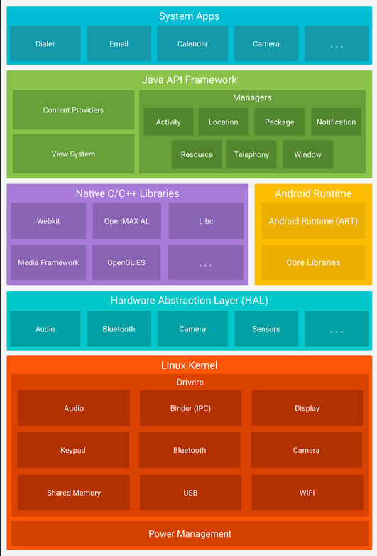
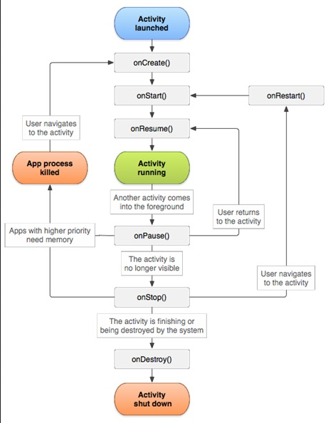

**Main Source:**

- **[Android (operating system) — Wikipedia](<https://en.wikipedia.org/wiki/Android_(operating_system)>)**
- **[CASE STUDY 1: UNIX, LINUX, AND ANDROID, SEC 10.8 - Andrew S. Tanenbaum - Modern Operating Systems]**

**Android** is an open-source operating system designed primarily for mobile devices such as smartphones and tablets, but it is also increasingly used as the embedded OS for dedicated devices that require a graphical user interface (GUI) such as VOIP phones, smartwatches, automotive dashboards, medical devices, and home appliances.

Android is a combination of open-source and closed-source. The **Android Open Source Project (AOSP)** is the open-source aspect of Android, it consists of the core components and functionalities of the Android platform. It is freely available for anyone, such as different manufacturers to use, modify, and distribute under open-source licenses.

By the core of Android platform, it does not include some proprietary Google applications and services, such as the Google Play Store, Gmail, Google Maps, and Google Play Services. These Google-specific components are not part of the open-source AOSP and are instead distributed as separate proprietary applications.

### Architecture

  
Source: https://developer.android.com/guide/platform

Starting from the bottom:

1. **Linux Kernel**: The Android OS is based on the modified version of [Linux kernel](/operating-system/linux-kernel). The kernel is responsible for managing the system's core functions, such as memory management, process management, device drivers, and system security.

   Let's discuss some components related to the Android in this layer:

   - **Binder**: Binder is the implementation of [IPC](/operating-system/inter-process-communication) mechanism in Android. The binder driver is part of the Linux kernel and manages the low-level details of the Binder IPC mechanism. The IPC is based on client-server model. Various type of data, including calls, parameters, and results are encapsulated in binder objects. The binder driver handles the creation, registration, and management of Binder objects, as well as the routing of transactions between clients and servers.

   - **Power Management**: Power management involves managing and optimizing the power consumption of hardware devices and system components. This layer is different compared to traditional computing, due to Android being a mobile device. Android introduces a feature called wake locks to manage how the system goes to sleep. Wake locks allow the system to maintain the desired power state, either running and ready for user input or deeply asleep, based on the device's activity and user interaction.

   - **Camera**: The camera handles the interaction between the hardware camera sensors and the software components that utilize them. It provides the necessary drivers and interfaces for controlling camera sensors, capturing images or videos, and handling camera-specific functionalities. Because Android can be customized, it is possible that different manufacturers offers different hardware, making it possible for specific Android device to have advanced feature such as dynamic range.

2. **Hardware Abstraction Layer (HAL)**: The HAL layer provide a standardized interface for interacting with device-specific hardware components. It allows the upper layers of the Android stack to access hardware features, such as camera, sensors, audio, and display, without worrying about the underlying hardware details.

3. **Native Libraries**: Android includes a set of native libraries written in programming languages like C and C++. These libraries provide essential functionality to the Android system, including graphics rendering, multimedia processing, SQLite database support, networking, and more.

4. **Android Runtime (ART)**: Android Runtime is the [runtime environment](/computer-and-programming-fundamentals/runtime-environment) for executing Android applications. The majority of Android apps are developed using the Java programming language, this makes Android follow [object-oriented design](/computer-and-programming-fundamentals/object-oriented-programming). In order to run a Java application, we will need a **Java Virtual Machine (JVM)** for its runtime environment.

   Android apps do not run directly on a standard JVM. Instead, Android introduced its own runtime environment called the **Dalvik Virtual Machine (DVM)**. The DVM was designed for device with limited resources like smartphones and tablets. The DVM runs Java app using [just-in-time (JIT) compilation](/computer-and-programming-fundamentals/interpreter#jit-compilation), which dynamically translates Java bytecode into machine code at runtime to improve performance.

   However, since Android 5.0, DVM is replaced with **Android Runtime (ART)**. The primary reason for this is that ART uses an **ahead-of-time (AOT) compilation** approach, where the application bytecode is compiled into native machine code during installation or upon first execution. This optimization improves performance and reduces runtime overhead.

5. **Java API Framework**: This layer consist of a set of high-level APIs for developers to build Android applications. It includes various components, such as activity manager, content providers, broadcast receivers, and services.

6. **System Apps**: At the topmost layer of the Android architecture are the applications themselves. These can be pre-installed system applications, such as the Phone app, Contacts, or Messaging, or third-party applications; they can be from specific manufacturers or downloaded from the Google Play Store or other sources.

### Characteristics

1. **Activity**: A single screen with a user interface is represented as an **Activity**. Activity has its own lifecycle, which indicates their status such as `onCreate()`, `onStart()`, `onResume()`, `onPause()`, `onStop()`, and `onDestroy()`. Compared to desktop, Android can only show a single activity to the user, activity shown to user is called **foreground activity**. Multiple activity can be run at the same time, but some will be put on the background. Activities in the background may retain their state and continue to run, but they have a lower priority compared to the foreground activity.

     
   Source: https://socs.binus.ac.id/2017/09/26/activity-dan-fragment-di-android-studio/

2. **Memory Management**: One of the memory management aspect of Android involves freeing up system resources by closing or "killing" the app's process on the background. By killing the app process, the app will need to go to the `onCreate()` lifecycle again. So, when the app is activated again from the background, the app will be started as a fresh start, losing all their state.

3. **Receiver**: Receiver is a component that listens for and responds to broadcast messages sent by the system or other apps. The app can register to listen to specific broadcast intents. Receivers enable your app to respond to events happening outside its own context, such as receiving a text message, Bluetooth update, sensor information, or a low battery warning.

4. **Service**: A service is a component that runs in the background, performing long-running operations without a user interface. Services can be categorized into foreground and background. Foreground service is shown to user, typically through notification, this can be an act of downloading files or playing music. On the other hand, background service is not shown to user, this can be an operation to sync local data to remote server.

5. **Intent**: Intents are a messaging mechanism in Android that allow components (such as activities, services, and receivers) to communicate with each other. An intent can be used to start an activity, launch a service, or send a broadcast to a receiver. It carries information such as the action to be performed and the data to be used. Intents can be explicit, specifying the target component, or implicit, allowing the system to determine the appropriate component based on the intent's action and data (e.g., default gallery app to open photos).
