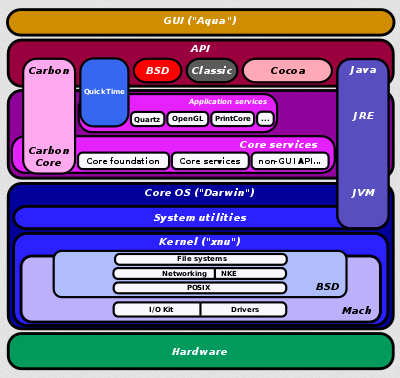
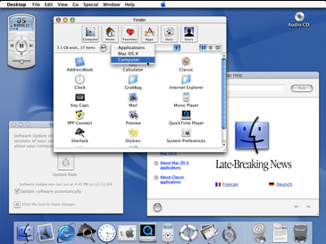
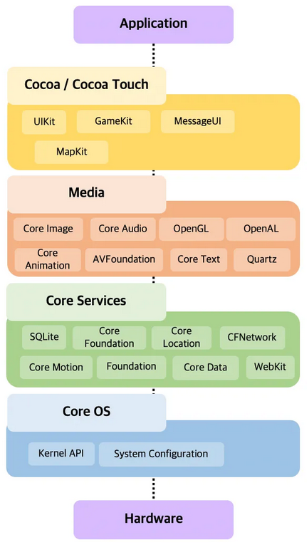

**Main Source:**

- **[Architecture of macOS — Wikipedia](https://en.wikipedia.org/wiki/Architecture_of_macOS)**
- **[[iOS] Architecture of iOS Operating System by ganeshrajugalla — Medium](https://medium.com/@ganeshrajugalla/ios-ios-introduction-and-structure-fdd7ecf08c4c)**

**macOS** (originally OS X) and **iOS** are operating systems developed by Apple Inc. for different hardware platforms. macOS is the operating system used on Apple's Macintosh computers, including iMac, MacBook, Mac Pro, and Mac Mini, for desktop and laptop computers. On the other hand, iOS is the operating system used on Apple's mobile devices, including iPhone, iPad, and iPod Touch.

Both macOS and iOS are based on a common foundation called **Darwin**, which is an open-source [Unix-like](/cs-notes/operating-system/unix) operating system.

Explaining it bottom-up, there exist a microkernel called **Mach**. It provides a minimal set of services, such as process management, virtual memory management, and inter-process communication. And then there is another kernel, called **XNU**. It is a hybrid kernel that combines the Mach microkernel with components of the [BSD UNIX (original version of BSD)](/cs-notes/operating-system/bsd) kernel. As we progress further, we reach Darwin, constructed on the XNU kernel, which functions as the core of macOS, iOS, and other related operating systems.

### macOS Architecture

  
Source: https://en.wikipedia.org/wiki/Architecture_of_macOS

1. **Kernel (XNU)**: BSD component of the kernel provides support for file systems, networking, POSIX APIs, network kernel extensions (NKE), and other essential functionalities. On the other hand, the Mach microkernel handles memory management, interprocess communication, and thread scheduling. Additionally, it includes the I/O kit, which is responsible for device driver development and management.
2. **System utilities**: System utilities that perform various low-level tasks related to system administration, configuration management, disk management, and diagnostics.
3. **Core OS (Darwin)**: The kernel and other system utilities are all included within the core Darwin OS.
4. **[Java Runtime Environment (JRE)](/cs-notes/computer-and-programming-fundamentals/runtime-environment#java-runtime-environment-jre)**: macOS supports the Java programming language through the JRE. The JRE provides the necessary runtime environment for executing Java applications on macOS. It includes the JVM, which interprets and executes Java bytecode, as well as other libraries and components required for Java application execution.
5. **Carbon & Core services**: Both are the APIs for making application for macOS. Carbon was initially introduced to assist in transitioning applications from the classic Mac OS to macOS. It offers support for legacy Mac OS APIs and allows developers to maintain compatibility with older applications.

   Core Services includes a range of OS functionality, including file management, networking, and interprocess communication. These frameworks enable developers to access system resources and build robust applications for macOS.

6. **Application Services & API**: There are many APIs provided, such as Quartz, PrintCore, QuickTime. Quartz is a graphics rendering and compositing engine in macOS. PrintCore is a printing subsystem in macOS for printing documents and managing printer devices. QuickTime is a multimedia framework and player for handling multimedia data, including audio, video, animation, and interactive media.
7. **GUI (Aqua)**: The highest level is the GUI known as Aqua. It provides the visual elements, windowing system, and user interaction components that users interact with on their Mac computers. Aqua is responsible for rendering the desktop, windows, icons, menus, dialog boxes, and other graphical elements.

     
   Source: https://en.wikipedia.org/wiki/Aqua_%28user_interface%29

### iOS Architecture

  
Source: https://medium.com/@ganeshrajugalla/ios-ios-introduction-and-structure-fdd7ecf08c4c

The architecture of iOS can be divided into several key components:

1. **Core OS**: Core OS includes the XNU kernel, drivers, security frameworks, networking, and file system management. Core OS handles low-level tasks such as hardware interaction, memory management, and security.
2. **Core Services**: Core Services and provides additional system-level functionalities. It includes services such as iCloud, Core Data (a persistence framework), Core Location (for geolocation services), and Core Bluetooth (for Bluetooth communication).
3. **Media**: Media layer consist of multimedia-related functionalities. It includes frameworks for audio, video, and graphics. Core Audio provides audio playback and recording capabilities, Core Animation for animations and transitions, Core Text for text rendering, Core Image for image processing, and AVFoundation framework for working with multimedia features like video editing and capture.
4. **Cocoa**: Cocoa is the framework specifically designed for building iOS applications. It provides a set of high-level APIs and tools for developing user interfaces, handling touch input, and managing application lifecycle. Cocoa Touch includes UIKit, which is responsible for building the UI, handling user interactions, and managing navigation between screens.
5. **Application Layer**: Layer where developers build their iOS applications. It includes the apps themselves, which are developed using the iOS SDK and various frameworks mentioned above.
