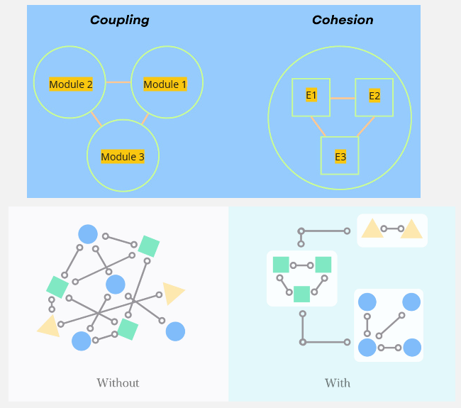
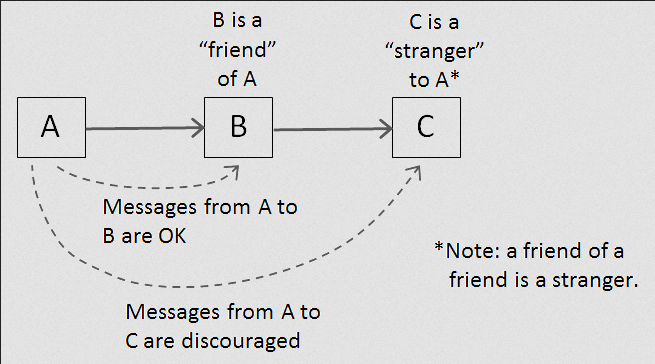
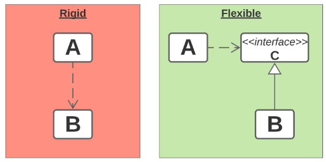

**Main Source:**

- **Various Google searches**
- **[Don't repeat yourself — Wikipedia](https://en.wikipedia.org/wiki/Don%27t_repeat_yourself)**
- **[KISS principle — Wikipedia](https://en.wikipedia.org/wiki/KISS_principle)**
- **[You aren't gonna need it — Wikipedia](https://en.wikipedia.org/wiki/You_aren%27t_gonna_need_it)**
- **[Law of Demeter — Wikipedia](https://en.wikipedia.org/wiki/Law_of_Demeter)**
- **[Separation of concerns — Wikipedia](https://en.wikipedia.org/wiki/Separation_of_concerns)**
- **[Prefer composition over inheritance? — stackoverflow](https://stackoverflow.com/questions/49002/prefer-composition-over-inheritance)**
- **[Summary of 'Clean code' by Robert C. Martin — wojteklu GitHub Gist](https://gist.github.com/wojteklu/73c6914cc446146b8b533c0988cf8d29)**
- **[SOLID — Wikipedia](https://en.wikipedia.org/wiki/SOLID) and the 5 articles**
- **[Difference Between Cohesion and Coupling — stackoverflow](https://stackoverflow.com/questions/3085285/difference-between-cohesion-and-coupling)**

**Software Principles** are collection of guidelines, styles, tips, good practices, by various software and engineers to help to guide the process of developing a good software. By good software, it means they are reliable, maintainable, scalable, and many more listed in [software characteristics](/software-engineering#software-characteristics).

### OOP

[Object-Oriented Programming (OOP)](/computer-and-programming-fundamentals/object-oriented-programming) is a common paradigm used in the world of software engineering. The elements of OOP such as classes, objects, inheritance, polymorphism, encapsulation, and many more promotes code organization, reusability, and modularity in a software system. These elements serve as the foundation of other software principle that we will see later.

We will see an example that demonstrate the benefits OOP about code reusing (in [Kotlin programming language](https://kotlinlang.org)).

Non-OOP approach:

```kotlin
val employee1Name = "John Doe"
val employee1Age = 30
val employee1Department = "Sales"

val employee2Name = "Jane Smith"
val employee2Age = 35
val employee2Department = "Marketing"

fun introduceEmployee(name: String, age: Int, department: String) {
    println("Hello, my name is $name. I am $age years old and work in the $department department.")
}

introduceEmployee(employee1Name, employee1Age, employee1Department)
introduceEmployee(employee2Name, employee2Age, employee2Department)
```

OOP approach:

```kotlin
class Employee(val name: String, val age: Int, val department: String) {
    fun introduce() {
        println("Hello, my name is $name. I am $age years old and work in the $department department.")
    }
}

val employee1 = Employee("John Doe", 30, "Sales")
val employee2 = Employee("Jane Smith", 35, "Marketing")

employee1.introduce()
employee2.introduce()
```

The code is about storing employee's data and have a function that can introduce them. The Non-OOP approach require us to make a bunch of variable just to store the data, while in OOP approach, we can make a class and represent the employee as an `Employee` object. Class and objects provides a structured and organized way to encapsulate related data and behavior, leading to more maintainable code.

### DRY

**DRY (Don't Repeat Yourself)** is a software development principle that promotes code reuse and avoids duplication. The DRY principle is stated as "Every piece of knowledge must have a single, unambiguous, authoritative representation within a system".

When code is repeated in multiple places, it becomes harder to update or modify because changes need to be made in multiple locations, increasing the chances of introducing bugs and inconsistencies. When a change is required, it only needs to be made in one place, making maintenance and updates more efficient and less error-prone.

Non-DRY approach:

```kotlin
fun main() {
    println("Hello, Alice!")
    println("Hello, Bob!")
    println("Hello, Charlie!")
}
```

DRY approach:

```kotlin
fun greet(name: String) {
    println("Hello, $name!")
}

fun main() {
    val names = listOf("Alice", "Bob", "Charlie")
    for (name in names) {
        greet(name)
    }
}
```

The code is about storing names and having a function to greet them. Non-DRY approach manually call `println` thrice with the name data. If we somehow wanted to change the greet message, we will need to modify all the three line of code. The DRY approach helps us to avoid printing the greeting message by putting it all in one function, and then integrate it with a for loop.

The previous OOP example also follows this DRY principle.

### KISS

**KISS (Keep It Simple, Stupid)** is a software development principle that promotes emphasizes the importance of simplicity. The principle suggests that systems and code should be kept as simple as possible, avoiding unnecessary complexity.

An example of unnecessary abstracted code:

```kotlin
class Parity(val num: Int) {
    var isEven = false

    fun updateIsEven() {
        if (decideIsEven(num)) {
            numIsEven()
        } else {
            numIsNotEven()
        }
    }

    fun numIsEven() {
        isEven = true
    }

    fun numIsNotEven() {
        isEven = false
    }

    fun decideIsEven(n: Int): Boolean {
        if (n % 2 == 0) {
            return true
        } else {
            return false
        }
    }

    fun getIsEven(): Boolean {
        return isEven
    }
}

fun main() {
    val parity = Parity(3)
    parity.updateIsEven()
    println("Is 3 even?: ${parity.getIsEven()}")
}
```

This code creates a class that is supposed to handle the parity of a number. The purpose of introducing a class in this code is to create an abstraction, this way the function caller doesn't need to handle the parity logic. In reality, the handling of parity is actually very simple and doesn't need to be overly abstracted like above. The checks for `num % 2 == 0` to determine if a number is even is a relatively well-known concept.

We don't need to make function for every single expression we are executing. Making a function just to set a field variable is unnecessary. Making a getter to get the `isEven` variable is also not needed, because in Kotlin properties can have implicit getters generated automatically.

### YAGNI

**YAGNI (You Ain't Gonna Need It)** principle suggests developers should avoid adding functionality until it is necessary. It is typically associated with [agile development methodology](/software-engineering/software-process#agile), where the development style revolve around quick incremental software development.

Its main idea is to focus on delivering the minimum viable product (MVP) or the necessary features to meet the immediate requirements, rather than adding functionality that may or may not be needed in the future.

There are some factors to consider when developing functionality:

- **Development Costs**: Resources required to build the software, such as developers' salaries, project management expenses, software licenses, development tools, and infrastructure costs.
- **Maintenance and Repair Costs**: There is a potential that the functionality may need bug fixes, updates, security patches, or technical support.

Unnecessary development sacrifice time and effort for future development and maintenance, possibly introducing **technical debt**. Technical debt is a consequence of software development bad decisions that keep accumulating costs and challenges as the software evolves, similar to financial debt that accumulates interest over time.

### Coupling & Cohesion

Both describe the relationship and dependency between software components. **Coupling** refers to the inter-component interaction, while **cohesion** refers to the intra-component interaction.

Cohesion is the degree to which elements within a component or module are related to accomplish a single, well-defined purpose.

- **High Cohesion**: A high cohesion component indicates that the elements within it are closely related and focused on a specific functionality or responsibility. A highly cohesive component performs a single task or represents a set of related tasks, forming a logically atomic unit. It is a preferred property to understand codebase easier.
- **Low Cohesion**: Low cohesion is the opposite, which is when a component has multiple unrelated functionalities and responsibilities. This can lead to a component that is difficult to understand. Low cohesion may also result in code duplication and reduced reusability.

On the other hand, coupling describe the interaction between modules.

- **Loose Coupling**: In a loosely coupled system, components are independent and they interact through well-defined interfaces. Loose coupling principle encourages components to have minimal dependencies on each other. Changes to one component have minimal impact on other components, making the system more flexible, modular, and easier to maintain.
- **Tight Coupling**: Tight coupling occurs when components have strong dependencies and rely heavily on each other's internal details or implementation. In a tightly coupled system, changes in one component may require corresponding changes in multiple other components. This can lead to code that is harder to modify, test, and maintain.

  
_with and without high cohesion and low coupling_  
Source: [top](https://www.boardinfinity.com/blog/cohesion/), [down](https://www.engati.com/glossary/cohesion-and-coupling)

Below are code that demonstrate cohesion and coupling.

Low Cohesion:

```kotlin
class Customer {
    fun calculateOrderTotal(order: Order) {
		// calculate order logic...
	}
	
    fun sendOrderConfirmationEmail(order: Order) {
		// send email to this customer object...
	}
	
    fun updateCustomerInformation() {
		// operate on this object...
	}
}
```

High Cohesion:

```kotlin
class OrderProcessor {
    fun processOrder(order: Order, customer: Customer) {
        validateOrder(order)
        calculateOrderTotal(order)
        notifyCustomer(customer)
    }
    private fun validateOrder(order: Order) {}
    private fun calculateOrderTotal(order: Order) {}
    private fun notifyCustomer(customer: Customer) {
		// customer.updateCustomerInformation(customer)
	}
}
```

The `Customer` class in the low cohesion code combine order functionality with customer functionality, simply because customer needs to know an order subtotal. On the other hand, the high cohesion code create an `OrderProcessor` class solely to process order.

The high cohesion code makes the caller easier to interact with the class. The caller can just call the method `processOrder` passing in an `Order` and `Customer` to process it. In contrast, in the low cohesion code, caller requires an understanding of how `Customer` class process order. (i.e., should we call `sendOrderConfirmationEmail` or `updateCustomerInformation` first?)

:::info
We typically call component that invokes or calls a function or method **caller**, while the one that is being invoked or called is called **callee**.
:::

Tight Coupling:

```kotlin
class UserService {
    private val userRepository = UserRepository()

    fun getUserById(userId: String): User {
        return userRepository.getUserById(userId)
    }

    fun saveUser(user: User) {
        userRepository.saveUser(user)
    }
}

class UserRepository {
    fun getUserById(userId: String): User {}
    fun saveUser(user: User) {}
}
```

Loose Coupling:**

```kotlin
interface UserRepository {
    fun getUserById(userId: String): User
    fun saveUser(user: User)
}

class UserService(private val userRepository: UserRepository) {
    fun getUserById(userId: String): User {
        return userRepository.getUserById(userId)
    }

    fun saveUser(user: User) {
        userRepository.saveUser(user)
    }
}
```

The `UserService` class in tight coupling code depends a lot on `UserRepository` class. It literally holds an instance of `UserRepository` inside it. By depend, it will affect how the class operates based on the class it depends on. If somehow we want to change the behavior of `UserRepository`, such as changing specific method functionality, we will need to alter the behavior of `UserService` as well. Tight coupling decrease flexibility and maintainability.

On the other hand, the loose coupling code introduce an interface, which allows for different implementation of `UserRepository` to be provided for `UserService` class. The `UserService` depend on the interface, and the implementor adhere to it. A modification to `UserRepository` behavior doesn't require us to modify many things, this is because they are based on the interface contract.

The contract is nothing but a specification that a `UserRepository` must contain method `getUserById`, which take a `userId` of type `String` and return an object `User`, and a `saveUser` method that takes `User`. This allows us to create a variety of class that may have different way of processing data internally. All they have to do is to follow the interface specification.

:::note
The ideal properties are high cohesion and low coupling.
:::

### Law of Demeter (LoD)

**LoD (Law of Demeter)** is a design principle that promotes loose coupling and encapsulation in [object-oriented programming](/computer-and-programming-fundamentals/object-oriented-programming). The principle states that an object should have limited knowledge about other objects and should only interact with its immediate neighbors.

There are three principles of LoD, based on [Wikipedia](https://en.wikipedia.org/wiki/Law_of_Demeter):

- Each unit should have only limited knowledge about other units: only units "closely" related to the current unit.
- Each unit should only talk to its friends; don't talk to strangers.
- Only talk to your immediate friends.

An object could have dependency to other object, meaning it relies on another object to fulfill certain tasks or provide specific functionality. We call the object that it depends on a **friend** or **neighbor**.

The principle states that an object should have limited knowledge about its friend. One of the benefits of an object with limited knowledge about its companion can be seen in the case of designing a public API. A random person using your API shouldn't need to understand the inner working of your API too much, because that is the point of API, to provide a high level of abstraction.

  
Source: https://blog.knoldus.com/the-law-of-demeter/

Let's say we are making an API that lets user (developer) to store book name data.

```kotlin
val dm = DataManager()
dm.saveData("Software Engineering 9th Edition by Ian Sommerville")
```

We can save data by just calling `saveData` method. Now under the hood, the API may use SQLite database to actually store the data.

```kotlin
class DataManager(private val databaseManager: DatabaseManager) {
    fun saveData(data: String) {
        // preprocess the data...
        databaseManager.saveToDB(data)
    }
}

class DatabaseManager(private val db: SQLite) {
    fun saveToDB(data: String) {
        db.initialize()
        db.syncWithRemoteServer()
        // other database setup here...
        db.save(data)
    }
}
```

The point of this API is to abstract away the process of saving data to database. `DataManager` is responsible for handling data, including preprocessing it and saving it to the database. The process of saving to database is abstracted again by `DatabaseManager`, it doesn't even know which database it is interacting to. Finally, the `DatabaseManager` choose `SQLite` as its database, and it contains the actual code that interact with database.

The application of LoD principle in this example can be seen in the `DataManager` class. It considers `SQLite` as a stranger, and they don't interact directly. They don't even know each other detail, `DataManager` is not responsible for instantiating the database.

### Separation of Concerns (SoC)

**Separation of Concerns (SoC)** is a principle for dividing a complex system into distinct and independent parts, where each part addresses a specific concern or responsibility.

**Concern** is a specific aspect or responsibility of a software system. It represents a distinct functionality or set of related behaviors that can be identified and separated from other parts of the system. For example, in a web application, concerns could include user authentication, database access, business logic, user interface rendering, logging, and error handling. These are general concern, concern can be as specific as "the name of which class to instantiate".

In SoC, a software system should be divided into modules or components, and each module should be responsible for a single concern or functionality. In the example of Law of Demeter, `DataManager` chose to not handle database connection. It instead communicates with an intermediary, which is `DatabaseManager`. The example demonstrates separation of concerns, where we delegate the database related task to class that is supposed to handle these.

SoC allows for code to be modular. If `DataManager` were to communicate directly with `SQLite` database, then if there exist another class that interact with database, we would need to repeat the similar code (i.e., setting up the database). Modularity allows for code reuse, as individual modules can be used in different contexts or projects.

### Dependency Injection

**Dependency Injection (DI)** is a technique used to achieve loose coupling and modularity in software engineering. If an object depends on another object, the object must be "injected" into the class rather than the class creating them internally.

Dependency injection is typically done through interface and provided via constructor. To demonstrate, consider this example.

Without DI:

```kotlin
// Service interface
interface MessageService {
    fun getMessage(): String
    fun isMessageAvailable(): Boolean
}

// Implementation of MessageService
class EmailService: MessageService {
    override fun getMessage(): String {
        return "Email message"
    }

    override fun isMessageAvailable(): String {
        return true // for simplicity, let's say message is always available
    }
}

// Class that directly creates an instance of EmailService
class MessageBroadcaster {
    private val messageService: MessageService = EmailService()

    fun broadcast() {
        while (messageService.isMessageAvailable()) {
            val message = messageService.getMessage()
            println("Broadcast: $message")
        }
    }
}

fun main() {
    // Using MessageProcessorWithoutDI directly
    val broadcaster = MessageBroadcaster()
    broadcaster.broadcast()
}
```

A message service is a service that should provide message, we should be able to retrieve the message using `getMessage()` and check its availability using `isMessageAvailable()`. Let's say we are making an email service, so we will make a class called `EmailService` that implements `MessageService`.

A message broadcaster is supposed to broadcast the latest message from the service. A message broadcaster without DI would instantiate its own service inside the class (look at `private val messageService: MessageService = EmailService()`).

The problem without DI arise when we wanted to have different instance of service, maybe `EmailService` and `UserService`. We can either make an entirely new broadcaster class or just instantiate an instance of `UserService` inside `MessageBroadcaster`. However, the latter is probably not an ideal solution. It introduces tight coupling and makes it difficult to replace or switch to a different implementation without modifying the class itself.

With DI:

```kotlin
// Service interface
interface MessageService {
    fun getMessage(): String
    fun isMessageAvailable(): Boolean
}

// Implementation of MessageService
class EmailService: MessageService {
    override fun getMessage(): String {
        return "Email message"
    }

    override fun isMessageAvailable(): String {
        return true // for simplicity, let's say message is always available
    }
}

// MessageService in constructor now
class MessageBroadcaster(private val messageService: MessageService) {
    fun broadcast() {
        while (messageService.isMessageAvailable()) {
            val message = messageService.getMessage()
            println("Broadcast: $message")
        }
    }
}

class UserService: MessageService {
    /* ... */
}

fun main() {
    // Creating an instance of EmailService (dependency)
    val emailService = EmailService()

    // Injecting the dependency into MessageBroadcaster
    val emailBroadcaster = MessageBroadcaster(emailService)

    // Easily create another type of MessageBroadcaster
    val userService = UserService()
    val userBroadcaster = MessageBroadcaster(userService)

    // Using MessageBroadcaster with injected dependency
    emailBroadcaster.processMessage()
    userBroadcaster.processMessage()
}
```

The `MessageBroadcaster` no longer instantiates an instance of `MessageService` itself; instead, it accepts whatever is provided to it through the constructor. This increases flexibility and allows us to create different types of `MessageBroadcaster`. We can make implementation of `MessageService` as we want, and provide it to `MessageBroadcaster` easily.

### Composition Over Inheritance

In OOP, there is a concept called [inheritance](/computer-and-programming-fundamentals/object-oriented-programming#inheritance). Inheritance allows a class to inherit all the properties and behaviors from a parent class. While inheritance can be useful in some cases, it can also lead to a rigid and inflexible class hierarchy. Child class exactly inherit anything the parent has. This means if the child class wants to remove some behaviors associated with the parent, the parent would need to do it. The impact is all the subclasses within the hierarchy is affected.

In other word, inheritance creates a tight coupling between classes, making it difficult to modify or extend the behavior of a class without affecting other classes in the hierarchy.

Inheritance is often associated with an **"is-a" relationship**. When a class inherits from another class, it is stating that the derived class is a specialized version of the base class. The derived class shares the characteristics and behaviors of the base class and adds additional features or overrides existing ones.

**Composition**, on the other hand, involves building complex objects by combining simpler objects or components. Instead of inheriting behavior from a parent class, an object is composed of other objects that provide the desired functionality. We often refer composition as a **"has-a" relationship**, signifying that one class has another class as part of its structure. This approach promotes loose coupling and flexibility in the design.

An example of code with inheritance:

```kotlin
open class Manufacturer(open val name: String)

class Car(
    override val name: String, val model: String, val color: String
): Manufacturer(name)
```

Inheritance is not suitable for this code. While a car is associated with a manufacturer, but a car doesn't have an "is-a" relationship. A car is not a manufacturer, but rather associated with particular manufacturer.

The inflexibility comes when we have actual manufacturer brand that inherits `Manufacturer`. They would have behavior like `produce` to produce a car. We would need to modify `Manufacturer` class by adding the method. However, this means that `Car` also need to implement `produce`, which doesn't make sense. Inheritance sometimes force an object to do something while it is not actually needed.

:::tip
A scenario that would fit with inheritance is the relationship of `Person` and `Employee` class. A person is a general representation of person, while an employee is a specialized person. An employee can definitely inherit a person and extend its properties and behavior.

If `Person` were to change, then it is okay for `Employee` to change as well, since it is also a person.
:::

Here's how `Manufacturer` and `Car` class would look like with composition:

```kotlin
class Manufacturer(open val name: String)

class Car(
    val manufacturer: Manufacturer,
    val model: String,
    val color: String
)
```

Instead of inheriting the manufacturer, we chose to include it inside car.

:::note
This principle says that inheritance is not the only thing to solve a relationship problem between objects. In certain cases, it is preferable to favor composition over inheritance when the class is actually composed of the other class. Inheritance does have its own use, but it's not always the solution.
:::

### Clean Code

The definition of clean code typically refers to well-structured, readable, and maintainable code that follows best practices and conventions to make it is easy to understand and modify. Of course, it is not needed to follow every best practices or conventions, since some exist to solve certain problem, and not everyone has that problem.

Some principles of clean code:

- Following standard conventions (e.g., language or team standard).
- Following code principles such as KISS, DRY, etc.
- Following design principles such as dependency injection, Law of Demeter, etc.
- Pronounceable, searchable, descriptive, and meaningful naming of identifier.
- Function can be made small and focus on one logic at a time.
- Adding comment that explains "why" rather than "what".

### SOLID

SOLID principles is a set of five design principles aimed to make OOP code more understandable, flexible, and maintainable.

#### Single Responsibility Principle (SRP)

> A class should have only one reason to change, meaning it should have a single responsibility.

An `Order` class may have a `calculateDiscount()` method. Upon a successful order, we may want to send an email the customer. The email contains order information, which `Order` class have. It will be much easier to have `sendEmail()` method in the `Order` class, but this violates SRP principle. Violation of SRP introduces tight coupling and the mixing of unrelated code together. An alternative would be making another class, such as `EmailSender`, which is responsible for sending emails.

#### Open/Closed Principle (OCP)

> Software entities (classes, modules, functions, etc.) should be open for extension but closed for modification. This principle encourages designing systems that can be easily extended with new functionality without modifying existing code.

Some choices to implement OCP includes using interfaces, abstract classes, composition, dependency injection, and generics.

#### Liskov Substitution Principle (LSP)

> Objects of a superclass should be replaceable with objects of its subclasses without affecting the correctness of the program. This principle ensures that subtypes adhere to the behavior expected from their base types.

A common example illustrating LSP principle is `Rectangle` and `Square` class that inherits `Shape`.

```kotlin
open class Rectangle(val width: Int, val height: Int) {
    open fun setWidth(width: Int) {
        this.width = width
    }

    open fun setHeight(height: Int) {
        this.height = height
    }
}

class Square(val sideLength: Int): Rectangle(sideLength, sideLength) {
    override fun setWidth(width: Int) {
        sideLength = width
    }

    override fun setHeight(height: Int) {
        sideLength = height
    }
}
```

The LSP principle states that we should be able to treat subclass interchangeably with the superclass without having unexpected behavior. This mean we can treat `Square` as `Rectangle`. A rectangle have method `setWidth` and `setHeight`, treating `Square` as `Rectangle` would mean we can set its width and height independently. However, this violates the nature properties of square, where its side should be equal, and yet we change them independently.

A solution for this would be making `Square` to not inherit `Rectangle`, maybe inherit a more general class like `Shape`. Another way to solve this is simply updating the width in `setHeight` and updating the height in the `setWidth` method, although this sounds counter-intuitive.

#### Interface Segregation Principle (ISP)

> Clients should not be forced to depend on interfaces they do not use. This principle advises breaking down large interfaces into smaller, more focused ones, tailored to the specific needs of clients.

Consider a base class `Animal`, it could have method `eat()` and `sleep()`. We may have `Dog`, `Cat`, etc., that inherits the base class `Animal`. As our class hierarchy get larger, we may need more method such as `fly()`. However, some of animal may not be able to fly, such as penguin. Because penguin inherits `Animal`, we are required to implement it. A way to avoid this is to implement the method with meaningless body, but this violates the principle.

A way to adhere ISP principle is splitting the class or interface hierarchy into a smaller and specific ones. So, we could make a subclass `FlyingAnimal` that inherits `Animal`, and move the behavior related to flying inside the `FlyingAnimal`.

#### Dependency Inversion Principle (DIP)

> High-level modules should not depend on low-level modules. Both should depend on abstractions. This principle promotes loose coupling and allows for easier substitution of dependencies.

```kotlin
class EmailSender {
    fun sendEmail(message: String) {
        println("Sending email: $message")
    }
}

class NotificationService {
    private val emailSender = EmailSender()

    fun sendEmailNotification(message: String) {
        emailSender.sendEmail(message)
    }
}
```

In this example, the `NotificationService` is the higher level module that we use that depends on `EmailSender`. The behavior or `NotificationService` is dictated by `EmailSender`, such as the requirement of passing `message` and calling the `sendEmail` method. Think of `EmailSender` as a public API, if we change its behavior (e.g., changing parameters), all the user using the `NotificationService` would need to change its behavior as well, which is not favorable. Furthermore, the cost of this become larger as we have a long chain of dependency within the system.

A code following dependency inversion would look like this:

```kotlin
interface MessageSender {
    fun sendMessage(message: String)
}

class EmailSender: MessageSender {
    override fun sendMessage(message: String) {
        println("Sending email: $message")
    }
}

class NotificationService(private val sender: MessageSender) {
    fun sendNotification(message: String) {
        sender.sendMessage(message)
    }
}
```

The `NotificationService` now depend on the `MessageSender` interface, which can be implemented by various type of sender, including `EmailSender`. If somehow `EmailSender` need to change, all it needs is to follow the interface contract. It becomes decoupled from the specific implementation details of the message sending logic, allowing for greater flexibility and modularity.

  
 Source: https://levelup.gitconnected.com/solid-programming-for-arduino-the-dependency-inversion-principle-4ce3bdb787d1
