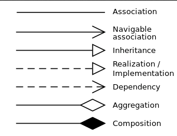
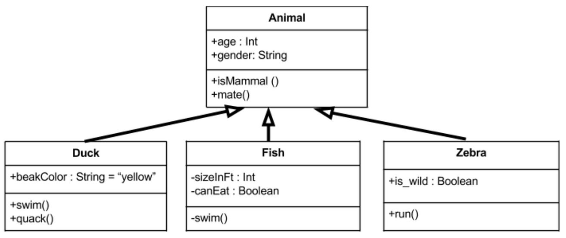
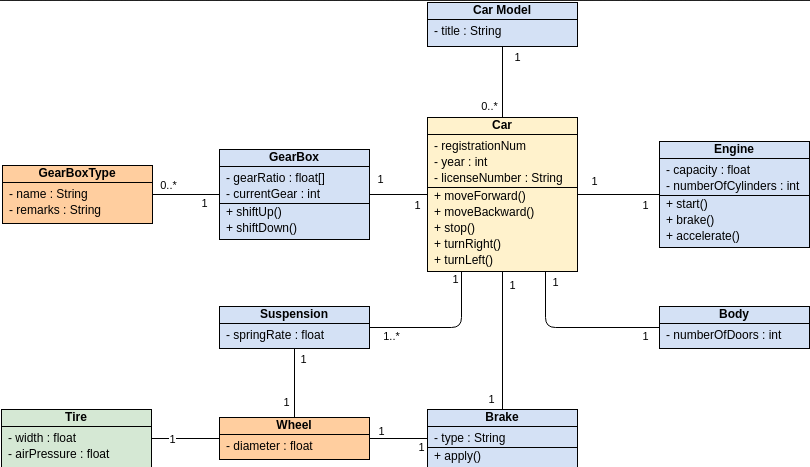
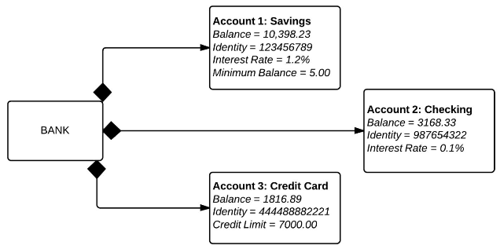
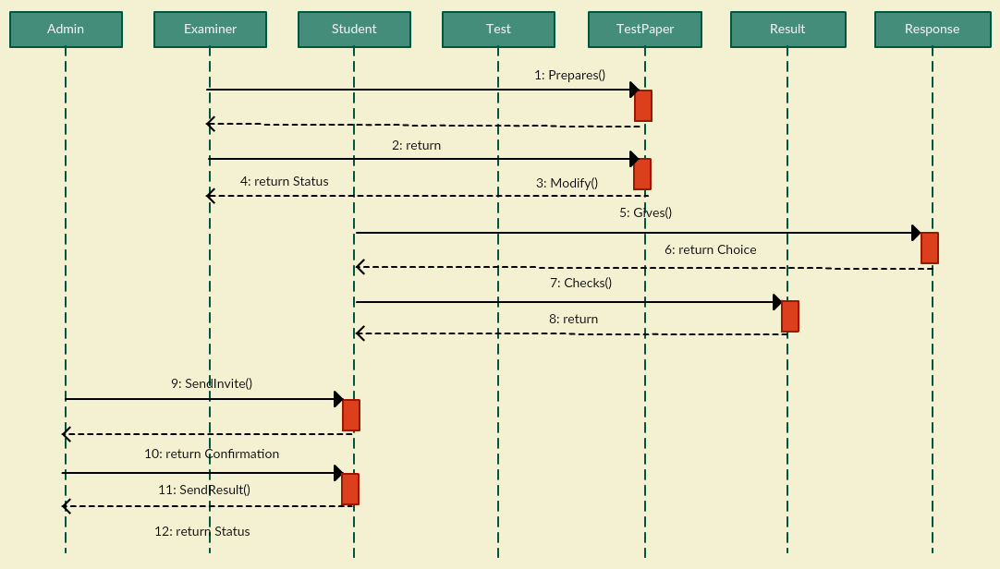
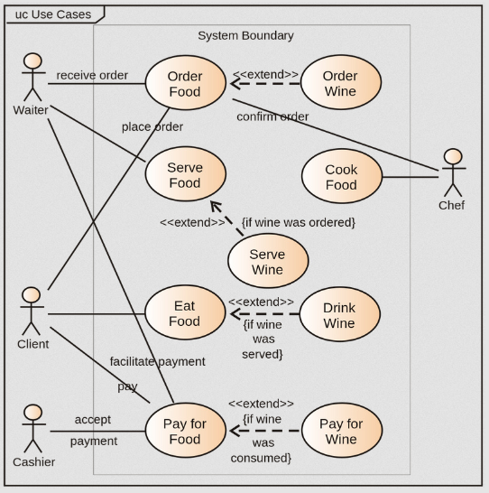
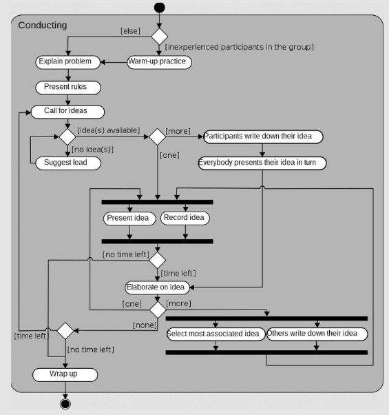
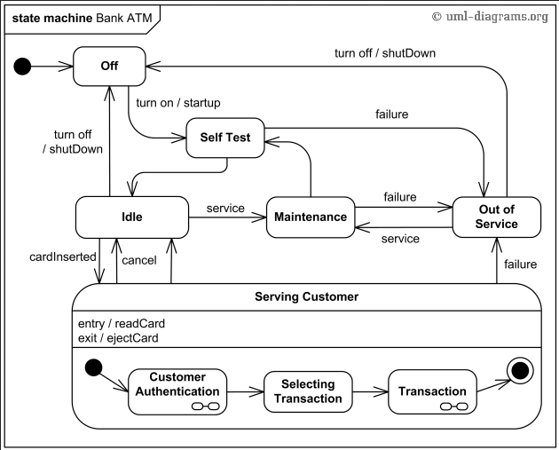

**Main Source:**

- **[Wireframe — ProductPlan](https://www.productplan.com/glossary/wireframe/)**
- **[Class diagram — Wikipedia](https://en.wikipedia.org/wiki/Class_diagram)**
- **[Use case diagram — Wikipedia](https://en.wikipedia.org/wiki/Use_case_diagram)**
- **[Activity diagram — Wikipedia](https://en.wikipedia.org/wiki/Activity_diagram)**
- **[UML state machine — Wikipedia](https://en.wikipedia.org/wiki/UML_state_machine)**

It is often to represent various aspects of software systems or its components in diagram. They are used to illustrate different facets of the system's design, architecture, behavior, or relationships between components.

### Wireframe

Wireframe is a visual representation or a low-detail outline of a user interface (UI). It is a basic visual guide that depicts the layout, structure, and functionality of an application or website without focusing on visual design elements such as colors, typography, or detailed graphics. Images and text are typically replaced with placeholder elements, such as lorem ipsum for text.

Wireframes are typically created early in the design process to outline the key elements and user interactions of a digital product. They serve as a blueprint or a visual plan that helps stakeholders, designers, and developers align their understanding of the project and make informed decisions about the user experience.

  
Source: https://www.productplan.com/glossary/wireframe/

### UML

**UML (Unified Modeling Language)** is a standardized notation for modeling software systems. There are two types of UML diagram, **behavior** and **structure**.

#### Class Diagram

A class diagram describes the structure of class, such as their properties, methods, and relationship.

The diagram consists of box with hierarchical structure, the box is divided into three sections:

- The name of the class, printed in bold and centered, and the first letter is capitalized.
- Contains attributes of the class., they are left-aligned and the first letter is lowercase.
- Contains the methods the class can execute, they are also left-aligned and the first letter is lowercase.

The visibility of class members:

- `+`: Public
- `-`: Private
- `#`: Protected
- `~`: Package

Relationship between class is denoted by arrows:

  
Source: https://en.wikipedia.org/wiki/Class_diagram#/media/File:Uml_classes_en.svg

- **Association**: Represents a general relationship between two classes, indicating they are connected.
- **Navigable association**: A specific type of association where one class has a reference to the other class. It indicates that the class can navigate, communicate, or access the objects of the associated class.
- **Inheritance**: Inheritance represents an "is-a" relationship between classes, where one class inherits the properties, methods, and relationships of another class.
- **Realization / Implementation**: Represents the relationship between a model and its implementation. It indicates that the class implements the operations and behaviors defined by the interface.
- **Dependency**: Signifies that one class depends on another class, typically when one class uses or relies on the functionality provided by another class.
- **Aggregation**: Aggregation represents a "has-a" relationship between two classes. It indicates that one class is composed of or contains other classes.
- **Composition**: Composition is similar to aggregation but with a stronger ownership relationship. It represents a relationship where the lifecycle of the contained class is dependent on the container class. In composition, the contained class cannot exist independently of the container class.

An example:

  
Source: https://medium.com/@smagid_allThings/uml-class-diagrams-tutorial-step-by-step-520fd83b300b

An `Animal` class with property `age` and `gender`; and method `isMammal` and `mate`, all of them are public. There are three subclasses that inherits animal, `Duck`, `Fish`, and `Zebra`.

Another example:

  
Source: https://online.visual-paradigm.com/id/diagrams/templates/class-diagram/uml-class-diagram-example-car/

Some class diagram have text like "0..1" or "0..\*" near the arrow, they are called **multiplicity**. It specifies cardinality or the number of instances that can participate in a relationship between classes. It specifies the allowed number of associations between classes.

- n: Unspecified number of instances, indicating that there can be any number of associations.
- 1: Denotes exactly one instance.
- 0..1: Specifies that the association is optional, and there can be zero or one instance.
- 0..n or 0..\*: Indicates that the association is optional, and there can be zero or more instances.
- 1..n: Specifies that there must be at least one instance, and any number greater than or equal to one is allowed.
- m..n: Specifies a range of allowed instances, where m is the minimum number and n is the maximum number of instances.

#### Object Diagram

Object diagram is similar to a class diagram. It represents actual instance of a class in a specific scenario or situation by showing their concrete attributes.

  
Source: https://www.lucidchart.com/pages/uml-object-diagram

#### Sequence Diagram

Sequence diagram illustrates the interactions between objects or components in a system over a specific period of time. It visualizes the flow of messages or method calls between objects, showing the order in which they occur.

Sequence diagrams are used to capture the dynamic behavior of a system, particularly emphasizing the sequence of events and the collaboration between objects during a specific scenario or use case. They help in understanding how different components or objects interact with each other to achieve a particular functionality.

Representation of sequence diagram:

- **Lifelines**: Lifelines are the vertical dashed lines, it represent the participating objects or components in the sequence diagram. They are labeled with the name of the object or component it represents. Lifelines indicate the lifespan of an object or component during the sequence of events.
- **Messages**: Messages represent the interactions or communication between objects or components. They are depicted as horizontal arrows or lines between lifelines, indicating the flow of messages or method calls. Messages can be synchronous (denoted by a solid arrow) or asynchronous (denoted by a dashed arrow).
- **Activation Boxes**: Activation boxes show the period of time during which an object or component is actively processing a message. They are represented as boxes or rectangles on the lifeline, indicating the duration of the method execution or processing.
- **Return Messages**: Return messages depict the response or return values from the called object or component back to the caller. They are represented as dashed lines with an arrowhead pointing back to the lifeline of the caller.

  
Source: https://medium.com/thousand-words-by-creately/the-ultimate-guide-to-sequence-diagrams-a78e0e516886

#### Use Case Diagram

**Use case diagram** is a diagram showing possible interaction with a system. **Actors**, such as users or other systems, are denoted depicted by stick man. Ovals or rectangles are **use cases**, which are specific functionalities or behaviors provided by the system. All the figure inside the big rectangle is considered as the scope of the system being modeled.

  
Source: https://en.wikipedia.org/wiki/Use_case_diagram

In addition, there are four types of relationship:

- **Association**: Represented by a solid arrow, indicates a communication or interaction between an actor and a use case.
- **Generalization**: Represented by a dashed arrow, indicates a specific use case or actor that inherits the behavior and characteristics of a more general use case or actor.
- **\<\<extend\>\>**: Represents optional or alternative functionality that can be added to a base use case under certain conditions.
- **\<\<include\>\>**: Represents a situation where one use case includes the functionality of another use case.

#### Activity Diagram

**Activity diagram** illustrates the flow of activities and actions within a system or a process. The flow of actions is connected with arrows, and the action are constructed with shapes, which are:

- **Black circle** represents the start (initial node) of the workflow
- **Capsule** represent actions
- **Diamonds** represent decisions
- **Bars** represent the start (split) or end (join) of concurrent activities;
- **Encircled black circle** represents the end (final node).

  
Source: https://en.wikipedia.org/wiki/Activity_diagram#/media/File:Activity_conducting.svg

#### State Diagram

**State diagram** is a type of UML diagram that represent the behavior of a system that is affected by events over time.

System has **states**, which represent the different conditions or modes that an object or system can be in during its lifecycle. Each state is depicted as a rounded rectangle with the name of the state inside.

An **event** represent occurrences or stimuli that trigger state transitions. **Transitions** represent the movement of an object or system from one state to another in response to an event or condition. Transitions are depicted with arrow, forming a [directed graph](/data-structures-and-algorithms/graph#directed) in the overall state diagram. When state transition takes place, **actions**, which describe operations or tasks will be performed.

  
Source: https://nulab.com/learn/software-development/a-simple-guide-to-drawing-your-first-state-diagram-with-examples/

Similar to activity diagram, the start and end of the diagram is represented as black circle and encircled black circle, respectively.

### ER Diagram

**Entity Relationship (ER) Diagram** is a flowchart that illustrates entities (or objects), relationships, attributes, and constraints within a database.

See [E/R model](/database-system/database-model#er-model).
