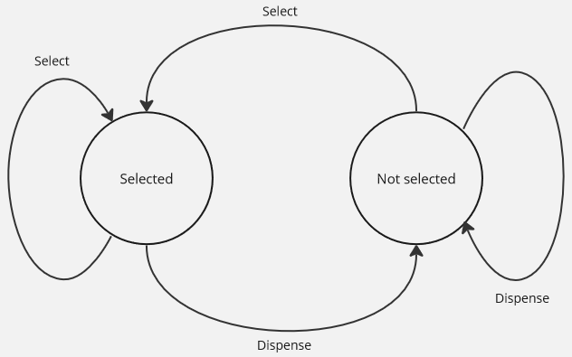

**Main Source:**

- **[Behavioral Design Patterns - Refatoring Guru](https://refactoring.guru/design-patterns/behavioral-patterns)**

Behavioral patterns are design patterns that focus on the interaction and communication between objects. They address the behavior and responsibilities of objects, helping to define how objects collaborate and fulfill their tasks.

### Command

Command pattern encapsulates a request as an object that contains information about the request. It is basically modeling action in terms of object-oriented. Each command object encapsulates a specific request along with any necessary parameters. We can provide useful information in the object, such as what it executes briefly, which allows us to support undo-redo operations.

Consider a simplified text editor:

```kotlin
class TextEditor {
    private var text = StringBuilder()

    fun write(start: Int, content: String) {
        text.append(content, start, content.length)
    }

    fun delete(start: Int, end: Int): String {
        val deleted = text.substring(start, end)
        text.deleteRange(start, end)
        return deleted
    }

    fun print() {
        println(text.toString())
    }
}

fun main() {
    val t = TextEditor()
    t.write(0, "asdf")
    t.print() // Output "asdf"
    t.delete(0, 2)
    t.print() // Output "df"
}
```

It's a simple class that hold a text (in `StringBuilder`), which we can edit through the `write` and `delete` method.

If we were to implement undo functionality, one way to do that is storing a list of previously written text. So we would add current text to the list every time we edit it. While this is easy to implement, it can consume so much space to store the string and a lot of time to copy the string.

Following command pattern, we would make another object that encapsulate the writing or deleting operation along with extra information, and another class that handles undo operation. With the given information, we will reverse the text operation.

The text commands:

```kotlin
sealed interface TextCommand {
    val start: Int
    val end: Int
    val content: String

    // move content to first, so we can use its length for end
    data class Write(
        override val content: String,
        override val start: Int,
        override val end: Int = content.length
    ): TextCommand

    // move content to last, so by default we don't have to specify it
    data class Delete(
        override val start: Int,
        override val end: Int,
        override val content: String = "" // only used for undoing
    ): TextCommand
}
```

In Kotlin, sealed interface can be thought as an interface that prevent anyone to implement it, unless they are inside the interface block. Sealed interface will form a hierarchy within its implementation, and allow us to access the member by dot notation, such as `TextCommand.Write`.

```kotlin
class TextCommandInvoker(private val textEditor: TextEditor) {
    private val history = mutableListOf<TextCommand>()

    fun execute(command: TextCommand) {
        when (command) {
            is Write -> {
                textEditor.write(command.start, command.content)
                history.add(command)
            }
            is Delete -> {
                val deleted = textEditor.delete(command.start, command.end)
                history.add(Delete(command.start, command.end, deleted))
            }
        }
    }

    fun undo() {
        if (history.isNotEmpty()) {
            val lastCommand = history.removeAt(history.lastIndex)

            when (lastCommand) {
                is Write -> {
                    textEditor.delete(lastCommand.start, lastCommand.end)
                }
                is Delete -> {
                    textEditor.write(lastCommand.start, lastCommand.content)
                }
            }
        }
    }
}
```

We move all the code to `TextCommandInvoker`, a class responsible for executing the text command. It will execute command based on the type of command it received. Any text command will be identified by `TextCommand` sealed interface. It will also keep track the text edit history by adding the command to a list for undoing operation. This will reduce much more space than if we were to store the copy of string each time we edit it.

Sample usage:

```kotlin
fun main() {
    val t = TextEditor()
    val invoker = TextCommandInvoker(t)

    invoker.execute(TextCommand.Write(content = "asdf", start = 0))
    invoker.execute(TextCommand.Delete(start = 0, end = 2))

    t.print() // Output "df"
    invoker.undo()
    t.print() // Output "asdf"
}
```

We will now do any text edit from `TextCommandInvoker`.

### Iterator

Iterator patterns provide a way to access elements of a collection (array, list, stack, tree, etc.) sequentially without exposing the underlying implementation details.

A traditional way of accessing a list would be:

```kotlin
fun main() {
    val collection = listOf(1, 2, 3, 4, 5)
    println(collection[0]) // Output 1
    println(collection[1]) // Output 2
}
```

The downside of this approach is the potential for going out of bounds. To prevent that, we would first check if the index is in the collection range before accessing any element. The purpose of iterator pattern is to abstract away the index checking and provide a simpler API for user.

```kotlin
class SimpleIterator(private val collection: List<Int>) {
    private var currentIdx = 0

    fun getNext(): Int {
        if (hasNext()) {
            val element = collection[currentIdx]
            currentIdx++
            return element
        }
        return -1
    }

    fun hasNext(): Boolean {
        return currentIdx < collection.size
    }
}
```

We created a simple iterator class, for simplicity, it can only take a list of integers. It still stores index under the hood, but it always checks if the index is out of bound using the `hasNext` method. User would use this iterator like:

```kotlin
fun main() {
    val collection = listOf(1, 2, 3, 4, 5)
    val iterator = SimpleIterator(collection)

    println(iterator.hasNext()) // Output true
    println(iterator.getNext()) // Output 1

    while (iterator.hasNext()) {
        println(iterator.getNext()) // Output 2 to 5
    }
}
```

To make it possible to use this iterator in a loop, we can use `hasNext` as the condition for the while loop.

This iterator patterns seems useless for basic collection like list or array. This is because some language typically implements iterator under the hood for loop expression like `for (num in collection)`. Still, iterator pattern for list allow for flexibility in getting element, we don't have to create a loop if we are just getting several elements. We can also customize the behavior of the iteration as we like. We may implement filtering to skip element, progress at different rates, or in different directions. Iterator pattern will be much more useful for complex data structure like tree or graph.

### Observer

Observer pattern implements a subscription mechanism, which allow multiple observer, to be notified automatically when the state of a subject object (also known as the observable) changes.

The subject maintains a list of observers and provides methods to add, remove, and notify observers. The observers register themselves with the subject and receive updates when the subject's state changes.

Let's imagine a YouTube subscription system. There is a `Youtuber`, acting as the subject, and there is `Subscriber`, acting as the observer.

```kotlin
data class Subscriber(val name: String, val subscribeTo: List<Youtuber>)

class Youtuber(val name: String) {
    fun hasUploaded(): Boolean {
        return true
    }
}
```

One way for subscriber to check if a YouTuber has uploaded a new video is, checking themselves.

```kotlin
fun main() {
    val yt1 = Youtuber("yt1")
    val yt2 = Youtuber("yt2")

    val subs1 = Subscriber("subs1", listOf(yt1))
    val subs2 = Subscriber("subs2", listOf(yt1))

    val subs3 = Subscriber("subs3", listOf(yt2))

    for (youtuber in subs1.subscribeTo) {
        youtuber.hasUploaded()
    }
}
```

This is obviously not realistic whether in code or in real life. It won't be efficient to create a loop for every subscriber and check every single YouTuber it subscribed.

So, why can't the YouTuber be the one that notify their subscriber whenever they uploaded a video? We can alter the `Youtuber` class to make it stores a list of subscriber and method to add or remove them.

```kotlin
data class Subscriber(val name: String) {
    fun notify(from: String) {
        println("$name: Youtuber $from has uploaded a new video")
    }
}

class Youtuber(val name: String) {
    val subscribers = mutableListOf<Subscriber>()

    fun addSubscriber(subs: Subscriber) {
        subscribers.add(subs)
    }

    fun removeSubscriber(subs: Subscriber) {
        subscribers.remove(subs)
    }

    fun uploadVideoAndNotify() {
        for (subs in subscribers) {
            subs.notify(name)
        }
    }

    fun hasUploaded(): Boolean {
        return true
    }
}
```

We also modified the `Subscriber` class for `notify` method. To use it:

```kotlin
fun main() {
    val yt1 = Youtuber("yt1")
    val yt2 = Youtuber("yt2")

    val subs1 = Subscriber("subs1")
    val subs2 = Subscriber("subs2")
    val subs3 = Subscriber("subs3")

    yt1.addSubscriber(subs1)
    yt1.addSubscriber(subs2)
    yt1.uploadVideoAndNotify()

    /* Output:
      subs1: Youtuber yt1 has uploaded a new video
      subs2: Youtuber yt1 has uploaded a new video
     */
}
```

While this code works, it may not make sense because the one adding or removing subscribers is the YouTuber itself. If you want a more realistic code where subscribers subscribe or unsubscribe themselves, you can edit the `Subscriber` code. Add a method, such as `subscribeTo` or `unsubscribeFrom`, which takes a YouTuber object and calls the `addSubscriber` or `removeSubscriber` method on it.

### State

State pattern allows an object to change its behavior dynamically as its internal state changes. In other word, the behavior of an object depend on its current state, and that state can change overtime.

One way to do this is by defining a state with an interface, and then each different state would implement its own behavior. The object on which we want to implement the state pattern would hold a particular state, which would control how that object behaves. In other words, the object delegates its behavior to the current state class.

An example would be a vending machine that operates differently based on its current condition, such as if an item is selected or not.

The vending machine operates as follows:

- When a user selects an item:
  - If the item has not been selected yet, it is selected.
  - If the item has already been selected, no action is taken.
- When a user dispenses an item:
  - If no item has been selected yet, no action is taken.
  - If an item has already been selected, it is dispensed.

We model every state with the `VendingMachineState`. We have two actions, selecting an item and dispensing an item. Each state should implement each action, which will return the new state.

```kotlin
interface VendingMachineState {
    fun handleSelection(item: String): VendingMachineState
    fun handleDispense(): VendingMachineState
}

class NoSelectionState: VendingMachineState {
    override fun handleSelection(item: String): VendingMachineState {
        println("Selected item: $item")
        return ItemSelectedState()
    }

    override fun handleDispense(): VendingMachineState {
        println("Please select an item first.")
        return this
    }
}

class ItemSelectedState: VendingMachineState {
    override fun handleSelection(item: String): VendingMachineState {
        println("Item $item is already selected.")
        return this
    }

    override fun handleDispense(): VendingMachineState {
        println("Dispensing item...")
        return NoSelectionState()
    }
}
```

The vending machine simply takes action by "asking" its current state:

```kotlin
class VendingMachine {
    private var currentState: VendingMachineState = NoSelectionState()

    fun selectItem(item: String) {
        currentState = currentState.handleSelection(item)
    }

    fun dispenseItem() {
        currentState = currentState.handleDispense()
    }
}
```

Whenever the state change, it will overwrite the current state through `changeState` method.

```kotlin
fun main() {
    val vm = VendingMachine()

    vm.selectItem("Coke")
    vm.dispenseItem()

    vm.dispenseItem()
    vm.selectItem("Chips")
    vm.selectItem("Chips")
    vm.dispenseItem()

    /*
    Output:
        Selected item: Coke
        Dispensing item...
        Please select an item first.
        Selected item: Chips
        Item Chips is already selected.
        Dispensing item...
    */
}
```

State pattern is related to [finite state machine](/cs-notes/theory-of-computation-and-automata/finite-automata#finite-state-machine). It can be thought as the object-oriented style of a state machine. This particular vending machine is quite simple, a pictorial representation looks like below.



The advantage of the state pattern is that it simplifies the modeling of state machines. Without it, we would use a bunch of if-else statements in one place, each of which could contain code that changes the state. This state is accessed by many pieces of code, making maintenance and bug-finding challenging. The state pattern instead encapsulates each state's behavior and connects them through an interface.

### Chain of Responsibility

Chain of responsibility pattern allows an object to pass a request in a chain of potential handlers. Each handler in the chain has the ability to handle the request or pass it to the next handler in the chain. A request can be handled by multiple handlers.

Consider a chain of mathematical arithmetic handler that we can choose which operation to do. Obviously it is unnecessary to use this pattern for it, but this is for the sake of example. Here's a simplified implementation of this:

```kotlin
abstract class MathHandler {
    lateinit var nextHandler: MathHandler
    abstract fun handle(request: MathRequest): Int
}

data class MathRequest(val operator: Char, val operand1: Int, val operand2: Int)
```

Each math operator would implement this `MathHandler`, particularly the `handle` method which is specific to each operator. A math request will be encoded in `MathRequest`. It contains selected operator and its operands. Depending on the selected operator, each handler will only handle if the given operator match their responsibility (i.e., math handler for addition should only handle addition operation).

If it's not their responsibility, they simply pass the request to the next handler.

:::tip
`lateinit` keyword mark a property as being "late initialized". We will not define the chain of handler here, it is done in another portion of code. The use of this keyword help us to avoid temporarily assigning `nextHandler` to default value like null, which could cause issues.
:::

And here's all the operator implemented:

```kotlin
class AdditionHandler: MathHandler() {
    override fun handle(request: MathRequest): Int {
        if (request.operator == '+') {
            return request.operand1 + request.operand2
        } else {
            return nextHandler.handle(request)
        }
    }
}

class SubtractionHandler: MathHandler() {
    override fun handle(request: MathRequest): Int {
        if (request.operator == '-') {
            return request.operand1 - request.operand2
        } else {
            return nextHandler.handle(request)
        }
    }
}

class MultiplicationHandler: MathHandler() {
    override fun handle(request: MathRequest): Int {
        if (request.operator == '*') {
            return request.operand1 * request.operand2
        } else {
            return nextHandler.handle(request)
        }
    }
}

class DivisionHandler: MathHandler() {
    override fun handle(request: MathRequest): Int {
        if (request.operator == '/') {
            return request.operand1 / request.operand2
        } else {
            return nextHandler.handle(request)
        }
    }
}

class UnknownHandler: MathHandler() {
    override fun handle(request: MathRequest): Int {
        return 0
    }
}
```

To handle user that gives undefined operator, we will also put `UnknownHandler` at the end of the chain to return a default 0 value.

Then, clients can use this chain of math handler through the `MathOperator` class. In this class we will also define the chain of handler, including assigning `UnknownHandler` at the end of the chain.

```
class MathOperator {
    private val handlerChain: MathHandler

    init {
        val first = AdditionHandler()
        val second = SubtractionHandler()
        val third = MultiplicationHandler()
        val fourth = DivisionHandler()

        first.nextHandler = second
        second.nextHandler = third
        third.nextHandler = fourth
        fourth.nextHandler = UnknownHandler()

        handlerChain = first
    }

    operator fun evaluate(request: MathRequest): Int {
        return handlerChain.handle(request)
    }
}
```

Client use it like below.

```kotlin
fun main() {
    val math = MathOperator()

    println(math.evaluate(MathRequest('+', 5, 3)))
    println(math.evaluate(MathRequest('-', 10, 7)))
    println(math.evaluate(MathRequest('*', 4, 6)))
    println(math.evaluate(MathRequest('/', 15, 3)))
    println(math.evaluate(MathRequest('%', 8, 2)))
}
```
