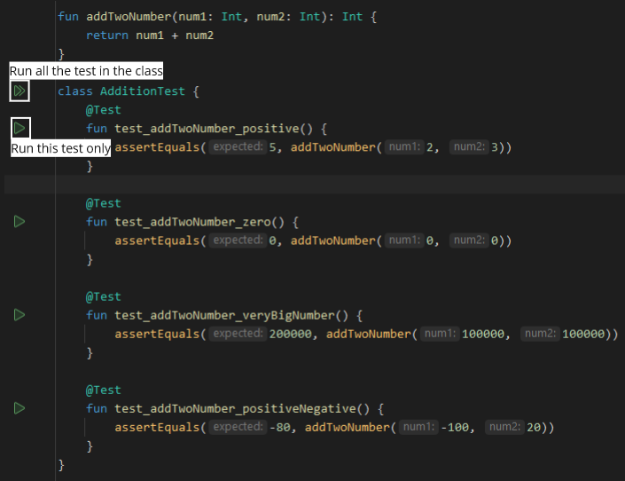
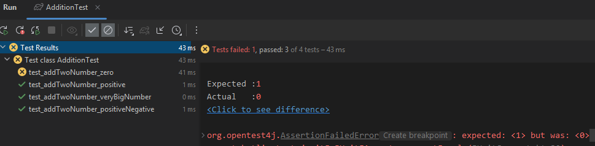

**Main Source:**

- **[Software testing — Wikipedia](https://en.wikipedia.org/wiki/Software_testing)**
- **[Test double — Wikipedia](https://en.wikipedia.org/wiki/Test_double)**

**Software Testing** is a process of evaluating a software application to determine whether it meets the specified requirements and performs as expected.

The main objectives of testing are:

- **Finding defects**: Before software is released, it is important to test their behavior. Testing helps in identifying bugs or defects in the software.
- **Verifying functionality & validating requirements**: When developing software, we have initial target and intended functionality. The process of testing the software involves verifying and validating it against our specified requirements.

### Testing Approach

There are many approaches of testing that can be categorized based on different ways.

#### Based on the execution time

- **Static**: We do not execute the code in static testing. Typically, static testing revolve around code reviews or inspections. We do static testing by relying on compiler to check syntax or using specific static analysis tool.
- **Dynamic**: In contrast to static, dynamic testing runs the program. Dynamic testing focuses on evaluating the behavior and performance of the software under various conditions and inputs.
- **Passive**: We also run the program in passive testing, but we do not interact with it directly. In passive testing, we gather information about the programs' behavior, usage patterns, or performance characteristics. Passive testing may involve techniques such as logging, tracing, profiling, or analyzing system logs and metrics.

#### Manual

Manual testing involve human intervention in the testing process. Software testers will verify the software behavior against different conditions and inputs. There are many ways manual testing can be performed:

- **Entering inputs by hand**: The tester run the program, through the user interface (e.g., terminal or GUI), the tester will test different scenario by inputting both valid and invalid data to the software. The tester then see the result and verify its correctness. An example of this would be checking if clicking the back button in the GUI actually navigate us back.
- **Entering inputs by code (semi-automated)**: Having to interact with the software to test its behavior can slow us down. It can be time-consuming to test the behavior against a bunch of different inputs and cases. Software tester may make a script or code snippets dedicated to test the programs' behavior.

  Consider a calculator app, there is a function that adds two number:

  ```kotlin
  fun addTwoNumber(num1: Int, num2: Int): Int {
      return num1 + num2
  }
  ```

  The function is used in addition functionality. Instead of interacting with the calculator UI and test its behavior, we can make several functions that automate the testing of the `addTwoNumber` function.

  ```kotlin
  fun addTwoNumber_negative() {
      println(addTwoNumber(-2, -3))
  }
  ```

  Here, we are testing its behavior against negative number input. `addTwoNumber(-2, -3)` is expected to return -5. By calling the `addTwoNumber_negative` function, we can print its result to the console. It is so much faster than interacting with the UI. We can make a bunch more function to test:

  ```kotlin
  fun addTwoNumber_positive() {
      println(addTwoNumber(2, 3))
  }

  fun addTwoNumber_zero() {
      println(addTwoNumber(0, 0))
  }

  fun addTwoNumber_veryBigNumber() {
      println(addTwoNumber(100000, 100000))
  }

  fun addTwoNumber_positiveNegative() {
      println(addTwoNumber(-100, 20))
  }
  ```

  And then effortlessly test all this behavior by:

  ```kotlin
  fun main() {
      addTwoNumber_positive()
      addTwoNumber_zero()
      addTwoNumber_veryBigNumber()
      addTwoNumber_positiveNegative()
  }
  ```

  By just running it, we already see the result of 4 different inputs. However, the **tester still need to see manually** the result of this function in the console. This approach can be improved by making it fully automated, which will be explained next.

- **Exploratory**: In exploratory, the tester doesn't have specific plan to follow. The test is focused on exploring the behavior of the application, they make on-the-spot decisions about what to test, how to test, and what areas of the software need more attention. One potential downside of exploratory testing is the possibility of missing certain test cases or areas that were not covered during the exploration.

#### Automated

Automated testing involves the use of automation tools, scripts, and frameworks to execute tests without human intervention.

The previously semi-automated approach make use of simple script to automate the test on different condition, but it just prints the output to the console, therefore requiring human intervention to verify the result. This can increase the effort of testing as the number of tests increases.

An automated testing tool involves execution engine, which will call the tests function as well as verifying them. More advanced tool may include test reporting and logging, to provide more detailed information about the test execution, such as what is wrong, where the behavior deviated from expectations, how many are failing or passing, etc.

An example of automated testing tool in Kotlin is the JUnit framework. Basically, JUnit require us to identify which function it should execute when we run the test. It also let us define our expectation of the function by using **assertions**.

Assertions are statements that check whether a given condition is true during the execution of a test case. Let's get to an example:

```kotlin
import org.junit.jupiter.api.Test
import kotlin.test.assertEquals

class Test {
    @Test
    fun addTwoNumber_positive() {
        assertEquals(5, addTwoNumber(2, 3))
    }

    @Test
    fun addTwoNumber_zero() {
        assertEquals(0, addTwoNumber(0, 0))
    }

    @Test
    fun addTwoNumber_veryBigNumber() {
        assertEquals(200000, addTwoNumber(100000, 100000))
    }

    @Test
    fun addTwoNumber_positiveNegative() {
        assertEquals(-80, addTwoNumber(-100, 20))
    }
}
```

The `assertEquals` function requires two parameters. The first parameter is our expected true value, and the second is the actual result. For instance, when checking `addTwoNumber(0, 0)`, where the expected result is 0, we place 0 as the first parameter and the result of `addTwoNumber(0, 0)` as the second parameter. If the expected is not equal to the actual result, JUnit will throw an exception, indicating that the assertion has failed.

There are other assert function, such as `assertTrue`, which assert that the expression is true, `assertFalse`, and `assertNotEquals`.

We will tell JUnit which function to call during the test by placing the `@Test` annotation at the top of the function. After that, we may run the selected test function. We can either do it via command line by calling specific command, or do this easily by pressing the "Run test" button in some IDE, such as IntelliJ.



We want to see what JUnit will tell us if one of our test is wrong. So, let's modify the expected parameter of `test_addTwoNumber_zero()` to be 1, instead of 0. Let's run the test.



Through the IntelliJ GUI, we can see the result of running these 4 tests. The `test_addTwoNumber_zero()` is indeed wrong, but all other test passed (indicated by green check symbol). The report says that expected is 1, but the actual is 0. It even tells us the difference of the result (if we click the "Click to see the difference").

JUnit also provide us the call stack, which shows the sequence of function calls that led to the error or failure. Here's the few top most log.

```kotlin
org.opentest4j.AssertionFailedError: expected: <1> but was: <0>
	at org.junit.jupiter.api.AssertionUtils.fail(AssertionUtils.java:55)
	at org.junit.jupiter.api.AssertionUtils.failNotEqual(AssertionUtils.java:62)
	at org.junit.jupiter.api.AssertEquals.assertEquals(AssertEquals.java:182)
	at org.junit.jupiter.api.Assertions.assertEquals(Assertions.java:1135)
	at kotlin.test.junit5.JUnit5Asserter.assertEquals(JUnitSupport.kt:32)
	at kotlin.test.AssertionsKt__AssertionsKt.assertEquals(Assertions.kt:63)
	at kotlin.test.AssertionsKt.assertEquals(Unknown Source)
	at kotlin.test.AssertionsKt__AssertionsKt.assertEquals$default(Assertions.kt:62)
	at kotlin.test.AssertionsKt.assertEquals$default(Unknown Source)
	at AdditionTest.test_addTwoNumber_zero(Test.kt:16)
```

The worth noting line is the last one, `at AdditionTest.test_addTwoNumber_zero(Test.kt:16)`. It indicates that has error specifically at line 16. In this case, it may be useless, because the function is literally a single line function.

The call stack trace will be more valuable in more complex codebases with multiple function calls and dependencies. It helps pinpoint the location of errors or failures.

All the report produced by JUnit, such as the logs and call stack, are called [test artifacts](#test-artifacts).

#### Box approaches

Box approaches describe the point of view that the testers are taking.

- **White-box**: Tester focuses on testing the internal structure, logic, and implementation details of a system. Testers have access to the internal code, data structures, and algorithms of the system and design test cases based on this knowledge. In white-box testing, we can about how the system does the logic.
- **Black-box**: Black box testing focuses on testing the functionality of a system without considering its internal structure or implementation details. Testers treat the system as a "black box" and only interact with it through its inputs and outputs. They are unaware of how the system processes the inputs or produces the outputs. In contrast to white-box testing, we do not care how a system does the logic, we are concerned with the expected behavior of the system.
- **Grey-box**: The grey-box is the hybrid approach of white-box and black-box testing. The testers test the system's behavior, but they also have the implementation details.

### Levels of Testing

- **Unit Testing**: Unit testing focuses on testing individual units or components of the software, such as functions, methods, or classes, in isolation. It aims to verify that each unit behaves as expected. The one with did in [automated testing](#automated) was a unit test. It is common in unit testing to have several functions that responsible for testing specific lines of code or behavior.
- **Integration Testing**: Integration testing verifies the interaction and integration between different components or modules of the software. It ensures that these components work together correctly. Integration tests are designed to identify issues that arise when different units are combined.
- **System Testing**: System testing focuses on testing the entire system as a whole. System tests cover various aspects, including functional requirements, performance, security, usability, and compatibility.
- **Acceptance Testing**: Acceptance testing is conducted to ensure that the software meets the customer's requirements or predetermined criteria and is ready for deployment.

### Test Artifacts

Test artifacts refer to the documentation or deliverables produced during the testing process. These artifacts provide a record of the testing activities, test design, test execution, and test results.

- **Test Plan**: A test plan outlines the overall testing strategy, objectives, scope, and approach for a specific testing effort.
- **Test Cases**: Test cases are detailed instructions or steps that testers follow to execute a specific test scenario. They include inputs, expected outputs, and any preconditions or postconditions.
- **Test Suite**: A collection of test cases that are intended to test a set of behaviors.
- **Test Scripts**: Test scripts are automated scripts or programs written to execute test cases automatically.
- **Test Data**: Test data is the input data used for executing test cases. It includes both valid and invalid data to cover different scenarios.
- **Test Logs**: Test logs capture the details of the testing activities, including test execution results, defects found, and any issues or observations during testing.

### Types, Techniques, and Tactics of Testing

- **Smoke Testing**: A testing done in early development to test primary or basic functionality of software.
- **Stress Testing**: Stress testing subject the software to high loads or unfavorable conditions beyond its normal operating capacity. It helps identify performance bottlenecks, stability issues, and failure points under stress.
- **Regression Testing**: Testing performed after a major change to the code. It ensures that changes or updates to the software do not introduce new defects or adversely impact existing functionality.
- **Alpha & Beta Testing**: These tests occur before releasing the software to external users. They are typically done by a software development team or group of chosen testers.
- **Functional & Non-functional Testing**: Functional testing verify the software functionality, while non-functional testing focuses on evaluating the software's non-functional aspects, such as performance, security, usability, reliability, and compatibility.
- **Accessibility Testing**: Accessibility testing ensures that the software can be used by people with disabilities. It focuses on verifying whether the software is accessible to individuals with visual, auditory, motor, or cognitive impairments.
- **Internationalization & Localization**: Internationalization (i18n) ensures that software is adaptable and customizable for different languages, regions, and cultures. Localization (l10n) adapt software to specific locale or target market, such as adapting date and time formats.
- **A/B Testing**: A/B testing compares two or more versions of software feature to determine which one performs better. It involves dividing the user base into different groups and exposing each group to a different version. The results and user behavior are analyzed to determine the version that yields better outcomes, such as higher conversion rates, user engagement, or usability.

### Terminologies

#### Code Coverage

In unit testing, we can make several functions, with each testing a specific behavior of a function. Often times, we can't cover all the possible cases.

Code coverage is a metric that measures the extent to which the source code of a software application is exercised during testing. It determines the percentage of code lines, branches, or paths covered by the executed tests.

Consider this function:

```kotlin
fun isGreaterThanN(x: Int, n: Int): Boolean {
    if (x > n) {
        return true
    } else {
        throw Exception()
    }
}
```

If we only run this test:

```kotlin
fun test_isGreaterThanN_greater() {
    isGreaterThanN(100, 10)
}
```

By entering greater `x` value, we are effectively going to the true branch of the if statement. Our test function didn't consider the if branch in the case false was evaluated. We could say that the code coverage is not 100%, because there is some line of code we didn't execute.

Now, what if some portion of the code that we don't test doesn't work, and what if it actually encountered in the real application? Achieving a 100% code coverage is indeed ideal, but the development cost to create tests and considering all possible case may not be worth it. Common percentage such as 75% or 80% code coverage is often used as metrics.

#### Test Double

Code works together, often times they depend on each other. In testing, often times these dependencies are not possible to achieve. Test double is a general concept of objects that is used in place of real dependencies during testing.

##### Mock

**Mock** is a simulated object that mimics the behavior of a real object or component. It is used to isolate the code being tested by replacing dependencies with controllable counterparts, typically in unit testing. Mocks are typically used in unit testing to verify interactions and behaviors between objects and to test code in isolation. By mocking an object, we can focus to test the behavior of specific component.

For example, we may want focus on testing our business logic. Some logic involve interacting with the database in a remote server. However, we may not want to set up the server just for the testing, as it can increase hosting costs.

```kotlin
class MockRemoteDB {
    fun getData(): String {
        return "Hardcoded data"
    }

    fun connect(): Boolean {
        return true
    }
}

fun test_processData() {
    val remoteDatabase = MockRemoteDB()
    if (remoteDatabase.connect()) {
        val data = fakeDatabse.getData()
        processData(data)
    }
}
```

Remote database is imagined to have `connect` and `getData` method. Because the server is not available, we will simulate the connection behavior to meet our expectation. We may also avoid loading the real data by providing it directly, such as hard coding it or having it in the local environment, so we don't need to waste bandwidth downloading the data.

##### Fakes

Fakes are simplified implementations of dependencies that replicate the behavior of real objects or components. They are typically used to replace real dependencies, such as databases, web services, or external systems, during testing.

Fakes provide a controlled and simplified alternative that allows for easier testing. Fakes are often used when the real dependencies are costly, complex, or not easily accessible in a testing environment.

However, we should be careful when making fakes, as they may be "too good to be true", or oversimplified.

```kotlin
fun connectToServer() {
    Thread.sleep(5000)
}
```

Let's say we are testing for loading animation. The loading animation is supposed to run whilst we wait to connect to the server. It may not be possible to run the server in testing environment, so we fake up the connection by stopping the thread.

##### Stub

Stub is a simplified implementation of a component or module used in testing. It provides predetermined responses to method calls or functions and is used to replace real functionality temporarily. Stubs help simulate specific scenarios or inputs.

```kotlin
fun test_processData() {
    val usersData = getAllDataNormalUser()
    processData(usersData)
}

fun getAllDataNormalUser(): User {
    return listOf(User(0, "stub"), User(1, "data"))
}

fun getAllDataWeirdUser(): User {
    return listOf(User(-1, "00000"), User(100000, ""))
}
```

Sometimes, stub keeps track information how they are all called, which might be useful for debugging in the case of test failures. These kinds of stubs are called **spies**.

##### Dummy

A dummy object is a placeholder object used to satisfy the requirements of a particular test scenario or to fulfill the dependencies of the system under test, but it does not have any significant behavior or functionality.

For instance, some business logic require us to back up the data before processing it, we can call the method that saves the data, but the method actually does nothing meaningful.

### Test-Driven Development (TDD)

TDD is a software development approach to make a software, where tests are written before writing the actual code.

The developers write test case that obviously will fail. The test case should contain test that the desired functionality. Then, they write the minimum amount of code necessary to pass the test. Finally, they refactor the code to improve its design and maintainability, but still running the test to ensure the correctness is preserved.

TDD treats test as specification of the program, they are assumed to be what define the program's target. Whenever a test fails, then only the code can change. Therefore, it's very important to make a test that truly reflect the desired behavior of the program. However, it is worth noting that as software requirements evolve or tests become obsolete, it is permissible and necessary to update or remove tests accordingly.

Benefits of TDD:

- **Reliable code**: As long as the tests are correct, then code should behave as expected and reduces the likelihood of introducing bugs or regressions.
- **Faster feedback loop**: With TDD, developers receive immediate feedback on their code. Failing tests highlight issues in the code, enabling developers to quickly identify and fix problems.
- **Incremental Development**: The lifecycle of TDD promotes incremental development. Developers write tests for a specific functionality, implement the code to make the tests pass, and then refactor if necessary. The process reduces the risk of building unnecessary complex feature.
