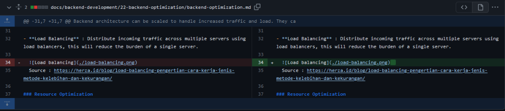
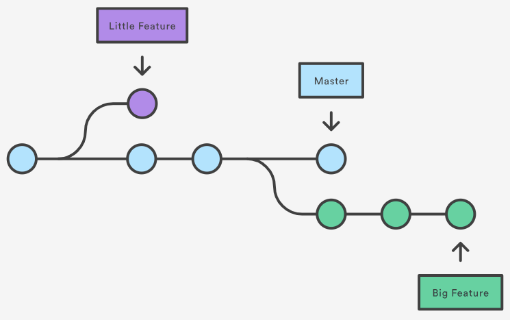
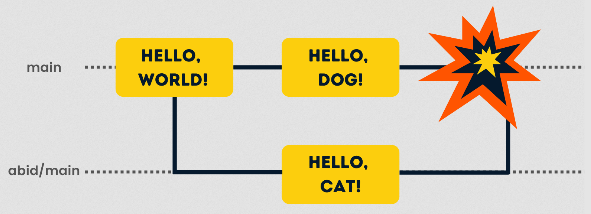

**Main Source:**

- **[Version control — Wikipedia](https://en.wikipedia.org/wiki/Version_control)**

**Version Control** is a system that is used to track and manage changes to files and directories over time. It is commonly used in software development to track the changes over a software.

Over time, as the software gets larger and more people coming to develop it, a version control system can be needed. The primary purpose is to provide a history and record of all changes made to files. This allows multiple contributors to know what others have done, and allow them to know what to work on next. Additionally, it allows for developers, where each have different copy of the source code to be synchronized with others. They can "pull" for the latest copy of the source and continue to work on the project.

The history system is also useful in case of bugs occurring only in some version. It allows us to revert to the working version, and find out which causes it.

### Basic Functions

Version control works by tracking and managing changes to files and directories over time. A typical usage version control system (VCS) is as follows.

#### Initialization

Version control process starts by initializing a repository. The repository is a central storage location that will hold all the files and their revision history. This can be a local repository on a developer's machine or a remote repository hosted on a server, although, both can be used together.

A team collaboration typically has a central remote repository. Any changes are made locally before "pushing" it to the main code in the remote repository.

#### Adding and Committing

Developers begin by adding files to the repository or selecting existing files that they want to track. They will add the file to the **staging area**, which is an intermediate step before actually saving the changes. After adding files to the staging area, developers can **commit** the changes. This creates a new version of the file in the repository. Each commit is accompanied by a commit message that describes the changes made.

#### Diffing

The VCS knows if a file is changed by using diff algorithm. The algorithm compares two input (the last committed and current file) and see the changes. If there is a change to committed file, the new changes are only the change made after committing it.

The above is example of difference of the same file. The `-` indicates of deletion and `+` indicates addition in the new file. If you notice there aren't significant difference, because the changes made is just adding two spaces to the end of the line.

#### Branching

Version control systems often support branching, which is a separate version of the main repository. Developers typically create branches to work on different features, bug fixes, or experiments independently of the main codebase. This is to avoid bugs or errors that may occur in the main code, ensuring it can always work smoothly.

Once the branch is completes, it can be merged to the main repository. Merge means we are combining the code from the branch to another branch (i.e., the main branch itself).

Similar to main repository, each branch has its own copy of the files and its own revision history. With some configuration, the branch history can also be combined to main.

  
Source: https://towardsdatascience.com/a-quick-primer-to-version-control-using-git-3fbdbb123262

##### Conflicts

However, the merge process may not happen smoothly. Consider a case where two independent developers working on the same issue on a different branch. Days later, they have completed their work and they wanted to merge it with the main branch. Let's say developer A merged the code first. Now, what if developer B were to merge after? What if developer B's changes overlap with the changes made by Developer A. It is definitely possible that these two have different way to solve the problem.

This is a common issue in collaboration projects. **Conflicts** are general issue where the VCS can't resolve automatically the differences between two commits. Solving conflict typically require human intervention to solve (e.g., deciding themselves which code should be used).

Furthermore, consider a scenario becomes developer A fixing bugs and developer B making new feature. At the start of their work, they own the latest copy of main code repository. Let's say developer A finishes their work first and he/she merged it directly with the main code. If developer B merge their code, a conflict will occur and the merge will be rejected. This is because at the time, developer B still owns the old main code, before developer A merges his/her code.

This conflict is typically easier to solve. As long as they are working on different tasks, and their changes do not overlap, Developer B can simply pull or fetch the latest main code before merging it.

  
Source: https://www.datacamp.com/tutorial/how-to-resolve-merge-conflicts-in-git-tutorial

### Terminologies

- **Baseline**: Specific version of a file that serves as a reference point or a stable snapshot of the codebase.
- **Master or Main**: A common term for the name of the default branch (typically containing the main codebase) in VCS.
- **Blame**: Identify the author or contributor responsible for the contribution of a particular line or section of code.
- **Checkout**: Switching to a different branch or a specific commit in a version control system.
- **Clone**: Creating a copy of a repository, including all of its files, commit history, and branches.
- **Fork**: Creating a personal copy of a repository, including all its files, history, and branches.
- **Push**: Upload local commits and changes to a remote repository.
- **Pull or Fetch**: Retrieve the latest changes from a remote repository.
- **Head**: Reference to the currently checked-out commit or branch, representing the latest state of the code that we are currently working on.

:::info
The most commonly used version control system is Git. Not to be confused it is different with GitHub, a web-based platform that provides hosting services for Git repositories.
:::

In systems like Git & GitHub, another common terminology are:

- **Pull request**: A request made by developer that wants to merge their code into another branch. It's called pull request because we are requesting for the branch to pull our code. Pull request is typically reviewed and discussed before accepted.
- **Issues**: Issues are task, bug report, or feature request that is tracked and managed within a project. Issues serve as a way to document, discuss, and track work items or problems related to a software project.

:::tip
See also [open sourcing](/software-engineering/open-sourcing) for more information about collaboration and contributing.
:::
