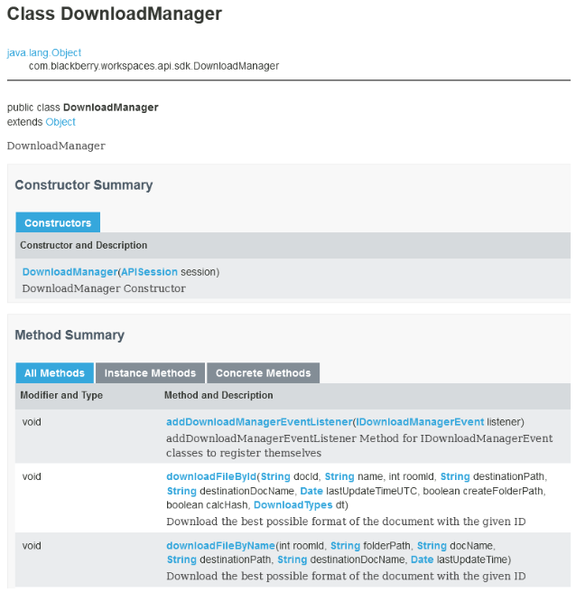
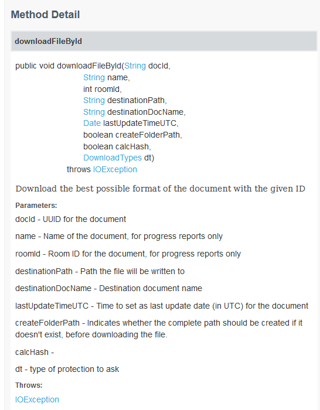
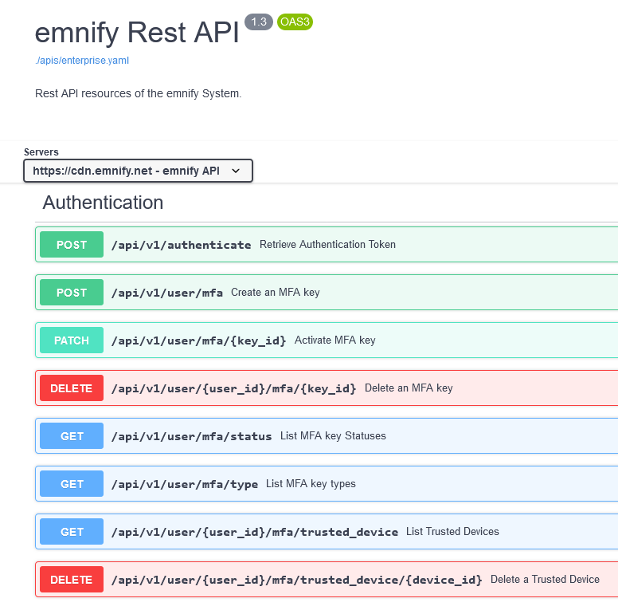
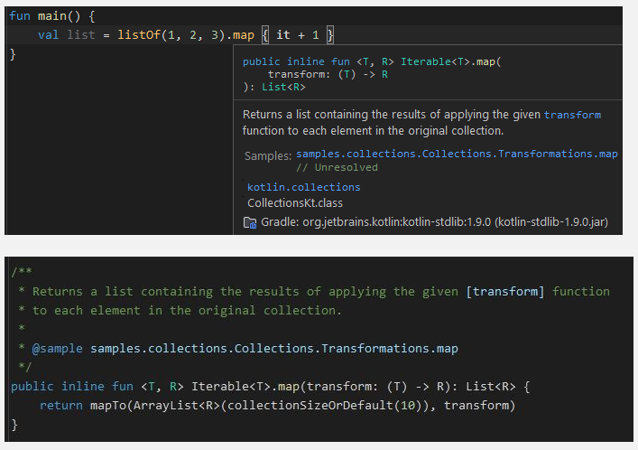

**Main Source:**

- **[Open source — Wikipedia](https://en.wikipedia.org/wiki/Open_source)**
- **[Choose an open source license](https://choosealicense.com/)**
- **[Creative Commons license — Wikipedia](https://en.wikipedia.org/wiki/Creative_Commons_license#Types_of_licenses)**
- **[Software documentation — Wikipedia](https://en.wikipedia.org/wiki/Software_documentation)**

**Open Sourcing** is the practice of releasing software or other intellectual property under an open-source license, granting the public the right to view, modify, and distribute the source code or content.

In the context of software engineering, open sourcing a software involve making the source code accessible to anyone and allowing anyone to contribute to its development or improvement. Code are shared in public repository platform, such as GitHub, GitLab, or Bitbucket.

### License

Software is considered as a form of intellectual property that is protected by copyright laws. Copyright grants exclusive rights to the creators or owners of original works, including software, and provides legal protection against unauthorized copying, distribution, modification, or use of the software.

An open sourced software is typically licensed with a free and open-source license. These are special licenses that allows anyone to access, use, modify, and distribute the software freely.

Different license have different freedom, some of these licenses are:

- **GNU General Public License (GPL)**: GNU GPL is a copyleft license that requires any derivative works or modifications of the software to be licensed under the same GPL terms. The GPL permits users to use, modify, and distribute the software freely, as long as the resulting works are also made available under the GPL.
- **MIT License**: MIT License is a permissive license that allows users to use, modify, and distribute the software with minimal restrictions. It grants users the freedom to use the software for any purpose, including commercial purposes, and allows users to sublicense, modify, and distribute the software under different terms if desired.
- **Apache License 2.0**: Another permissive license with similar freedom to MIT license. The Apache license is stricter, it includes patent grants and provides more explicit terms related to contributions and patents compared to some MIT license.
- **Creative Commons License**: A public copyright license for creative works, including software (although it's not recommended). CC provides various permission which can be combined, including:

  - **Attribution (BY)**: Anyone may copy, distribute, modify, or use, as long as the original author is credited.
  - **ShareAlike (SA)**: Modified or adapted work must be shared under the same or a compatible license.
  - **NonCommercial (NC)**: Restricts the use of the work for commercial purposes.
  - **NoDerivatives (ND)**: The work must be used as-is, without any modifications or adaptations.

- **Unlicense**: The license that dedicates a work to the public domain, granting users with maximum freedom to use, modify, and distribute the software or creative work without any restrictions.

### Documentation

It is important to provide documentation for public software to enable developers to contribute easily. A documentation provide instructions, explanations, and guidance on how to install, configure, use, and contribute to the software.

A documentation can be software requirements, architecture or design, technical, or manuals for end user. One of the example of technical documentation is an API reference. API reference focuses on documenting the APIs exposed by software libraries or services. API documentation explains how to use the APIs, including details on input parameters, return values, error handling, and usage examples.

  
Source: https://developer.blackberry.com/devzone/files/blackberry-workspaces/java-doc/

An API reference typically includes documentation for all the packages and modules within the API. For object-oriented API, it may contain all the class or interfaces available.

The API reference shown in the image above is an example of object-oriented API. The documentation for each class includes constructor and method summary on the top. This help user to know essential information about the class quickly.

  
Source: https://developer.blackberry.com/devzone/files/blackberry-workspaces/java-doc/

Under the summary, the detail of each method is provided. The detail contains more comprehensive information about the parameters, return values, exceptions, and any additional usage notes or examples.

Here's another example, a [REST API](/backend-system/rest-api) documentation.

  
Source: https://cdn.emnify.net/api/doc/swagger.html

#### Embedded Documentation

Many languages provide a way to document their code through comments. For example, in languages like C, C++, Java, and JavaScript, comments are denoted using double slashes `//` for single-line comments or enclosed within `/* ... */` for multi-line comments.

Some languages such as Java (Javadoc) and Kotlin (KDoc) have special comments enclosed within `/** ... */` (double asterisk on start), which indicates a special documentation format specifically designed for documenting code. These format supports Markdown, allowing us to refer between documentation, and supports to document different elements of code, classes properties, constructor, parameters, and more.

The image above demonstrate using standard library API in Kotlin. Hovering over a variable, function, method, class, interface, or other identifier (i.e., `map`) will reveal a tooltip or pop-up that displays contextual information about the identifier. Turns out that the information in the tooltip comes from the documentation in the `map` declaration.

### Code of Conduct

Some open source project includes code of conduct, which outlines the expected behavior and standards of conduct for participants within the open source community.

Code of conduct may contain:

- **Respect**: Promotes respectful environment where all participants should be treated with dignity and respect, regardless of their background, identity, or beliefs.
- **Harassment and Discrimination**: It explicitly prohibits any form of harassment, discrimination, or offensive behavior.
- **Consequences for Violations**: Specifies the potential consequences for violations, ranging from warnings and temporary suspensions to permanent bans from the community.

### Contributing Guidelines

Contributing guidelines are a set of instructions and recommendations that outline how individuals can contribute to an open source project.

Contributing guidelines, sometimes in CONTRIBUTING.md file, may contain:

- **Overview**: The introduction or the summary of the project, includes the purpose, goals, and target audience.
- **Getting Started**: Instructions on how to get started with contributing to the project. This may include details on setting up the development environment, obtaining the project's source code, and installing any necessary dependencies.
- **Types of Contributions**: A description of the different types of contributions that are welcome, such as code contributions, documentation improvements, bug reports, feature requests, translations, or community engagement.
- **Conventions**: Specify the convention, such as coding standards, style conventions, and best practices the project are using.

#### Issues

Some platform, such as GitHub provide an issue tracker. Issues refer to bugs, problem reports, feature requests, or tasks that need to be addressed or completed within the project. Issues can be created by project maintainers, contributors, or users of the software, along with additional information:

- **Title**: A brief and descriptive title that summarizes the issue.
- **Description**: A detailed explanation of the issue, including the context, problem statement, or desired improvement. In the case of bugs report, it may include step to reproduce.
- **Labels**: Labels categorize issues, making it easier to filter and search. Common labels include bug, enhancement, documentation, help wanted, and more.
- **Milestones**: Group related issues together and track progress towards specific project goals or releases. For example, for certain version releases, a particular bug issue need to be addressed.
- **Status and Progress**: Issues have status which can be open, closed, in progress, resolved, or duplicate.

#### Pull Request

Pull request (PR) is a way for contributors to propose changes to a codebase. Pull request are reviewed, discussed, and need to be approved by the project maintainer before it is applied to the codebase.

Pull request contains:

- **Title**: A descriptive title summarizing the purpose of the pull request.
- **Description**: Detailed explanation of the changes, which may include context, reasoning, or any relevant information about the changes, such as bug references or feature requirements.
- **Changes**: The actual modifications made to the codebase. This can include new code, modified code, or deleted code. The changes are usually displayed in a "diff" format, highlighting the specific lines or sections that have been added, modified, or removed.
- **Testing**: Some project may require new changes to past the automated tests in order to validate the correctness.
- **Documentation**: If the changes impact the project's documentation, the pull request may include updates or additions to the relevant documentation files.
- **Related Issues**: If the pull request addresses a specific issue or feature request, it is common to reference the corresponding issue or feature request number.
