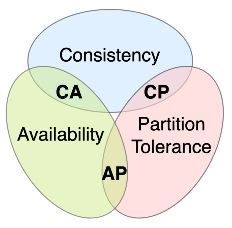
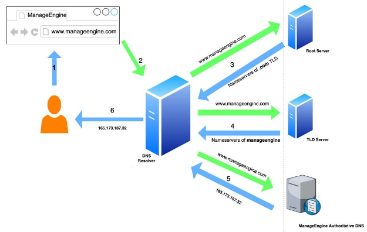
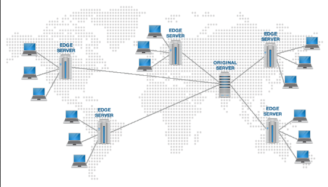
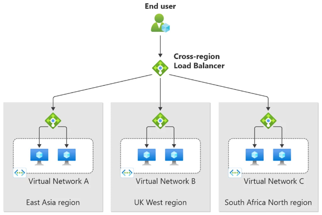

**Main Source:**

- **[system-design-primer by donnemartin — GitHub](https://github.com/donnemartin/system-design-primer)**
- **My previous notes**
- **[CAP theorem - Availability and Partition Tolerance — stackoverflow](https://stackoverflow.com/questions/12346326/cap-theorem-availability-and-partition-tolerance)**
- **[You Can’t Sacrifice Partition Tolerance — Coda Hale](https://codahale.com/you-cant-sacrifice-partition-tolerance/)**

**System Design** is the process of defining the architecture, components, modules, interfaces, and data for a software system. Many factors including criteria of requirements are considered when designing the architecture.

- **Performance**: The speed, responsiveness, and efficiency of a software system. The goal is to optimize the system to deliver fast response times, minimize resource utilization, and handle high workloads.
- **Scalability**: The ability of a system to handle increasing workloads and growing user demands.
- **Availability & Reliability**: Availability is the ability of a system to remain operational and accessible to users (e.g., low downtime during update). Reliability refers to the system's ability to consistently perform as expected without failures (e.g., no data loss during update).
- **Consistency**: Relates to maintaining data integrity and ensuring that the system behaves predictably under concurrent operations.
- **Infrastructure**: The design or choice of the underlying hardware and software environment required to support the software system. This includes selecting appropriate servers, networking, storage solutions, and cloud services.
- **Security**: Mechanisms implemented to protect the system, data, and users from unauthorized access, data breaches, and malicious attacks.

### Performance

There are several performance measures:

- **Latency**: Delay in transmission of request or response.
- **Processing time**: The time it takes for the request to be processed.
- **Response time**: The time it takes for the system to process a request from client and response.
- **Throughput**: Number of requests handled within a unit of time.

To put it simply, `response time = latency + processing time + latency`. The goal is to get **low latency**, **low processing time**, **low response time**, and **high throughput**.

Technique to improve performance includes:

- Implement [caching mechanism](/cs-notes/computer-and-programming-fundamentals/caching).
- [Optimize database](/cs-notes/database-system/database-optimization), such as using [database index](/cs-notes/database-system/database-index).
- [Load balancing](#load-balancer), incorporate multiple servers or instance to distribute the workload.
- Efficient algorithms and data structures.
- Asynchronous systems, use algorithm that are capable of doing concurrent operations.

### Scalability

To handle more workload, a system can either be scaled horizontally or vertically.

**Horizontal scale** includes adding more instance, such as adding more server to handle the request. **Vertical scale** increase the individual resources of existing instances, such as upgrading the server CPU, memory, or disk.

Improving scalability is typically related to distributing the workload::

- Use load balancer with distributed architecture like [SOA](/cs-notes/backend-system/soa) or [microservice](/cs-notes/backend-system/microservice), allowing the system to be decomposed into smaller and independent server that can be developed, deployed, and scaled individually. For example, the authentication system may struggle with workload, but not the file uploader, which means we can scale up the authentication system.
- Make service or system that are **stateless**. Stateless refer to the ability of a system or service to operate without relying on stored state information. A stateless system treats each request as an independent transaction and does not maintain any session or context information between requests.

  With more users present, storing all their session data can be a burden. One approach is to share the state across all the server, to reduce the burden of a single server storing the data. However, this approach require additional synchronization mechanism, which can increase the complexity of the system.

- [Database partitioning](/cs-notes/database-system/database-optimization#partition) is a term for breaking down a large database into smaller, more manageable units called partitions. This is done within a single database instance. Partition can scale the system horizontally, this is done by distributing the partition across multiple servers, this process is called [database sharding](/cs-notes/cloud-computing-and-distributed-systems/distributed-database#database-sharding).

### Availability & Reliability

Availability measures the extent to which users can access the system without interruption or downtime. On the other hand, reliability measures the likelihood that a system will operate without failure.

Availability is often expressed as a percentage, such as 99.9% (three nines) or 99.99% (four nines). For example, a system with 99.9% availability would be expected to have less than 0.1% (or 8.76 hours) of downtime within a year. Higher availability percentages indicate better system performance and reliability.

A system can operate in **parallel** (at the same time) or in **sequence** (one after the other). A parallel system generally have higher availability, because when one fails, the other is still operating.

The formula of availability:

- Parallel: $\text{availability (total)} = \text{availability (system 1)} \times \text{availability (system 2)}$.
- Sequence: $\text{availability (total)} = 1 - (1 - \text{availability (system 1)}) \times (1 - \text{availability (system 2)})$.

In parallel, if both system availability is 99.9%, the total would be 99.8%. While in sequence, the total would be 99.9999%.

Two mechanisms to improve availability and reliability:

- **Failover**: Quickly and automatically transfer workload from a failed component or system to a backup or standby component. When a failure is detected, the failover mechanism triggers the transition to the backup component, which assumes the workload and resumes normal operations.

  Failover can be done in **active-passive** or **active-active**. In active-passive, one system is running, and the other is on standby. In the latter one, two systems are running together, to distribute workload as well as to increase the availability.

- **Replication (redundancy)**: Create and maintain duplicate copies of data or system components across multiple locations or systems. Ensure that data or services are accessible even if one copy or component becomes unavailable. See also [database replication](/cs-notes/database-system/logging-and-recovery#replication) for replicating database and [database sharding](/cs-notes/cloud-computing-and-distributed-systems/distributed-database#database-sharding).

### Consistency

Consistency is concerned with concurrency of multiple component or system modifying the same data.

The level of consistency required for a system can be adjusted based on the trade-offs we are willing to make. These consistency models are categorized based on their degree of strength:

- **Weak**: Low synchronization among replicas. There are no guarantees about the order in which updates are seen by different system. Different replicas may have inconsistent views of the data at any given time.

  Used in scenarios such as real-time systems, where immediate consistency is not critical, and the system prioritizes availability and performance over strict consistency.

- **Eventual**: Eventual consistency guarantees that data will eventually be consistent with just slight delay.
- **Strong**: All replicas observe the same order of updates, and any read operation will return the most recent write. Strong consistency ensures that replicas reflect a single, globally agreed-upon state at all times.

Ways to improve consistency:

- Use [transaction](/cs-notes/database-system/transactions) on database operation and adhere to [ACID properties](/cs-notes/database-system/transactions#acid) of database.
- Implement synchronization mechanisms to coordinate access and updates to shared resources or data. [Various technique](/cs-notes/operating-system/multithreading#synchronization-primitives), such as locks and semaphores can help to guarantee concurrent operations.

#### CAP Theorem

Distributed system is a collection of interconnected computer that are separated and only connected by one central computer. The computers in the connection are often called as node. Each node communicate and coordinate their activities through message passing, shared memory, or other forms of inter-process communication.

CAP theorem is a principle that states that it is impossible for a distributed system to simultaneously provide all three CAP properties in the face of **network partitions**. Network partition is a phenomenon that in which nodes are disconnected, causing them unable to communicate. It is a realistic situation that can occur even in large system due to various reasons, such as network failures, hardware failures, misconfigurations, or even during routine maintenance activities.

The three CAP properties are:

- **Consistency**: Requirement that all nodes in a distributed system have the same view of data at the same time.
- **Availability**: System remains operational and responsive even in the presence of failures.
- **Partition Tolerance**: System's ability to continue functioning even when network partitions occur.

The reasoning behind CAP theorem is one conflicting another. Nodes in distributed system can be thought as disjoint set, which is a non-overlapping set. If $A = \{1, 2\}$ and $B = \{3\}$, then A and B are disjoint sets.

When a node receives new data, it has the option to write it or reject it. If it chooses to write it, then we can say the system is available at the time (it serves request), but it will need to synchronize with others in order to maintain consistency.

When a partition occurs, nodes can't communicate with each other. If they keep choosing to write the new data, then it would lead to **inconsistency**, as the data is not synchronized across all nodes and they can't synchronize. If they choose to reject the write request, then we just **sacrificed availability**. This means guaranteeing CA together is not possible, resulting in the impossibility of achieving CAP as well.

This leaves us with two possible system:

- **CP**: CP system sacrifice availability whenever a partition occurs. It will block or delay responses until the partition is resolved.
- **AP**: An AP system will continue to operate and serve requests during partition, even if it means allowing temporary inconsistencies of the data.

  
Source: https://en.wikipedia.org/wiki/CAP_theorem#/media/File:CAP_Theorem_Venn_Diagram.png

:::tip
More about [distributed systems](/cs-notes/cloud-computing-and-distributed-systems).
:::

### Infrastructure

Infrastructure refers to the hardware, software, and network components that provide the foundation for a system to operate.

#### DNS

The main purpose of [Domain Name System (DNS)](/cs-notes/computer-networking/dns) resolves a domain name (e.g., `google.com`) to the corresponding IP address (i.e., `216.239.38.120`), to allow browser to establish a connection with the correct server.

Other than that, we can configure DNS for load balancing and traffic distribution using DNS service, such as Cloudflare. DNS can rotate and distribute requests among different servers based on workload, latency, or geolocation.

  
Source: https://blogs.manageengine.com/clouddns/2022/10/24/how-does-a-dns-work.html

#### CDN

**Content Delivery Network (CDN)** is a distributed network of servers located in various geographical locations that work together to deliver content to end users with improved performance and availability.

The idea of CDN is to spread server around the world, so that when a user requests content, the CDN serves it from the nearest edge server instead of the origin server, reducing latency and improving delivery speed. It is commonly used to deliver static and dynamic content, such as web pages, images, videos, and other media files.

There are two approaches of distribution in CDN:

- **Push CDN**: In a Push CDN, the content is uploaded or "pushed" to the CDN's edge servers in advance, either manually or automated. When a user requests the content, the CDN delivers it directly from the edge server without needing to fetch it from the origin server. It is typically used to deliver content that doesn't change so often.
- **Pull CDN**: Pull CDN serve content in cache-like mechanism. When a user requests a specific content, the CDN checks if it has a cached copy at the edge server. If the content is not available or has expired, the CDN pulls it from the origin server, caches it on the edge server, and delivers it to the user. Subsequent requests for the same content can be served directly from the edge server's cache.

  
Source: https://www.domainesia.com/tips/apa-itu-cdn-dan-fungsi-cdn/

#### Load Balancer

**Load balancer** distribute incoming traffic across multiple servers to reduce a burden of a single. It serves a purpose beyond just workload balancing, as it can also be utilized to reroute connections away from systems that are unhealthy or experiencing failures.

Other benefits of load balancer:

- **Session Persistence**: Now, because the server are distributed, it could be possible that they don't share data with each other. In the case of stateful application, in which the server need to store user's session data, load balancer can maintain **session persistence** by ensuring that requests from the same client are consistently routed to the same server.
- **SSL Termination**: Client through web browser connects to server with secure connection, encrypted with [SSL/TLS protocol](/cs-notes/computer-networking/network-encryption#ssltls). Load balancer can decrypt the connection before it connects to the application servers. Furthermore, it can encrypt outgoing connection from the server. Using load balancer as SSL termination help separating the concern of server, so they do not need to be concerned by security-related issues.

There are two levels of where load balancer can operate:

- **Network Level**: In this level, load balancers distribute traffic based on network-level protocols, typically at the [transport layer (layer 4) of the OSI model](/cs-notes/computer-networking/osi-model#osi-layers). They forward incoming requests using information such as source IP address, destination IP address, and TCP/UDP ports. They do not examine the content of the requests, and they are generally faster and more efficient, but lack of application layer access.
- **Application Level**: Application level is the layer 7 of the OSI model, it has access from the application layer protocol, such as HTTP headers, URLs, cookies, and session information. They are generally slower, but they can perform content-based routing, SSL termination, caching, etc.

  
Source: https://azure.microsoft.com/en-us/blog/build-a-globally-resilient-architecture-with-azure-load-balancer-2/

#### Reverse Proxy

[Reverse proxy](/cs-notes/computer-networking/proxy#reverse-proxy) can function similar to load balancer, however, instead of evenly distributing the workload, a reverse proxy forwards request to the appropriate backend server.

#### Architecture

Several choices of architecture are:

- **[Monolithic](/cs-notes/backend-system/monolithic)**: Simple to develop and deploy but can become harder to maintain and scale as the application grows.
- **[Microservice](/cs-notes/backend-system/microservice)**: Flexible, scalable, and isolate fault, but introduces additional complexity in terms of service coordination and communication.
- **[Service Oriented Architecture (SOA)](/cs-notes/backend-system/soa)**: Similar to microservice, it can lead to complexity in terms of service coordination and communication.
- **[Serverless](/cs-notes/backend-system/serverless)**: Easy development, automatic scaling, and cost efficiency but may have limited control over low-level components.

#### Message Broker

[Message broker](/cs-notes/backend-system/message-broker) can be useful to handle the communication and coordination between components or services in a system.

Benefits:

- Message broker promotes loose coupling, components can communicate with each other without direct knowledge or dependency on one another.
- Message won't be lost as they can be kept temporarily when component or service are temporarily unavailable or experiences a failure.

### Security

Ways to improve security:

- Implement [authentication](/cs-notes/backend-system/authentication) and [authorization](/cs-notes/backend-system/authorization) mechanism.
- Use secure protocols such as [SSL/TLS](/cs-notes/computer-networking/network-encryption#ssltls).
- Avoid [various security vulnerability](/cs-notes/computer-security) and apply best practices.
- Maintain IP whitelists and blacklists to allow or block traffic from specific IP addresses or ranges.
- Implement rate limiting to control the amount of incoming traffic, preventing [DoS](/cs-notes/computer-security/network-security#ddos-attack).

:::tip
See also:

- [Backend Optimization](/cs-notes/backend-system/backend-optimization)
- [Database Optimization](/cs-notes/database-system/database-optimization)
- [Database Index](/cs-notes/database-system/database-index)
- [Network Security](/cs-notes/computer-security/network-security)
- [Web Security](/cs-notes/computer-security/web-security)
- [Mobile Security](/cs-notes/computer-security/mobile-security)
- [Backend & Server Security](/cs-notes/computer-security/backend-server-security)
- [Other Attack & Exploit](/cs-notes/computer-security/other-attack-and-exploit)
:::
