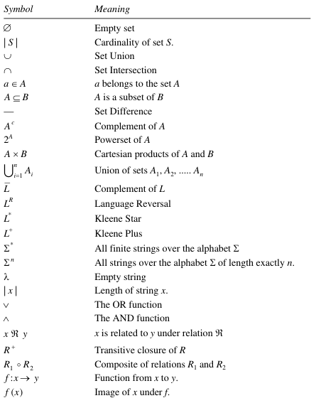
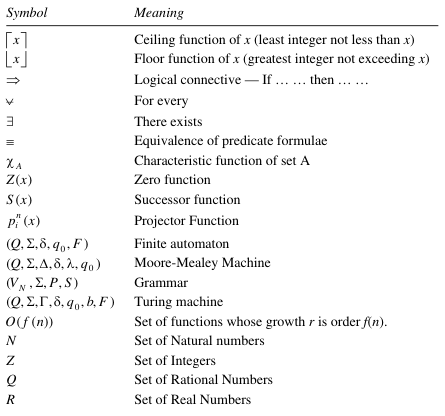
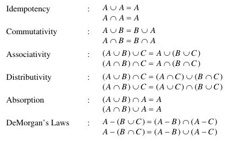
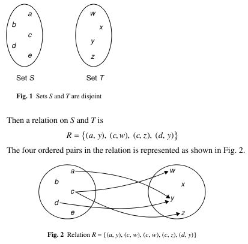
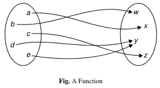
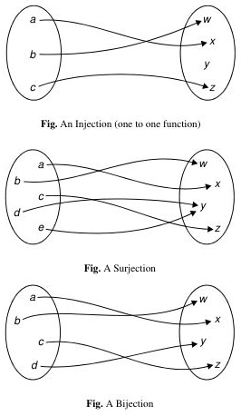
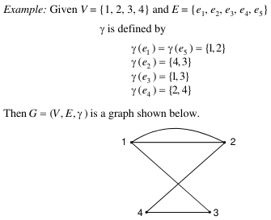

**Main Source:**

- **[Theory of computation — Wikipedia](https://en.wikipedia.org/wiki/Theory_of_computation)**
- **Book chapter 0**
- **[Finite state machine — Wikipedia](https://en.wikipedia.org/wiki/Finite-state_machine)**
- **[Introduction to Theory of Computation — Neso Academy](https://youtu.be/58N2N7zJGrQ?si=ApDqs6e96kyBP1XJ)**
- **[Finite State Machine (Prerequisites) — Neso Academy](https://youtu.be/TpIBUeyOuv8?si=FPa7InDywdw2YxoX)**

### Introduction

**Theory of Computation (TOC)** is the study of abstract models of computation and the fundamental limits of what can be computed. It seeks to understand the nature of computation, the power, and limitations of different computational models, and the relationships between different classes of problems.

This field is further divided into three:

- **Automata Theory & Formal Language**: Automata theory is the study of abstract models of computation or machines used to solve computational problems. Formal language is concerned about formalizing a natural language by specifying with symbols or character, following a set of rules called the formal grammar. Automata are designed to recognize formal language. In other word, the formal language is used as the input and output for the abstract model of computation. Different types of automata recognize different types of languages.
- **Computability Theory**: Computability theory focuses on the study of what can be computed and the limits of computation. It deals with the question of which problems can be solved algorithmically and which problems are unsolvable. Problems are analyzed with abstract model of computation along with other formal systems.
- **Computational Complexity Theory**: Computational complexity theory focuses on understanding the resources required to solve computational problems. It focuses on classifying problems into different complexity classes based on the amount of time, space, or other resources needed to solve them.

### Foundational Concepts

TOC uses much math.

#### Notation

TOC uses mathematical logics as the tool to formalize and analyze computational concepts. Therefore, there are various mathematical notation used here. These notations will be covered later.

Source: Book notation part

#### Sets

In mathematical logic, set is a collection of objects. The objects within a set can be anything from numbers, letters, other sets, or even more abstract mathematical objects.

Sets are typically denoted using curly braces $\{\}$. For example, the set of natural numbers less than 5 can be written as $\{0, 1, 2, 3, 4\}$, where each number is an element of the set. If an object $x$ is an element of a set $A$, it is represented as $x \in A$, and if $x$ is not an element of $A$, it is represented as $x \notin A$.

Sets can be finite or infinite, depending on the number of elements they contain. For example, the set of all even numbers is an infinite set, while the set of colors in a rainbow is a finite set.

Set operations and terminologies:

- **Empty set**: A set is empty, denoted as $\varnothing$ if it contains no elements.
- **Union**: The union of two sets $A$ and $B$, denoted by $A \cup B$, is the set that contains all the elements that are in either set A or set B, or in both. For example, if #$A = \{1, 2, 3\}$ and $B = \{3, 4, 5\}$, then $A \cup B = \{1, 2, 3, 4, 5\}$.
- **Intersection**: The intersection of two sets $A$ and $B$, denoted by $A \cap B$, is the set that contains all the elements that are common to both $A$ and $B$. For example, if $A = \{1, 2, 3\}$ and $B = \{3, 4, 5\}$, then $A \cap B = \{3\}$.
- **Set difference**: $A - B$ denotes the difference between set $A$ and $B$. It is a set that contains everything in $A$, but not in $B$. For example, if $A = \{1, 3, 9\}$ and $B = \{3, 5\}$, then $A - B = \{1, 9\}$.
- **Complement**: Denoted by $A^{C}$, is a set that contains everything that is not in $A$.
- **Properties**: Set has some properties as follows.

    
   Source: Book page 2-3

- **Subset**: A set $A$ is said to be a subset of a set $B$ if every element of $A$ is also an element of $B$. If $A = \{1, 2\}$ and $B = \{1, 2, 3\}$, then $A$ is a subset of $B$ ($A \subseteq B$). It is possible for a set to be a subset of another set without being equal to it. If $A$ is a subset of $B$ and there exists at least one element in $B$ that is not in $A$, then $A$ is called a proper subset of $B$, denoted as $A \subset B$.
- **Superset**: Conversely, a set $B$ is said to be a superset of a set $A$ if every element of $A$ is also an element of $B$. In other words, if every element $x$ in $A$ satisfies the condition $x \in B$, then $B$ is a superset of $A$, denoted as $B \supseteq A$. Similar to subsets, if $B$ is a superset of $A$ and there exists at least one element in $B$ that is not in $A$, then $B$ is a proper superset of $A$, denoted as $B \supset A$.
- **Disjoint sets**: Disjoint sets are sets that have no elements in common. In other words, two sets $A$ and $B$ are disjoint if their intersection is the empty set $\varnothing$. For example, if $A = \{1, 2, 3\}$ and $B = \{4, 5, 6\}$, then $A$ and $B$ are disjoint sets because their intersection is $\varnothing$.
- **Cardinality**: The number of element in some set. The cardinality of a set $A$ is denoted as $|A|$.
- **Powerset**: The powerset of a set $A$, denoted as $P(A)$, is the set that contains all possible subsets of $A$, including the empty set $\varnothing$ and the set $A$ itself. For example, if $A = \{1, 2\}$, then $P(A) = \{\varnothing, \{1\}, \{2\}, \{1, 2\}\}$.
- **Cartesian Product**: The Cartesian product of two sets $A$ and $B$, denoted as $A \times B$, is the set of all possible ordered pairs where the first element comes from $A$ and the second element comes from $B$. In other words, it combines every element of $A$ with every element of $B$. For example, if $A = \{1, 2\}$ and $B = \{a, b\}$, then $A \times B = \{(1, a), (1, b), (2, a), (2, b)\}$.

#### Relations

Relation is a set of ordered pairs that relates elements from one set, called the domain, to elements of another set, called the range or codomain. More specifically, a relation on sets $S$ and $T$ is a set of ordered pairs $(s, t)$, where:

1. $s \in S$
2. $t \in T$
3. $S$ and $T$ need not be different
4. The set of all first elements in the “domain” of the relation, and
5. The set of all second elements is the “range” of the relation

Two sets $A = \{1, 2, 3\}$ and $B = \{a, b, c\}$. A relation $R$ from $A$ to $B$ could be $\{(1, a), (2, b), (3, c)\}$. This relation relates each element from set $A$ with a corresponding element from set $B$.

  
Source: Book page 8-9

- **Equivalence Relations**: An equivalence relation is a relation that satisfies three properties:
  - **Reflexivity**: Every element is related to itself. For all elements $a$ in the set, $(a, a)$ is in the relation.
  - **Symmetry**: If one element is related to another, then the other is related to the first. For all elements $a$ and $b$ in the set, if $(a, b)$ is in the relation, then $(b, a)$ is also in the relation.
  - **Transitivity**: If one element is related to a second, and the second is related to a third, then the first is related to the third. For all elements $a$, $b$, and $c$ in the set, if $(a, b)$ is in the relation and $(b, c)$ is in the relation, then $(a, c)$ is also in the relation.
- **Partial Ordering Relation**: A relation that satisfies three properties: reflexivity, antisymmetry, and transitivity. A set with a relation being partial order is called partially ordered set.
  - **Antisymmetry**: The opposite of symmetry, for all elements $a$ and $b$ in the set, if $(a, b)$ is in the relation, then $(b, a)$ must not be in the relation, unless $a = b$.
- **Partition**: A partition of a set is a collection of non-empty, disjoint subsets (called blocks) that cover the entire set. Each element of the set belongs to exactly one block of the partition. A set $\{1, 2, 3, 4, 5\}$ can be partitioned into $\{\{1, 4\}, \{2, 5\}, \{3\}\}$.

#### Functions

A function is a special type of relation that assigns a unique element from the range to each element in the domain. In other words, it relates each element in the domain to exactly one element in the range. Functions are often represented using mappings or formulas.

For example, the function $f: A \rightarrow B$ is defined by $f(1) = a$, $f(2) = b$, and $f(3) = c$. This function assigns a unique element from set $B$ to each element in set $A$.

  
Source: Book page 12

Kind of functions:

- **Injection (one-to-one)**: A function in which each element in the domain is mapped to a unique element in the range. In other words, no two distinct elements in the domain are mapped to the same element in the range.
- **Surjection (onto)**: A function in which every element in the range is mapped to by at least one element in the domain. In other words, the range of the function covers the entire range.
- **Bijection (one-to-one and onto)**: A function that is both injective and surjective. In other words, it is a function where each element in the domain is mapped to a unique element in the codomain, and every element in the codomain is mapped to by exactly one element in the domain.
- **Invertible function**: A function $f: A \rightarrow B$ is invertible if there exist an inverse relation $f^{-1}$ that maps from $B$ to $A$.

    
   Source: Book page 12-13

#### Graphs

Formally, a graph $G$ is defined as a triple of $(V, E, \gamma)$, where $V$ is a finite set of objects called **vertices**, $E$ is another finite set of objects called **edges**, and $\gamma$ is a function that assigns to each edge in a graph a subset $\{v, w\}$, where $v$ and $w$ are vertices of the graph.

  
Source: Book page 15

See [graph](/cs-notes/data-structures-and-algorithms/graph) for terminologies and types of graph. In addition, we can say a graph is a [tree](/cs-notes/data-structures-and-algorithms/tree) if it is connected and has no simple cycles.

#### Strings & Languages

A string is a finite sequence of symbols chosen from a given alphabet. An alphabet $a$, denoted by $\Sigma_a$ is a finite set of symbols. The symbols can be characters, numbers, or any other discrete elements. For example, if we have $\Sigma_a$ consisting of the symbols $\{0, 1\}$, then "0101" and "111" are the example of strings over $\Sigma_a$.

- **Length**: The length of a string is the length of its sequence. The length of string $w$ is denoted as $|w|$.
- **Empty string**: A string with zero length, denoted as $\epsilon$.
- **Reverse string**: The reverse of a string. If $w = w_1 w_2 ...w_n$, where each $w_i \in \Sigma$, then the reverse is $w_n w_{n-1} ... w_1$.
- **Substring**: A substring is a contiguous sequence of characters within a string. As an example, "deck" is a substring of "abcdeckabcjkl".
- **Concatenation**: An operation of combining them together to form a new string. Suppose string $x$ with length of $m$ and string $y$ with length of $n$. The concatenation between them is written as $xy$, which is obtained by appending $y$ to the end of $x$, that is $x_1 x_2...x_m \space y_1 y_2...y_n$.

  In the case of concatenation of a string with itself, it is denoted as $x^k$, where $k$ is the number of repetition. A concatenation of $w = abc$ with empty string $\epsilon$ will be $w\epsilon = abc$.

- **Prefix**: Substring that appears at the beginning of the string. If $w = vy$ for some $y$, then $v$ is a suffix of $w$.
- **Suffix**: Substring that appears at the end of the string. If $w = xv$ for some $x$, then $v$ is a prefix of $w$.
- **Lexicographical ordering**: Lexicographical ordering is a way to compare strings based on their alphabetical order. For example, "apple" comes before "banana" and "01" comes before "10" in lexicographical ordering. The lexicographic ordering of all strings over the alphabet $\{0, 1\}$ is $(\epsilon, 0, 1, 00, 01, 10, 11, 000, ...)$.
- **Language**: Formally, it is any set of strings over an alphabet. The set of all strings, including the empty string over an alphabet $\Sigma$ is denoted as $\Sigma^*$. A language can consist of string that follows some property. Examples:

  - $L_1 = \{w \in \{0, 1\}^*: w \text{ has an equal number of 0's and 1's}\}$. Language $L_1$ consist set of string that has the equal number of zeros and ones. For example, some strings that would belong to $L_1$ are "01", "0011", "1100", "000111", and so on.
  - $L_2 = \{w \in \Sigma^*: w = w^R\}$, where $w^R$ is the reverse string of $w$. This language consist of string where its original is equal to its reverse (i.e., a palindrome, such as racecar, poop.).

- **Language with power**: A language with a power $\Sigma^n$, where $\Sigma = \{0, 1\}$ describe the set of all strings of length $n$ under language $\Sigma$.

  - $\Sigma^0 = \{\epsilon \}$ (consist of just empty string).
  - $\Sigma^1 = \{0, 1 \}$.
  - and so on...

  We can also write $\Sigma^*$, a set of all strings over an alphabet $\Sigma$ as $\Sigma^* = \Sigma^0 \cup \Sigma^1 \cup \Sigma^2 ...$ (infinite).

- **Language concatenation**: If $L_1$ and $L_2$ are languages over alphabet $\Sigma$, their concatenation is written as $L = L_1 \cdot L_2$, or simply $L = L_1 L_2$, where $L = \{w \in \Sigma^*: w = x \cdot y \text{ for some } x \in L_1 \text{, and } y \in L_2\}$.

  For example, given $\Sigma = \{0, 1\}$,  
   $L_1 = \{w \in \Sigma^*: w \text{ has an even number of 0's} \}$  
   $L_2 = \{w: w \text{ starts with a 0 and the rest of the symbols are 1's} \}$  
   then $L_1 L_2 = \{w: w \text{ has an odd number of 0's} \}$. This is true because $L_1$ itself consist of even number of 0's, concatenating it with $L_2$, which mean adding 1 zero will make any language there have the odd number of zeros.

- **Kleene Star**: A language operation denoted as $L^*$, which is the set of all strings obtained by concatenating zero or more strings from $L$. More specifically, $L^* = \{w \in \Sigma^*: w = w_1 \cdot ... \cdot w_k \text{ for some } k \ge 0 \text{ and some } w_1, w_2, ..., w_k \in L \}$.

  For example, from a language $L = \{01, 1, 100\}$, we can form "110001110011", since it can be formed by the concatenation of $1 \cdot 100 \cdot 01 \cdot 1 \cdot 100 \cdot 1 \cdot 1$.

#### Boolean Logic

See [boolean logic](/cs-notes/computer-organization-and-architecture/boolean-logic).

#### Grammar

A grammar is simply a mechanism to describe a language, or specifically a set of production rules that describe the structure of a formal language. A grammar consists of a quadruple $(V, T, S, P)$, where:

- $V$: Finite set of objects called **variables** or **non-terminal symbols**. These symbols represent different syntactic categories or components that can be combined to form valid strings in the language. Examples of non-terminal symbols can include syntactic categories like noun, verb, sentence, or expression.
- $T$ or $\Sigma$: Finite set of objects called **terminal symbols**. These symbols represent the basic building blocks or atomic units of the language. Terminals are the actual characters or tokens that appear in the strings of the language. Examples of terminal symbols include individual letters, digits, or punctuation marks.
- $P$, in the form of $x \rightarrow y$: Finite set of **productions rule**. Each production rule specifies how a non-terminal symbol can be replaced by a sequence of terminals and non-terminals. It defines the valid ways to construct strings in the language.
- $S$, where $S \in V$: A special non-terminal symbol that represents the starting point, called **start variables**. The goal is to generate valid strings in the language by repeatedly applying production rules, starting from the start symbol.

If we have a string $w$ in the form $w = uxv$, and we apply the production rule $x \rightarrow y$, it means that we replace the substring $x$ in $w$ with the string $y$ to obtain a new string $z = uyv$. We call a sequence of production rule applications that transforms the start symbol $S$ into a specific string $w$ a **derivation**.

:::tip
The set of all strings obtained by using production rules is the languages generated by the grammar.
:::

Consider a grammar $G = (V, T, S, P)$ and $L(G) = \{w \in T^*: S \xRightarrow{*} w \}$. This expression represents the language generated by the grammar $G$, comprising all strings that can be derived from the start symbol $S$ according to the production rules defined in $P$.

- $T^*$ represents the set of all possible strings that can be formed using the terminal symbols $T$.
- $S \xRightarrow{*} w$ denotes that the start symbol $S$ can be derived or rewritten to produce the string $w$ using a sequence of production rule applications. The $S \xRightarrow{*} w$ symbol indicates zero or more rewriting steps.

If a string $W$ belong to the grammar, or $W \in L(G)$, then there exists a sequence $S \Rightarrow w_1 \Rightarrow w_2 \Rightarrow w_3 ... \Rightarrow w_n \Rightarrow w$, which is a sequence of production rule applications (or a derivation) that transforms the start symbol $S$ into the string $w$.

During the derivation process, we call intermediate strings produced a **sentential form**. Therefore, with the string $S$, we call $w_1, w_2, ..., w_n$ a sentential form of the derivation.

:::tip
See also [Formal grammar](/cs-notes/theory-of-computation-and-automata/formal-grammar).
:::
