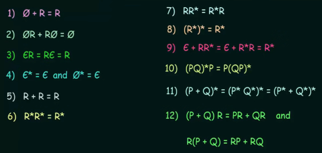
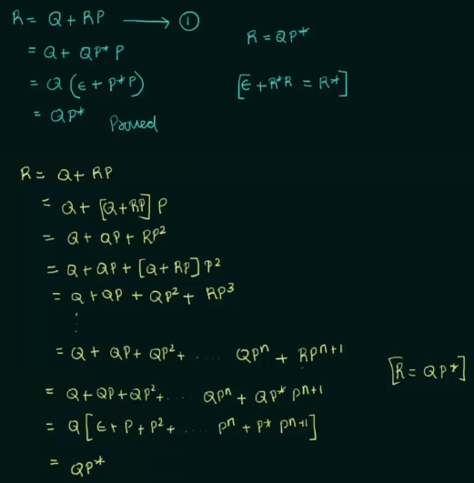

**Main Source:**

- **Book chapter 1.4**
- **Neso Academy playlist 8-9**
- **Neso Academy playlist 45-48**

### Regular Language

Regular language is a language that can be recognized by some [finite state machine](/theory-of-computation-and-automata/finite-automata). It is constructed by three set operations, union, concatenation, and Kleene star.

With alphabet $\Sigma$, the class of regular languages over $\Sigma$ is defined as:

1. $\varnothing$ is a regular language
2. For each $\sigma \in \Sigma, \{\sigma\}$ is a regular language
3. For any natural number $n \ge 2$ if $L_1, L_2, ..., L_n$ are regular languages, then so is $L_1 \cup L_2 \cup ... ... \cup L_n$.
4. For any natural number $n \ge 2$, if $L_1, L_2, ..., L_n$ are regular languages, then so is $L_1 \cdot L_2 \cdot ... ... \cdot L_n$.
5. If $L$ is a regular language, then so is $L^*$.
6. Nothing else is a regular language unless its construction follows from rules (1) to (5).

So, a regular language can be constructed using the three mentioned operations, including any symbol, and the empty set is also considered a regular language.

#### Closure Properties

If an operation is said to have **closure** property, it means that performing the operation on members of the set should yield a result that is also a member of the set. For example, addition in the set of integers own the closure property, because adding two integers will always result in another integer. This is not the case for division, as it might result in fraction.

In regular language, operation that owns closure property are union, concatenation, intersection, set difference, complementation, and Kleene star.

### Regular Expression

Regular expression is the formal notation of describing regular languages. It consists of a sequence of characters that represents a pattern or rule used to match and manipulate strings within a given alphabet.

Character and operators:

- **Terminal symbols**: Terminal symbol including symbols that are contained within the $\Sigma$, including $\epsilon$ (empty string) and $\varnothing$ (empty set) are regular expression.
- **Union ($+$)**: Union operation is like a [logical OR](/computer-and-programming-fundamentals/bitwise-operation#or), if we have two regular expression, $R_1, R_2$, union between them would be represented as $R_1 + R_2$. This mean we are making a pattern that match either $R_1$ or $R_2$.
- **Concatenation ($\cdot$)**: With $R_1, R_2$, concatenation is $R_1 \cdot R_2$, and it indicates that the two expressions must occur consecutively in the input string.
- **Kleene star ($*$)**: It acts like an iteration that specifies that the preceding expression can occur zero or more times. It matches any number of occurrences of the preceding expression, including no occurrence at all. For example, the regular expression $a^*$ matches strings like $\epsilon$ or "", "a", "aa", "aaa", and so on.

All the operations behave recursively, meaning we can apply it not only to individual characters or subexpressions but also to larger expressions or groups of expressions. For example, with $a \cdot b \cdot c$, we can make it as $(a \cdot b) \cdot c = (ab \cdot c) = abc$.

#### Common Expression

Assume that $\Sigma = \{a, b, c\}$

- **Zero or more**: We can use Kleene star for this, $a^*$ means one or more a's.
- **One or more**: Use one 'a' before the zero or more expression: $aa*$ ($a*a$ is also right).
- **Zero or one**: $(a + \lambda)$ describe optional 'a'.
- **Any string**: Union all alphabet with a Kleene star: $(a + b + c)^*$.
- **Any nonempty string**: Because Kleene star permits zero or more, then we would need extra any string in front of it, so it will be $(a + b + c)(a + b + c)^*$.
- **Any string not containing**: We should exclude the string that we don't want it to contain from the any string expression, $(b + c)^*$ exclude any 'a'.
- **Any string containing exactly one**: Just add the desired string before or after the any string not containing expression, $(b + c)^* a(b + c)^*$.

:::tip
We can also use $0^+$ to describe zero or more string excluding the empty string.
:::

#### Regular Expression Identities

Regular expression identities are regular expression laws or properties, or a set of rules or relationships that hold true for regular expressions. These identities are useful for simplifying or transforming regular expressions while preserving their matching behavior.

  
Source: https://youtu.be/yp4pYgXfYD8?si=rwI7XntRncW2qGoK&t=26

For example, applying Kleene star multiple times (rule 8) doesn't affect anything. This property is similar to adding infinity to infinity, it remains infinity.

In the rule 9, $RR^*$ represents one or more string, meaning empty string is not possible to matched. If we add an empty string with that expression, in other words, we include $\epsilon$ in the set of all possible string matched, then it will be equal back to $R^*$ again.

##### Arden's Theorem

One application of regular expression identities is the Arden's theorem. Arden's theorem states that:

> If $P$ and $Q$ are two regular expressions over $\Sigma$, and if $P$ does not contain $\epsilon$, then the following equation in $R$ given by $R = Q + RP$ has a unique solution, that is $R = QP^*$.

Arden's theorem can be proved by using several regular expression identity:

  
Source: https://youtu.be/Idl_0mPzZjE?si=OyVyX6JPE4VhDaz2&t=430

The proof consist of two part, the first part proves that $R$ is equal to $QP^*$, and the second part proves that $QP^*$ is the unique solution for the equation $R = Q + RP$, by substituting and expanding the $R$ with the $QP^*$. It mostly uses the distributive property of regular expressions.
