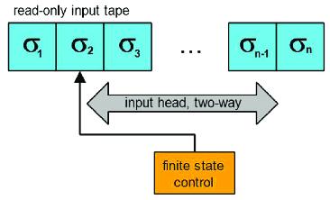
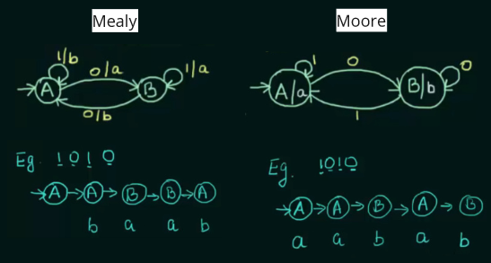
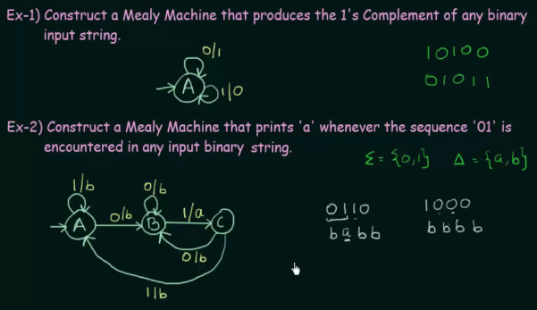
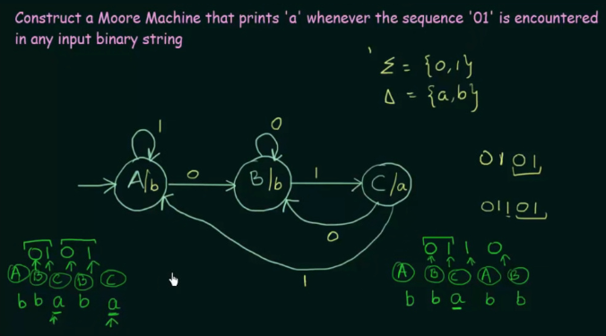
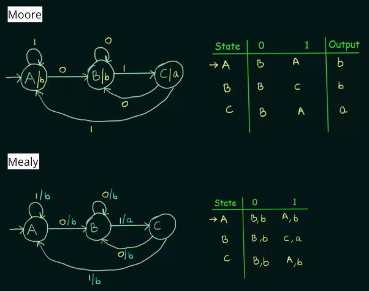
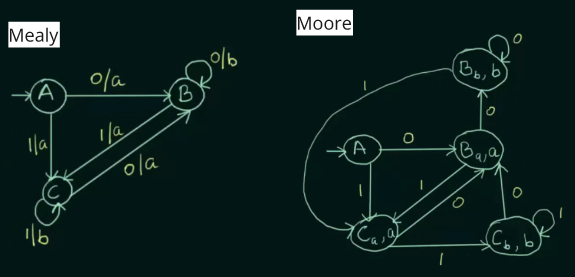
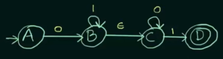
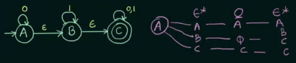
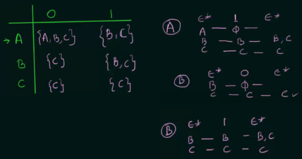
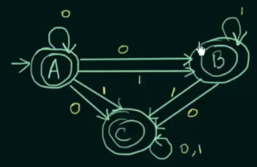

**Main Source:**

- **Book chapter 1.5-1.6**
- **Neso Academy playlist 27-28, 29**
- **Neso Academy playlist 34, 37**
- **Neso Academy playlist 41-42**

Advanced Automata page

### Two-Way Finite Automata

Two-way finite automata (2DFA) have additional ability to move its read head in both directions on the input tape. It can read symbols from left to right and also move to the left to read symbols. Given an input string, it can advance forward to the end or back to the start.

  
Source: https://www.researchgate.net/figure/Representation-of-two-way-deterministic-finite-automata_fig1_345669547

A 2DFA is defined as octuple: $M = (Q, \Sigma, |-, -|, \delta, s, t, r)$

- $Q$: finite set of states
- $\Sigma$: finite set of input alphabet
- $|-$ and $-|$: left and right endmarker, respectively, These symbols are not included in the input alphabet $\Sigma$.
- $\delta: Q \times (\Sigma \cup \{|-, -|\}) \rightarrow (Q \times \{L, R\})$:
- $s \in Q$: start state
- $t \in Q$: accept state
- $r \in Q$: reject state, $r \ne t$

The transition function takes a state and a symbol it reads on the tape as argument, returning the new state as well as the direction to move the head, either $L$ or $R$. If the machine reads a left or right endmarker, it will move to the opposite direction.

### Finite Automata with Output

Some finite automata are able to produce output, it is defined as:

$M = (Q, \Sigma, O, \delta, \lambda, q_0)$

- $O$ or $\triangle$: finite output alphabet
- $\delta: Q \times \Sigma \rightarrow Q$: Similar to [normal DFA](/theory-of-computation-and-automata/finite-automata#dfa), takes a state and alphabet, returns a new state
- $\lambda$: output function
- $q_0$: initial states
- The rest is same

There are two types of finite automata with output, **Mealy machines** and **Moore machines**. Both have the same definition, but they differ in output function. Mealy's output function is defined as $\lambda: \Sigma \times Q \rightarrow \triangle$, while Moore's output function is defined as $\lambda: Q \rightarrow \triangle$.

We can also define it with function notation, output function $F(t)$ for Mealy is $F(t) = \lambda(q(t), x(t))$. For Moore, $F(t) = \lambda(q(t))$.

In other word, Mealy takes account current state and input symbol to produce an output, while Moore's output is only associated with states.

  
Source: https://youtu.be/EzMWYmRkHFQ?si=y1tFCwsE9c3BAyys&t=599

:::warning
Mealy and Moore machine doesn't have final state.
:::

:::tip
The $1/b$ on transition of Mealy machine means that on getting input "1", produce output "b". The $A/a$ on state of Moore machine means that whenever we are at that particular state, produces output "a".
:::

The Moore machine that associates output with states implies the length of output string is always the length of input string + 1, as it takes account the initial state.

#### Mealy Machine example

  
Source: https://youtu.be/LioitkXDfmA?si=EwGx0NP7AQsDp7bC&t=534

1. The first example wants us to produces complement of the input string. We can do it easily by self-looping the input and make it produces whatever the complement is.
2. Because Mealy machine has to produce an output for every transition function, we can produce "b" as the unwanted output, and only produce "a" if we got the sequence of input right.

#### Moore Machine example

  
Source: https://youtu.be/MFnRF07SoFo?si=0l5W2_c2w2BGXoBE&t=511

Similar to the Mealy machine, we produce "b" as the unwanted output.

#### Conversion of Moore to Mealy Machine

  
Source: https://youtu.be/HEVWx4irOx4?si=OKG2BVRIcQowB9uD&t=386

This example is the one we have seen on the Mealy and Moore machine example, it is fairly to convert between them. Just move the output to transition rather than the states.

#### Conversion of Mealy to Moore Machine

For this particular example, we have to add new states $B_b$ and $C_b$, indicating it is state $B$ that produces output "b". The rest is just changing the association of output to states rather than to transition.

  
Source: https://youtu.be/-etILQcfgTg?si=DKocof81DknSFHna&t=490

In summary, conversion of Moore to Mealy does not increase the number of state, while the opposite does.

### Epsilon-NFA

Epsilon-NFA (ε-NFA) is the extension of [NFA](/theory-of-computation-and-automata/finite-automata#nfa) that allows for $\epsilon$ (epsilon) or empty string transition. The rest of definition is same as explained in [NFA](/theory-of-computation-and-automata/finite-automata#nfa). However, the transition function for ε-NFA is now defined as $\delta: Q \times \Sigma \cup \epsilon \rightarrow 2^Q$.

  
Source: https://youtu.be/84oNUttWlN4?si=B2LxuA_aOE-XCKu8&t=321

Every state is able to take epsilon as input, however it won't transition to anything if it's not defined.

#### Conversion of Epsilon-NFA to NFA

To convert between ε-NFA to NFA, we have to follow the ε-closure, that is, listing the possible state that can be reached with the sequence of ε, input symbol, and ε again.

  
Source: https://youtu.be/WSGcmaHNBFM?si=RAMRSa3emKfvW77c&t=271

For example, from state $A$, by inputting zero or more $\epsilon$, we can either remain at $A$ itself, transition to $B$, or reach the final state $C$. Next, following the second sequence, input a symbol. If we input "0" in state $A$, we will remain at $A$, inputting "0" in state $B$ would lead us nowhere, signified by the empty set, and with input "0" in state $C$, it will result in a self-loop.

This will be done for every state and defined transition on each.

  
Source: https://youtu.be/WSGcmaHNBFM?si=c9oiBEsxpPCYLwhk&t=445

After filling up the table, determining which one will be the final state in the converted NFA is done by looking which states can reach the final state. In the example, state $A$, $B$, and $C$ can reach the final state, so they are all going to be the final state in the converted NFA.

  
Source: https://youtu.be/WSGcmaHNBFM?si=pqyzMwwDEl0nLr3w&t=567
