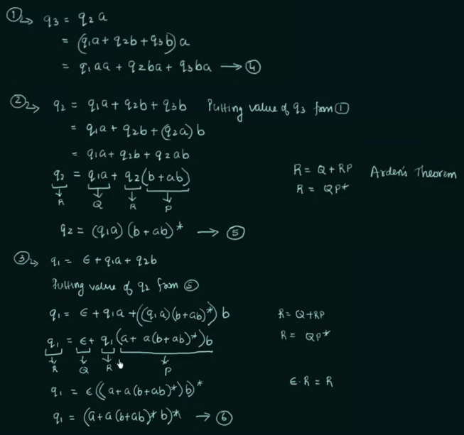
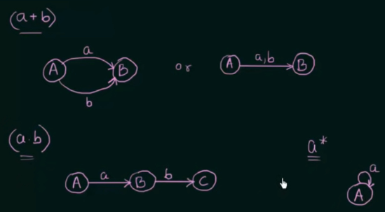
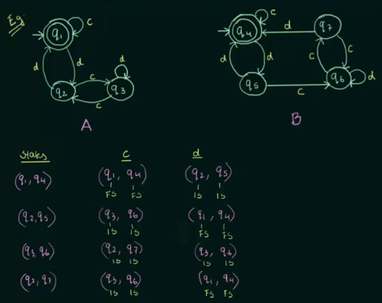
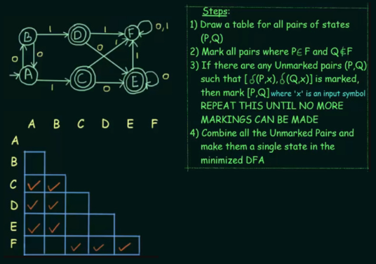
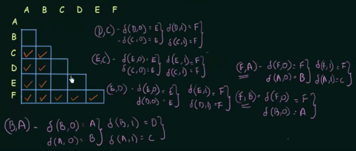
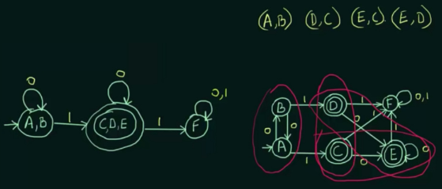
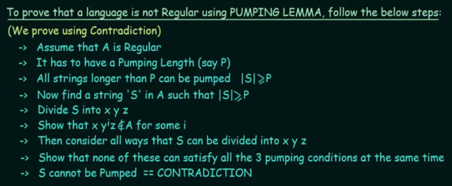
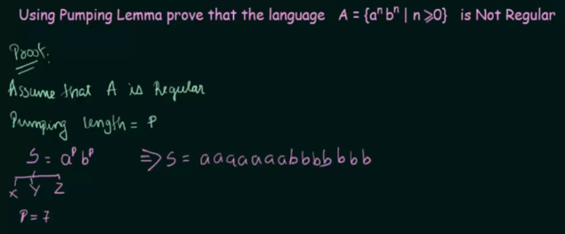
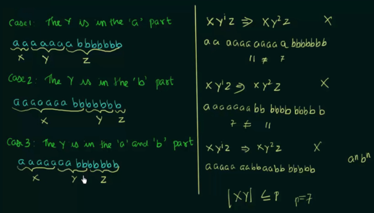

**Main Source:**

- **Book 1.7, 1.8, 1.9, 1.10**
- **Neso Academy playlist 51-55**
- **Neso Academy playlist 58**
- **Neso Academy playlist 25**
- **[Myhill–Nerode theorem — Wikipedia](https://en.wikipedia.org/wiki/Myhill%E2%80%93Nerode_theorem)**
- **Neso Academy playlist 60-61**

### NFA to Regular Expression

The conversion of an NFA (or DFA) to a regular expression involves designing a regular expression that represents the paths leading to a specific state.

The first thing to do is to list regular expression equation for each state in the NFA. To do that, we have to list the state and symbol that are used to reach particular state.

  
Source: https://youtu.be/OKFrju0HB7k?si=urpjdmtbkJPJ8wm2&t=171

$q_3 = q_2a$ means $q_3$ is reachable from state $q_2$ and symbol "a".

The second step is to simplify each state equation.

  
Source: https://youtu.be/OKFrju0HB7k?si=s5PWuHMUz19Q9HlF&t=609

Some step substitute other terms, some also use [regular expression identities](/cs-notes/theory-of-computation-and-automata/regular-languages-part-1#regular-expression-identities), and [Arden's theorem](/cs-notes/theory-of-computation-and-automata/regular-languages-part-1#ardens-theorem).

The last is to substitute other non-final states to the final state, so that the regular expression is produced.

  
Source: https://youtu.be/OKFrju0HB7k?si=T8uy19dz2X1lE5Yh&t=755

:::tip
The method of converting an NFA or DFA to a regular expression is the same. In cases where multiple final states exist in the automaton, we simply need to union the multiple regular expressions produced by the final state equations.
:::

### Regular Expression to Finite Automata

This means we have to design an automaton in such a way that it accepts the set of all strings that match the specified pattern.

  
Source: https://youtu.be/RxfXyvfTsgQ?si=_oeWTxvkSevhpHgL&t=253

A regular expression $(a + b)$ matches any string that contains "a" or "b". Therefore, a finite automaton for this would be a state with transition function that accepts "a" or "b".

  
Source: https://youtu.be/62JAy4oH6lU?si=w_zPMKLPSgzBjRoN&t=512

The above is another example, a Kleene star can be converted into state that self-loops.

### Equivalence of Two Finite Automata

Two automata are said to be equivalence if:

1. For any pair of states $\{q_i, q_j\}$ the transition for input $a \in \Sigma$ is defined by $\{q_a, q_b\}$ where $q_a = \delta\{q_i, a\}$ and $q_b = \delta\{q_j, a\}$. The two automata are not equivalent if for a pair $\{q_a, q_b\}$ one is intermediate state and the other is final state.

   In simpler term, two finite automata are equivalent if with the same input string, they both either accept or reject the string.

2. If initial state is the final state of one automaton, then in the second automaton, its initial state must be a final state as well for them to be equivalent.

To actually check the equivalence, we will check each pair of the state from both automaton inputting the same symbol.

  
Source: https://youtu.be/nX4JrcHgpZY?si=W35ijxnJD-cGCo7l&t=632

It turns out that for each pair of states from both automata, they either reach a final state or an intermediate state, indicating they are equivalent.

### Myhill-Nerode Theorem

Myhill-Nerode theorem provides a way to determine whether a language is regular by examining the behavior of its strings.

It works by grouping together string into same equivalence classes. Equivalence classes are formed based on the behavior of strings with respect to acceptance or rejection by the language.

The conditions for language to be regular:

> 1. The number of equivalence classes is finite.
> 2. That number is equal to the number of states in the minimal DFA accepting the language.
> 3. Any minimal DFA acceptor for the language is _isomorphic_ to the following one:  
>    Let each equivalence class $[x]$ correspond to a state, and let state transitions be $a: [x] \rightarrow [xa]$ for each $a \in \Sigma$. Let the starting state be $[\epsilon]$, and the accepting states be $[x]$ where $x \in L$.

:::tip
Two structures are said to be _isomorphic_ if they have the same underlying structure, although they may have different names or representations. Isomorphism can be determined if there exists a mapping (or transformation) between one and another that can convert between them while preserving their behavior and language recognition capabilities.
:::

This theorem is also related to the [DFA minimization](/cs-notes/theory-of-computation-and-automata/finite-automata#minimization). In DFA minimization, we used the method of listing equivalence class to minimize a DFA. In fact, the similar method can be used to prove if the number of equivalence class is finite (but thorough an exhaustive case).

The third condition simply mean that the transition in the minimal DFA should correspond to the set in the equivalence classes. This is why when we minimize DFA, we are required to combine state that belong to the same set within the equivalence classes.

In summary, Myhill-Nerode theorem bridge the relationship between regularity of a language and the behavior of strings within that language. By grouping strings into equivalence classes based on their behavior with respect to acceptance or rejection by the language, the theorem allows us to identify indistinguishable states in a DFA, which in turns allow us to minimize the DFA by combining the states with similar behavior.

#### Table Filling Method

Another way to minimize DFA is the table filling method, it is based on the Myhill-Nerode theorem. The minimization is done by following the 4 steps in the image below.

  
Source: https://youtu.be/UiXkJUTkp44?si=xEqD2nTn-bH8fxES&t=436

1. Draw a table for all pairs of states, but there's no need to permute the pairs. Therefore, AB = BA, and we only need one of them.
2. For each cell, we will mark it if only one of the state pair is final state and the other is intermediate state.

     
   Source: https://youtu.be/UiXkJUTkp44?si=RXdmpBdcyZ5Q3kSD&t=916

3. Next, for the unmarked pairs, we will mark them only if the transition between them, given the same input, arrives at a pair of states that is already marked. For example, with pair $B$ and $A$, by inputting "0", $B$ will transition to $A$ and $A$ will transition to $B$. The pair $A$ and $B$ is not marked, so we have to try another input. This will be repeated for each pair and input until no more markings can be made.
4. Lastly, do the step 4.

     
   Source: https://youtu.be/UiXkJUTkp44?si=gcsPHCj7ApbyvdWe&t=1159

### Pumping Lemma for Regular Languages

In mathematics, a lemma is a proven statement or proposition used as a "stepping stone" in the proof of a larger theorem. The pumping lemma for regular languages is used to show that certain languages are not regular. It is a tool to prove a language is not regular, rather than proving its regular like Myhill-Nerode theorem.

Pumping lemma for regular languages states that:

> If $A$ is a regular language, then $A$ has a pumping length 'p', such that any string $S \in L$ where $|S| \ge P$ may be divided into three parts, $S = xyz$, satisfying the following conditions:
>
> 1. $xy^iz \in A$ for every $i \ge 0$
> 2. $|y| > 0$
> 3. $|xy| \le P$

In simpler terms, we can prove that a language is not regular by contradicting the statement. To check if a string is not regular, we should be able to divide it into three parts and "pump" the $y$ part any number of times such that it still belongs to the language. Additionally, we have to conform with the second and third condition. The length of $y$ should be greater than 0, and the combined length of $x$ and $y$ should be less than or equal to $P$.

  
Source: https://youtu.be/dikEDuepOtI?si=kCQM7RFKoldzU5je&t=361

#### Example

The proof follows the step above.

  
Source: https://youtu.be/Ty9tpikilAo?si=UyAWA_7gOwX5Fi7s&t=261

Choosing a $P$ and the string $S$.

  
Source: https://youtu.be/Ty9tpikilAo?si=TfK_BtM6FaSXlD9-&t=794

Considering all the case to divide $S$ into $x$, $y$, and $z$, as well as checking if any of the cases satisfy the first pumping lemma condition, that is, the formed $xy^iz$ string needs to be in the language. The string needs to be $a^P b^P$, but the $xy^iz$ in the case 1 does not satisfy it. Lastly, we need to show that none of the cases can satisfy all the 3 pumping conditions at the same time. The second condition is satisfied but not the third condition.
