**Main Source:**

- **Book chapter 2**
- **Neso Academy playlist 65**
- **Neso Academy playlist 73-77**
- **Neso Academy playlist 78-81**
- **Neso Academy playlist 82-83**

Context-free grammar is the grammar that generates context-free language, which is recognized by [pushdown automata](/theory-of-computation-and-automata/pushdown-automata). The production rule is:

$A \rightarrow \alpha$, where $\alpha = \{V \cup \Sigma^*\}$ and $A \in V$.

Similar to the [general](/theory-of-computation-and-automata/formal-grammar#grammar) and [regular grammar](/theory-of-computation-and-automata/formal-grammar#regular-grammar), a non-terminal symbol can produce $\alpha$ which can be any symbol from the set of all possible strings of symbols that can be generated using both the non-terminal symbols and the terminal symbols of the grammar, including the empty string.

:::info
From different sources, $T$ is sometimes used as $\Sigma$. This implies that ($\{V \cup \Sigma^*\}$ is equivalent with $\{V \cup T\}$).
:::

The difference between regular grammar and context-free grammar lies in the production rules. Regular grammar is more restrictive, as the production rule must place non-terminal symbols either on the right or left side (i.e., non-terminals cannot be placed in the middle of the string). In contrast, context-free grammar allows the placement of non-terminals anywhere.

For example, the grammar $G = \{(S, A), (a, b), (S \rightarrow aAb, A \rightarrow aAb| \epsilon)\}$ is considered as a context-free grammar.

We can generate: $S \rightarrow aAb$  
$\rightarrow aaAbb$ (by $A \rightarrow aAb$)  
$\rightarrow aaaAbbb$ (by $A \rightarrow aAb$)  
$\rightarrow aaabbb$ (by $A \rightarrow \epsilon$)

The language of this grammar will be in the form of $a^n b^n$.

### Derivation Trees

Also known as **parse tree**, it is an ordered rooted tree that graphically represent the derivation process of a context-free grammar. The five properties of derivation tree:

1. The root of a derivation tree is $S$.
2. Every leaf node is a terminal symbol $T \cup \{\lambda\}$.
3. Every vertex node is a non-terminal symbol in $V$.
4. When a vertex $A \in V$ has a set of children labeled from $a_1, a_2, ..., a_n$, then vertex $A$ will have production rule in the form of $A \rightarrow a_1, a_2, ..., a_n$.
5. A leaf labeled with $\lambda$ has no siblings, that is, a vertex with a child labeled $\lambda$ can have no other children.

In other word, each level of the tree represents a step in the derivation process. Starting from the root, each level corresponds to the application of a production rule. The nodes at a particular level are derived from the nodes at the previous level.

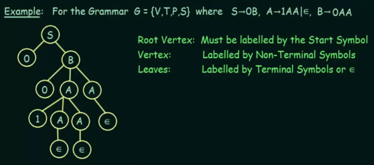  
Source: https://youtu.be/u4-rpIlV9NI?si=mAYV4hyYXS9j7sfh&t=244

We see in the example that starting from $S$, it produces terminal $0$ and non-terminal $B$. We will make it as the child of $S$, and continue the derivation process of $B$. This is done for all production rule. If there exist multiple production rule for one non-terminal symbol, then we will have to use both of them in distinct node. When the production rule is recursive (i.e., $A \rightarrow 1AA$), we may stop the derivation and fill the leaf nodes with $\epsilon$.

We also call any step of the derivation as a **sentential form**. A derivation tree in which the leaves contain a label from $V \cup T \cup \{\lambda\}$, or in other words, if any of the leaf still contains a non-terminal symbol, then the tree is said to be a **partial derivation tree**.

:::info
See also [tree data structure](/data-structures-and-algorithms/tree).  
$\epsilon$ is same as $\lambda$.
:::

#### Left & Right Derivation

When deriving a string with a grammar, there are two approaches, **leftmost derivation** and **rightmost derivation**. In leftmost derivation, the leftmost non-terminal in the current sentential form is always selected for expansion. While in the rightmost derivation, we select the rightmost non-terminal symbols. There is also **mixed derivation**, in which the two approaches is combined.

For example, a simple grammar with production rule $S \rightarrow AB$, $A \rightarrow a$, $B \rightarrow a$.

Using this grammar, the string "ab" can be derived in the following ways:

- Leftmost Derivation: $S \Rightarrow AB \Rightarrow aB \Rightarrow ab$
- Rightmost Derivation: $S \Rightarrow AB \Rightarrow Ab \Rightarrow ab$

Another example with the graphical derivation tree:

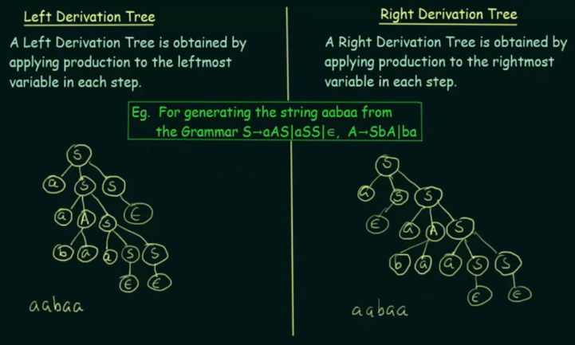  
Source: https://youtu.be/u4-rpIlV9NI?si=mWlwEeGp_w5Ky123&t=740

In the left derivation process, we chose to apply the production rule $S \rightarrow aSS$, because applying the other rule $S \rightarrow aAS$ would require us to replace $A$. The production rule of $A$ involve occurrence of $b$, if we use the $A \rightarrow ba$ production rule, we will have $b$ as the second character of the string (which is invalid). The process of derivation continues like this until we successfully create a parse tree with the correct characters combined from all the leaf nodes.

### Parsing

Parsing is the process of finding a derivation for a string from a given grammar. It is a way to recognize a string and to determine if a string belong to the grammar.

The basic idea of parsing is, finding (or making) a parse tree. The manual way is to analyze a given string and the grammar, then carefully construct a parse tree (like what we did in the previous example above).

A brute force way of parsing, also called **exhaustive search parsing** involve generating all possible strings of the same length as the input and checking if any of them matches the input. This approach is obviously inefficient. A practical parsing algorithms would be designed to avoid exhaustive search by employing various optimization techniques.

#### Ambiguity

In parsing, ambiguity refers to a situation where a given grammar can produce more than one valid parse tree for a particular input string. Depending on which production rule is applied on each step, a different but valid parse tree could be generated.

The grammar $G = (\{S\}, \{a, b\}, S, S \rightarrow aSb | bSa | SS | \lambda)$ generates strings having an equal number of "a"'s and "b"'s. The string "abab" can be generated in two distinct ways as shown in the following.

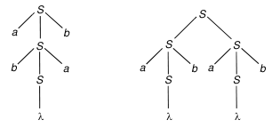  
Source: Book page 129

Furthermore, the string "abab" has two distinct leftmost derivations:

- $S \Rightarrow aSb \Rightarrow abSab \Rightarrow abab$
- $S \Rightarrow SS \Rightarrow aSbS \Rightarrow abS \Rightarrow abaSb \Rightarrow abab$

And two distinct rightmost derivations:

- $S \Rightarrow aSb \Rightarrow abSab \Rightarrow abab$
- $S \Rightarrow SS \Rightarrow SaSb \Rightarrow Sab \Rightarrow aSbab \Rightarrow abab$

Ambiguity can happen even in our daily lives, such as when encountering this ambiguous math expression "2 + 3 × 4". Without parenthesis, it wouldn't be clear in which order do we process this expression. We can interpret "2 + 3 × 4" as either "(2 + 3) × 4" or "2 + (3 × 4)".

We will say a string that leads to this situation "ambiguously derivable". A grammar $G$ is said to be ambiguous if there exists at least one string in $L(G)$ which is ambiguously derivable. Ambiguity is a property of grammar, it is not always possible to find equivalent unambiguous grammar.

### Simplification

The simplification of context-free grammar involves transforming or modifying the grammar to make it simpler or more manageable while preserving its language. This includes removing useless symbols, unreachable symbols, and simplifying the production rules.

For example, if we have production rule $A \rightarrow aBa$ and $B \rightarrow y$, we can simplify this by directly substituting $B$ in the $A$ production rule. So, the simplified production rule is $A \rightarrow aya$. This technique is also called **substitution rule**.

There are three steps in CFG simplification, reduction of CFG, removal of unit production, and removal of null production.

#### Reduction of CFG

The reduction involve eliminating useless symbols in the grammar, including non-terminals and terminals that do not contribute to generating any valid string in the language. It is divided into two phases.

1. Removal of useless symbols, non-terminals and terminals that do not contribute to generating any valid string in the language.
2. Removal of unreachable symbols, symbols that do not participate in the derivation of any sentential form.

A helpful procedure from the video:

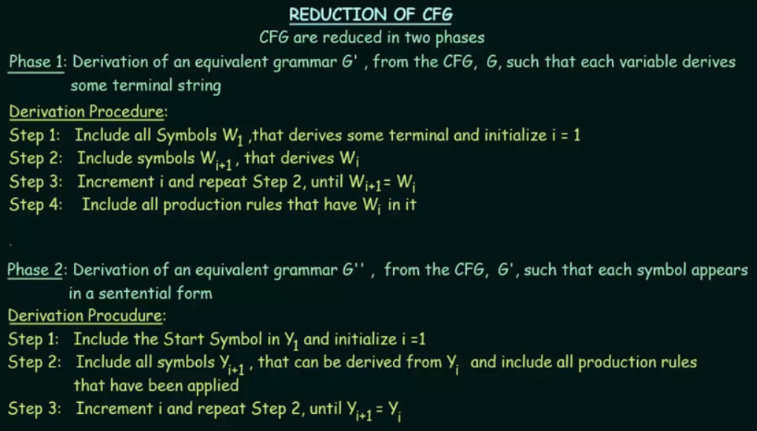  
Source: https://youtu.be/EF09zxzpVbk?si=qtn-ff6Wb-TJ2Zxv&t=323

With example grammar $G$ with production rules $P$: $S \rightarrow AC|B$, $A \rightarrow a$, $C \rightarrow c|BC$, $E \rightarrow aA|e$.

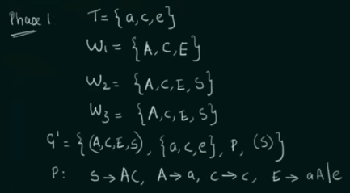  
Source: https://youtu.be/EF09zxzpVbk?si=gc_WXN5N0yI5d6et&t=604

1. Create a set $w_1$ that includes non-terminals that derives to some terminals.
2. Create another set $w_2$ that includes non-terminals that derives to all symbol in the previous step.
3. It is repeated until we obtained the same set in two consecutive steps (end at $w_3$).
4. The new grammar $G'$ will contain non-terminal symbols from the last set $w_3$, and terminal symbols that are derived by those non-terminal symbols.
5. A new production rule is created in which the symbol that doesn't appear in the non-terminal of $G'$ won't be included. In the example, we see that we removed production rule $S \rightarrow B$, because $B$ itself doesn't generate any terminal symbol (i.e., $B$ is a useless symbol).

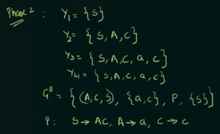  
Source: https://youtu.be/EF09zxzpVbk?si=ra95MHcYogTYxDC9&t=779

1. Create a set $y_1$ starting from the start symbol $S$.
2. Create another set $y_2$ that includes all the symbol (including non-terminals and terminals) that can be derived from the previous set.
3. It is repeated until we obtained the same set in two consecutive steps (end in $y_4$).
4. A new grammar $G''$ we include the non-terminals and terminals from the last set $y_4$.
5. We will alter the production rule by only including those that are in the non-terminals of $G''$. In the example, we removed symbol $E$ entirely, because in fact no other symbol can reach it (i.e., $E$ is an unreachable symbol).

#### Removal of Unit Productions

Unit production refers to any production rule in the form $A \rightarrow B$, or a non-terminal that transform to another non-terminal. Unit production is sometimes redundant and can be simplified using substitution rule.

If $B$ production rule is in the form $B \rightarrow y_1|y_2|...|y_n$ and there is a $A \xRightarrow{*} B$ or a sequence of derivation that leads from $A$ to $B$, then we can delete $A \rightarrow B$ and replace it with $A \rightarrow y_1|y_2|...|y_n$.

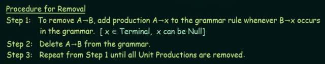  
Source: https://youtu.be/B2o75KpzfU4?si=NUhYWR4P7fznC6Lp&t=219

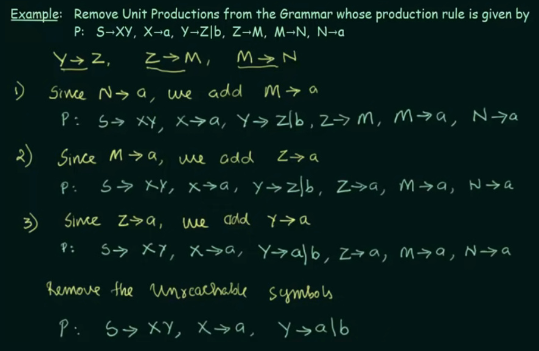  
Source: https://youtu.be/B2o75KpzfU4?si=PYaESnF-Flc8mljR&t=493

The production rule involves a sequence of derivation from non-terminals to another non-terminals. We can substitute the final derivation step that derive to terminals to each sequence of derivation. Finally, we can remove all unreachable symbols.

#### Removal of Null Productions

A null production is a production rule in the form of $A \rightarrow \epsilon$. If the variable doesn't directly map to $\epsilon$, this mean it needs a sequence of derivation $A \xRightarrow{*} \epsilon$, then we call the variable **nullable**.

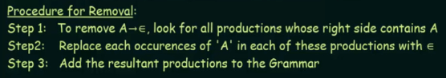  
Source: https://youtu.be/mlXYQ8ug2v4?si=i7_75uZdYmBzYOCL&t=131

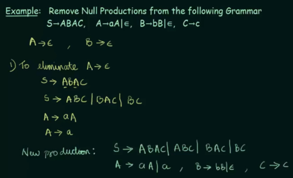  
Source: https://youtu.be/mlXYQ8ug2v4?si=sSOBcDT_ll4KWpl6&t=396

The first step is to remove all null productions from a variable and replace the variable occurrences in other production rules with epsilon. For example, we are going to remove $A \rightarrow \epsilon$ first. $S \rightarrow ABAC$ contains 2 $A$, and there is three possibility of removal. Changing the first $A$ to $\epsilon$, so it becomes $S \rightarrow ABC$, changing the second $A$ to become $S \rightarrow BAC$, and changing both $A$ to be just $S \rightarrow BC$. $A$ also appear in production rule of $A$ itself, and we can replace the $A$ in $A \rightarrow aA$ to $\epsilon$ to become just $A \rightarrow a$.

Next step is to remove all null production of $B$, and obtain the simplified CFG.

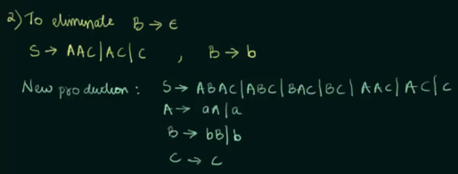  
Source: https://youtu.be/mlXYQ8ug2v4?si=7OuiYOepKinpa4z7&t=492

### Normal Forms

A context-free grammar is said to be in normal forms when they follow specific structure or standards.

#### Chomsky Normal Form

Chomsky Normal Form (CNF) is when the context-free grammar follow the production rule in form:

- $A \rightarrow BC$ (where $A$, $B$, and $C$ are non-terminals)
- $A \rightarrow a$ (where $A$ is a non-terminal and $a$ is a terminal)
- $S \rightarrow \epsilon$ (where $S$ is the start symbol and $\epsilon$ represents the empty string)

In CNF, all production rules on the right-hand side should either be two non-terminals or a terminal, except for the rule allowing the start symbol to derive the empty string. Other standard are the elimination of unit productions and null productions, as well as the conversion of longer productions.

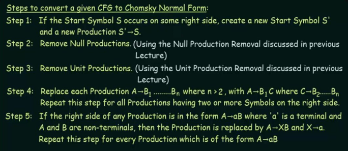  
Source: https://youtu.be/Mh-UQVmAxnw?si=EZD7ndYRKnodk7mJ&t=143

The step 4 is a way to enforce maximum of two non-terminals on the right-hand side. It is done by adding another non-terminals that has the same production rule. For example, instead of $A \rightarrow B|C|D$, we can add $E$ that $E \rightarrow C|D$, and change $A$ to $A \rightarrow B|E$.

Additionally, when a production rule contains both non-terminal and terminal symbols simultaneously, we can follow the step 5. The step 5 shows that we can separate non-terminal and a terminal by making another non-terminal that produce the terminal.

##### Example

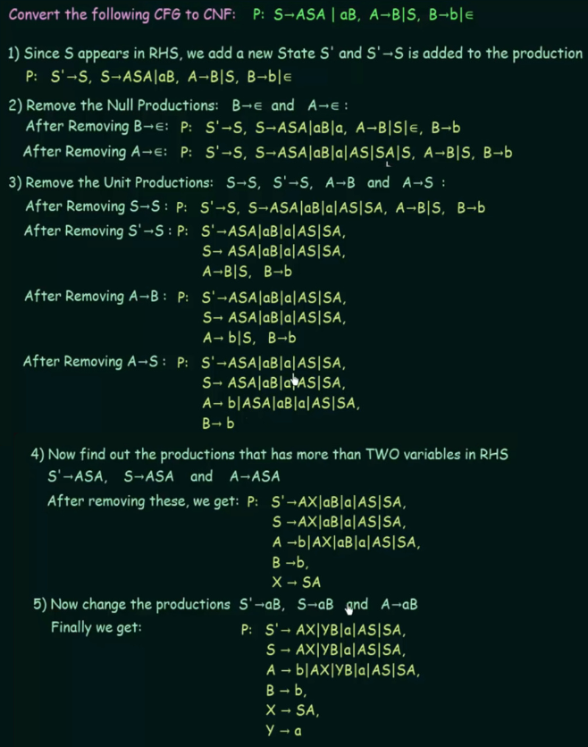  
Source: https://youtu.be/FNPSlnj3Vt0?si=Ao7POmbn_eLJCk1O&t=725

1. Start symbol can't appear on the right-hand side, so we can make a new start symbol $S'$ that produce $S$.
2. Removing null production by following [this](#removal-of-null-productions).
3. Removing unit production by following [this](#removal-of-unit-productions).
4. A new non-terminal $X$ is added here.
5. $Y$ is added to replace $a$ that is combined with $aB$.

#### Greibach Normal Form

In Greibach Normal Form (GNF), every production rule in the grammar is in the form:

- $A \rightarrow a\gamma$ (where $A$ is a non-terminal, $a$ is a terminal, and $\gamma$ is a possibly empty sequence of non-terminals)

The right-hand side of the production rule starts with a terminal symbol, followed by a sequence of non-terminals.

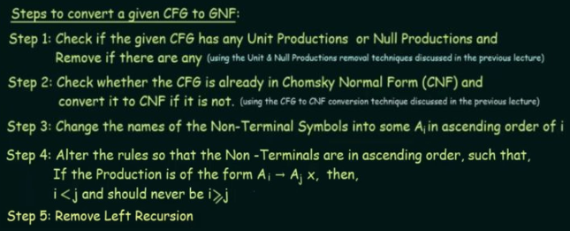  
Source: https://youtu.be/ZCbJan6CGNM?si=pS0u9kuYGdlGbHC8&t=758

In order to convert from CFG to GNF, we have to convert it to CNF first. If CNF restrict the length of right-hand side of a production, GNF allows for longer right-hand sides compared to CNF.

##### Example

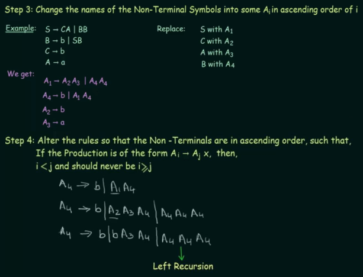  
Source: https://youtu.be/ZCbJan6CGNM?si=DiBqkV6DAv0zHJwb&t=767

3. Keep in mind that we have to confirm it is in CNF first. The step 3 told us to change the name of non-terminals to numbered $A$, such as $A_1, A_2$.
4. The production rule will be altered so that the $A$ numbering in left-hand side is always lower than the right-hand side.

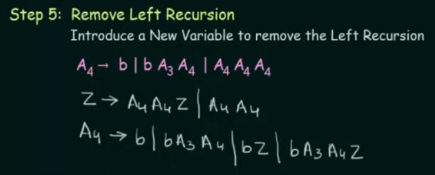  
https://youtu.be/rauqqM0nfuI?si=FplhJA1avFCa6QsS&t=294

5. A left recursion is when non-terminal on the left-hand side of a production rule appears as the first symbol on the right-hand side. Removing left recursion involve adding new variable to remove it. Upon adding the new variable, we will rewrite the production rule $A_4$ twice. The first time will be same, following the old $A_4$, the second time will be rewriting $A_4$ but adding the new variable to each production rule.

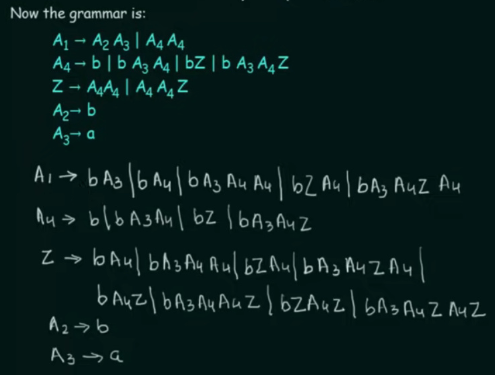  
Source: https://youtu.be/rauqqM0nfuI?si=cSCk3rJx4KJAg9KT&t=633

6. After altering $A_4$, there is still a problem, a non-terminal symbol appears as the first element on the right-hand side of the production rule for $A_1$. The $A_1 \rightarrow A_2A_3$ can be replaced to $A_1 \rightarrow bA_3$. Then, the first $A_4$ in $A_1 \rightarrow A_4A_4$ is substituted with the whole $A_4$ production rule. For example, the first $A_4$ is changed to $b$ and then added with the second. Next, $A_4$ is replaced again with $bA_3A_4$ and added with the second $A_4$, and so on for each production rule in $A_4$.
7. There is also a problem in $Z$, we also address this by doing the similar thing.

### Pumping Lemma for Context-Free Languages

Pumping lemma for context-free languages is to **prove that a language is not context-free**. In contrast, [pumping lemma for regular language](/theory-of-computation-and-automata/regular-languages-part-2#pumping-lemma-for-regular-languages) proves that a language is not regular.

The lemma states:

> Any context-free language $A$ has a pumping length $O$, such that any string $S$ in $A$, where $|S| \ge P$ can be divided into five parts: $S = uvxyz$, satisfying the following conditions:
>
> 1. $uv^{i}xy^{i}z$ is in $A$ for every $i \ge 0$
> 2. $|vy| > 0$
> 3. $|vxy| \le P$

Similar to the previous pumping lemma, it is a proof based on contradiction. A helpful procedure from the video:

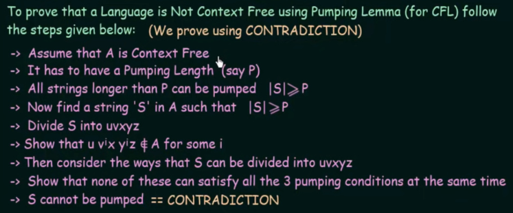  
Source: https://youtu.be/jRhqx1_KcCk?si=PQWy2IpLX7wc_wfp&t=259

#### Example

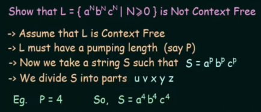  
Source: https://youtu.be/eQ0XkUk3qGk?si=2DO7eT_GCWy0jLFQ&t=429

1. Pick a pumping length $P$ and a string $S$. $P$ is chosen to be 4 and $S = a^pb^pc^p$, so $S = a^4b^4c^4$.

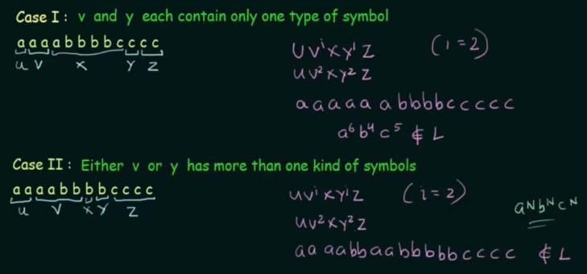  
Source: https://youtu.be/eQ0XkUk3qGk?si=RyCf4AbLvHGW-yxr&t=700

2. Consider some case of language such that $uv^ixy^iz \notin A$ for some $i$. Remember that the language must be in the form of $a^nb^nc^n$ according to the original language.
3. It is shown that in either two case, both fail to satisfy the three pumping lemma condition at the same time, so the language is proven to not be a context-free.
